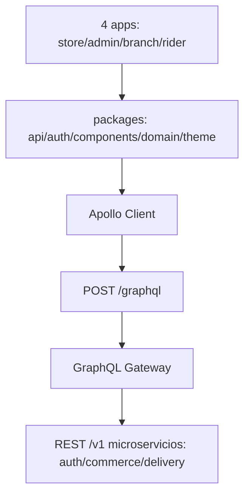
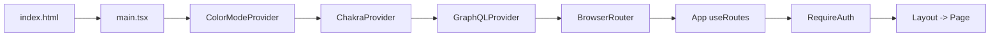
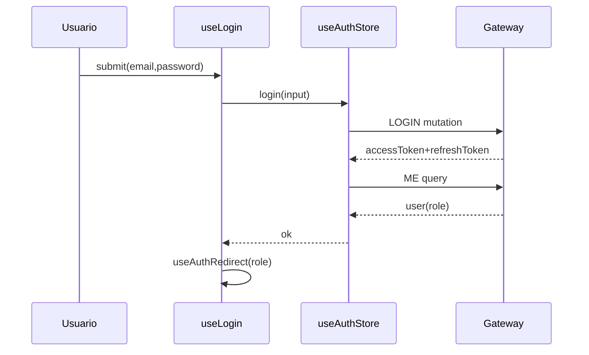
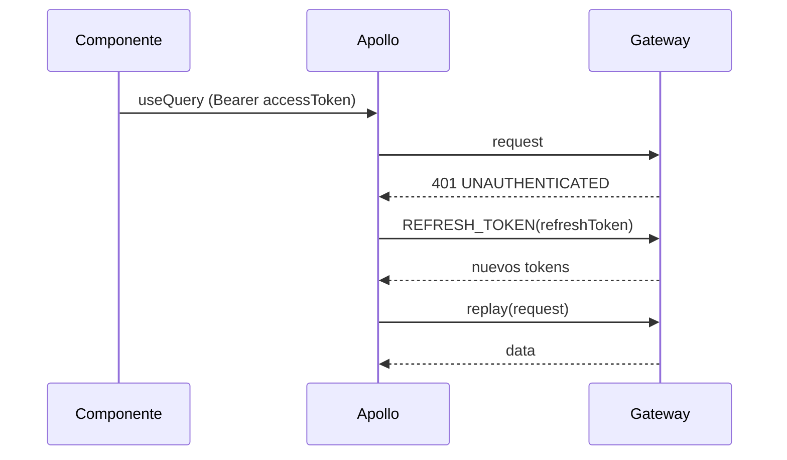
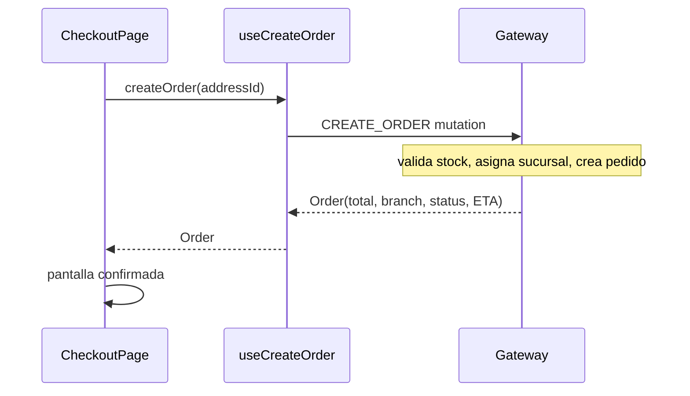
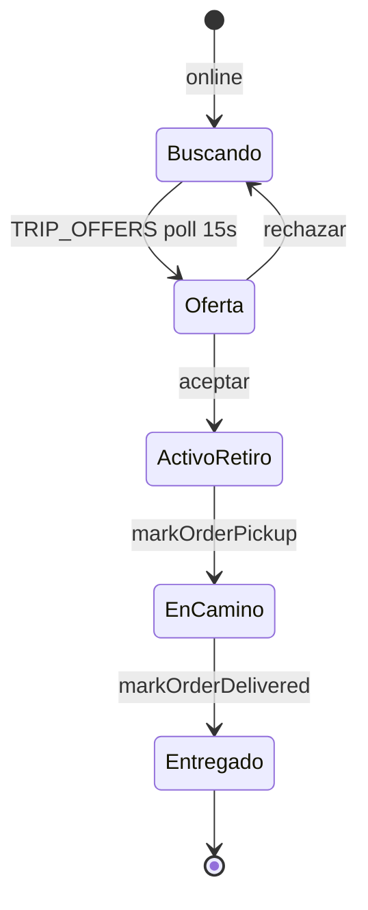
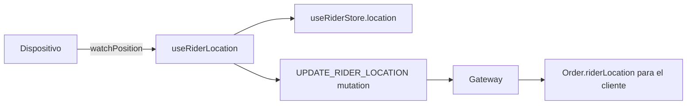
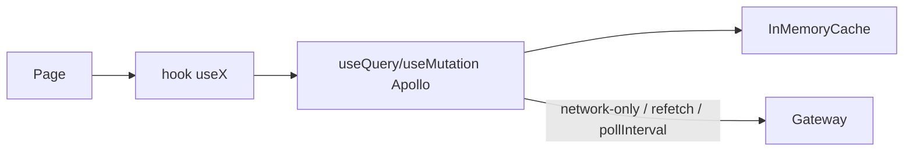

# FRONTEND_DEMO_GUIDE — Food Bosco (Frontend)

> Guía técnica de defensa/demo. Reconstruida **leyendo el código real** (no solo README/docs).
> Fuente de verdad: el código. Donde la documentación (`CLAUDE.md`, `README.md`, `ui-manifesto.md`, `STATUS.md`, `planRider.md`) contradice al código, se marca explícitamente.

---

## Tabla de contenidos

1. [Resumen ejecutivo](#resumen-ejecutivo)
2. [Arquitectura completa](#1-arquitectura-completa-del-frontend)
3. [Inicio de la aplicación](#2-inicio-de-la-aplicación)
4. [Routing y navegación](#3-routing-y-navegación)
5. [Autenticación](#4-autenticación)
6. [Roles y permisos](#5-roles-y-permisos)
7. [Comunicación con el backend](#6-comunicación-con-el-backend)
8. [GraphQL](#7-graphql)
9. [Manejo de estado](#8-manejo-de-estado)
10. [Flujos principales de usuario](#9-flujos-principales-de-usuario)
11. [Flujo de compra (cliente)](#10-flujo-de-compra)
12. [Rider / Repartidor](#11-rider--repartidor)
13. [Geolocalización](#12-geolocalización)
14. [Tiempo real](#13-tiempo-real)
15. [Lógica de negocio en frontend](#14-lógica-de-negocio-en-frontend)
16. [Algoritmos importantes](#15-algoritmos-importantes)
17. [Formularios y validaciones](#16-formularios-y-validaciones)
18. [Manejo de errores](#17-manejo-de-errores)
19. [Loading, cache y actualización](#18-loading-cache-y-actualización-de-datos)
20. [Componentes importantes](#19-componentes-importantes)
21. [Hooks importantes](#20-hooks-importantes)
22. [Servicios externos](#21-servicios-externos)
23. [Deployment y configuración](#22-deployment-y-configuración)
24. [Seguridad](#23-seguridad)
25. [Accesibilidad y UX técnica](#24-accesibilidad-y-ux-técnica)
26. [Qué lógica NO está en frontend](#25-qué-lógica-no-está-en-frontend)
27. [Cosas que no preguntaste](#26-cosas-importantes-que-no-pregunté)
28. [Evidencia del código](#27-evidencia-del-código)
29. [Documentación vs código](#28-código-real-por-encima-de-documentación)
30. [Qué tengo que saber para la demo](#qué-tengo-que-saber-para-la-demo)
31. [Preguntas que podrían hacerme](#30-preguntas-que-podrían-hacerme)
32. [Diagramas que debería poder dibujar](#31-flujos-que-debería-poder-dibujar)
33. [Glosario](#32-glosario)
34. [Resumen oral 5 minutos](#si-tuviera-que-explicar-el-frontend-en-5-minutos)
35. [Resumen 1 minuto](#si-sólo-tuviera-1-minuto)
36. [Checklist de estudio](#35-checklist-de-estudio)

---

# Resumen ejecutivo

Food Bosco es una **plataforma de pedidos de comida** (hamburguesas, pizzas, etc.) compuesta por **4 aplicaciones frontend** en un **monorepo Turborepo**:

| App           | Rol            | Puerto dev | Objetivo                                                                                                 |
| ------------- | -------------- | ---------- | -------------------------------------------------------------------------------------------------------- |
| `apps/store`  | `customer`     | 5173       | Tienda del cliente (catálogo, carrito, checkout, tracking). También compila a Android/iOS con Capacitor. |
| `apps/admin`  | `super_admin`  | 5174       | Admin global (catálogo, sucursales, personal, stock, reportes, pedidos de todas las sucursales).         |
| `apps/branch` | `branch_admin` | 5175       | Admin de una sucursal (productos por sucursal, stock, pedidos de la sucursal, reportes).                 |
| `apps/rider`  | `rider`        | 5176       | Repartidor (disponibilidad, ofertas de viaje, pickup/entrega, geolocalización).                          |

Tecnologías: **Vite 8 + React 19 + TypeScript**, **Chakra UI v3**, **Apollo Client (GraphQL)**, **Zustand** (estado global), **React Router 7**, **React Hook Form + Zod**, **Capacitor** (apps nativas). Se comunica con un **GraphQL Gateway** (`POST /graphql`) que a su vez orquesta microservicios REST internos.

Lo más importante para la demo: **el frontend habla únicamente GraphQL con un único endpoint**; el backend (gateway) es quien resuelve N+1, asigna sucursales/repartidores, valida transiciones de estado y aplica la autorización real.

---

# 1. Arquitectura completa del frontend

## 1.1 Monorepo

Turborepo + npm workspaces (`package.json` en la raíz, `"workspaces": ["apps/*", "packages/*"]`). Build orquestado por `turbo.json` (tasks `build`, `dev`, `lint`, `typecheck`).

```
food-bosco/
├── apps/
│   ├── store/      # cliente (Capacitor Android/iOS)
│   ├── admin/      # super_admin
│   ├── branch/     # branch_admin
│   └── rider/      # repartidor
├── packages/
│   ├── api/        # @repo/api — capa de datos (Apollo client, hooks, stores, mocks)
│   ├── auth/       # @repo/auth — UI de autenticación reutilizable
│   ├── components/ # @repo/components — componentes/tokens UI compartidos
│   ├── domain/     # @repo/domain — tipos, constantes, schemas (TS puro)
│   ├── theme/      # @repo/theme — tokens semánticos de Chakra
│   ├── eslint-config/     # @repo/eslint-config
│   └── typescript-config/ # @repo/typescript-config
├── docs/           # requerimientos, manifesto UI, fundamentación gateway
├── turbo.json
└── package.json
```

## 1.2 Mapa conceptual real

```text
main.tsx (cada app)
   ↓
<StrictMode>
   ↓
ColorModeProvider  (next-themes, dark mode)
   ↓
ChakraProvider (system = createSystem(defaultConfig, config))  ← @repo/theme
   ↓
GraphQLProvider (ApolloProvider + apolloClient)                ← @repo/api
   ↓
BrowserRouter
   ↓
App (useRoutes)  — compone authRouteObjects + rutas protegidas
   ↓
RequireAuth (HOC, roles)  ← @repo/components
   ↓
Layout (StoreLayout / AdminLayout / BranchLayout / RiderLayout)
   ↓
Page  (HomePage, CatalogPage, ...)
   ↓
Components (producto, carrito, ...)
   ↓
Hooks de datos (useCatalog, useCart, useOrder, ...)  ← @repo/api (Apollo useQuery/useMutation)
   ↓
apolloClient (authLink → errorLink → httpLink)  →  POST /graphql
   ↓
GraphQL Gateway (backend) → microservicios REST internos
```

Cada app comparte el mismo esqueleto. Lo único que cambia es `config.ts` (URLs/env), `routes.ts`, `App.tsx` (qué `roles` exige `RequireAuth` y qué layout/páginas monta) y los componentes/pages propios.

## 1.3 Responsabilidades de cada paquete

- **`@repo/domain`** (`packages/domain/src/`): TS puro, sin React. Tipos (`Order`, `Product`, `Trip`, `User`, `Address`, `Branch`, `Cart`...), constantes (`ORDER_STATUS_LABELS`, `ORDER_TRANSITIONS`, `ATTENTION_ORDER_STATUSES`, `TRIP_STATUS_LABELS`), helpers (`formatPrice`, `cartTotal`, `isActiveOrder`, `formatVehicle`) y **schemas Zod** (`schemas.ts`).
- **`@repo/api`** (`packages/api/src/`): la **capa de datos**. Contiene:
  - `client/apollo.ts` — configuración del Apollo Client (links, refresh).
  - `client/operations.ts` — operaciones GraphQL de auth/direcciones.
  - `client/store.ts`, `admin.ts`, `branch.ts`, `rider.ts` — documentos GraphQL (queries/mutations) + _mappers_ (`toOrder`, `toProduct`, `toRider`, `toTrip`...).
  - `client/rest.ts` — helpers `getJson`/`postJson`/`patchJson`/`deleteJson` (hoy prácticamente sin uso).
  - `hooks/*` — ~30 hooks `useX` (Apollo `useQuery`/`useMutation`).
  - `stores/authStore.ts` — sesión (Zustand persist).
  - `mocks/*` — datos mock (hoy mayormente vestigiales).
  - `GraphQLProvider.tsx` — wrapper de `ApolloProvider`.
- **`@repo/auth`** (`packages/auth/src/`): UI de autenticación (Login, Register, ForgotPassword, ResetPassword), `AuthProvider`/`useAuthConfig`, `authRouteObjects`, `useAuthRedirect`. Cada app monta estas rutas públicas.
- **`@repo/components`** (`packages/components/src/`): tokens de UI (`PageTitle`, `Price`, `PrimaryButton`, `EmptyState`, `OrderStatusBadge`, `OrderTimeline`, `RequireAuth`, `ResponsiveModal`, `MobileNav`, ...).
- **`@repo/theme`** (`packages/theme/src/config.ts`): `defineConfig` de Chakra con fuentes (Outfit), paleta `brand` (naranja) / `accent` (ámbar) y **tokens semánticos** con variante `_light`/`_dark`.

## 1.4 Stack tecnológico

| Capa          | Tecnología                                        | Evidencia                                                      |
| ------------- | ------------------------------------------------- | -------------------------------------------------------------- |
| Build         | Vite 8 (`vite`)                                   | `apps/*/vite.config.ts`                                        |
| UI            | React 19.2                                        | `apps/*/package.json`                                          |
| Lenguaje      | TypeScript 5.9                                    | raíz `package.json`                                            |
| UI kit        | Chakra UI v3 (`@chakra-ui/react` ^3.36)           | `apps/*/package.json`                                          |
| Server state  | **Apollo Client** (`@apollo/client`)              | `packages/api/src/hooks/*`                                     |
| Estado global | Zustand 5 (`persist`)                             | `authStore`, `addressStore`, `riderStore`, `branchStatusStore` |
| Routing       | React Router DOM 7 (`useRoutes`)                  | `apps/*/src/App.tsx`                                           |
| Formularios   | React Hook Form + Zod (`@hookform/resolvers/zod`) | `packages/domain/src/schemas.ts`                               |
| Móvil         | Capacitor 8 (`@capacitor/core`)                   | `apps/store/package.json`                                      |
| Iconos        | `@gravity-ui/icons`                               | `apps/*`                                                       |
| Dark mode     | `next-themes` (via `ColorModeProvider`)           | `packages/components/src/ColorModeProvider`                    |

> ⚠️ **Inconsistencia importante (docs vs código):** `CLAUDE.md`, `README.md` y `ui-manifesto.md` dicen que se usa **SWR** para fetching y "mock-first". El código real usa **Apollo Client** (`useQuery`/`useMutation`). `swr` está en `package.json` pero **no se importa en ningún archivo**. El documento `docs/resumen-sesion-conexion-admin-global.md` documenta esta migración de SWR+mocks → Apollo GraphQL.

---

# 2. Inicio de la aplicación

Todas las apps arrancan igual. Ejemplo `apps/store`:

```text
index.html
→ src/main.tsx
→ createRoot(...).render(
     <StrictMode>
       <ColorModeProvider defaultTheme="system" enableSystem>   # dark mode
         <ChakraProvider value={system}>                          # system = createSystem(defaultConfig, config)
           <GraphQLProvider>                                      # ApolloProvider
             <BrowserRouter>
               <App />                                            # useRoutes(...)
             </BrowserRouter>
           </GraphQLProvider>
         </ChakraProvider>
       </ColorModeProvider>
     </StrictMode>
   )
```

Evidencia: `apps/store/src/main.tsx` (idéntico en admin/branch/rider).

### Qué ocurre al abrir la app (paso a paso)

1. **Mount de providers** (main.tsx): `ColorModeProvider` (next-themes, lee tema del sistema y aplica clase `dark`), `ChakraProvider` con el `system` construido a partir de `@repo/theme`, `GraphQLProvider` (instancia el `ApolloClient`), `BrowserRouter`.

2. **`App` → `useRoutes`** (App.tsx): compone `authRouteObjects(config)` (rutas públicas de auth) + una rama protegida por `<RequireAuth>`.

3. **Restauración de sesión**: el `useAuthStore` está persistido en `localStorage` con key `store-auth` (`packages/api/src/stores/authStore.ts`, `partialize` guarda `user`, `accessToken`, `refreshToken`, `bypassAuth`). Al cargar, `user` y `accessToken` ya están disponibles **síncronamente** (Zustand `persist` rehidrata del storage).

4. **Guard de ruta** (`RequireAuth` en `packages/components/src/RequireAuth/index.tsx`):
   - Si `!user` y no hay bypass → `<Navigate to={loginPath} state={{ from: location }} />`.
   - Si `roles` está definido y `user.role` no está incluido → redirige a `loginPath`.
   - Caso contrario → `<Outlet />` (renderiza el layout y la página).

5. **`useProfile`** (`packages/api/src/hooks/useProfile.ts`): apenas hay token, dispara la query `ME` (`fetchPolicy: 'network-only'`) y hace `setUser(toUser(data.me))` — refresca el perfil real del usuario contra el gateway.

6. **Layout** (`StoreLayout`): consulta `useAddresses()`. Si no hay dirección seleccionada válida, abre el `AddressPickerModal` para obligar a elegir dirección (verdad de producto: la entrega es a una dirección del cliente).

7. **Render** de la página correspondiente a la URL.

### Sesión en Android (Capacitor)

El store compila a app nativa (`npm run store:android` / `store:ios`). Usa `BrowserRouter` (ver §22). La UI de auth vive **dentro del mismo APK** (paquete `@repo/auth`), no en una SPA externa (esto fue una refactorización documentada en `docs/plan-auth-store-android.md`).

---

# 3. Routing y navegación

- Librería: **React Router DOM 7**.
- Patrón: **`useRoutes`** (objetos de ruta), no JSX `<Routes>`. `App.tsx` construye el árbol de rutas y lo pasa a `useRoutes`.
- Rutas públicas: provistas por `authRouteObjects(config)` de `@repo/auth`.
- Rutas privadas: dentro de `<RequireAuth>`.

## 3.1 Rutas del store (`apps/store/src/App.tsx` + `routes.ts`)

| Ruta                     | Pantalla           | Acceso                  | Objetivo                          |
| ------------------------ | ------------------ | ----------------------- | --------------------------------- |
| `/login`                 | LoginPage          | público                 | login                             |
| `/register`              | RegisterPage       | público                 | registro (cliente o rider)        |
| `/forgot-password`       | ForgotPasswordPage | público                 | recuperar contraseña              |
| `/reset-password/:token` | ResetPasswordPage  | público                 | restablecer                       |
| `/`                      | HomePage           | autenticado             | landing con hero + catálogo       |
| `/catalog`               | CatalogPage        | autenticado + dirección | búsqueda/filtro de productos      |
| `/products/:productId`   | ProductDetailPage  | autenticado + dirección | configurador + agregar al carrito |
| `/cart`                  | CartPage           | autenticado + dirección | carrito                           |
| `/checkout`              | CheckoutPage       | autenticado + dirección | confirmar pedido                  |
| `/branches`              | SucursalesPage     | autenticado + dirección | sucursales disponibles            |
| `/orders`                | OrdersPage         | autenticado + dirección | pedido activo + historial         |
| `/orders/:orderId`       | OrderDetailPage    | autenticado + dirección | seguimiento                       |
| `/profile`               | ProfilePage        | autenticado + dirección | perfil                            |
| `/profile/edit`          | EditProfilePage    | autenticado + dirección | editar perfil                     |
| `/profile/addresses`     | AddressesPage      | autenticado + dirección | CRUD direcciones                  |

## 3.2 Rutas del rider (`apps/rider/src/App.tsx`)

| Ruta               | Pantalla            | Acceso  |
| ------------------ | ------------------- | ------- |
| `/`                | HomePage            | `rider` |
| `/trip/:orderId`   | TripOrderDetailPage | `rider` |
| `/history`         | HistoryPage         | `rider` |
| `/profile`         | ProfilePage         | `rider` |
| `/profile/edit`    | EditProfilePage     | `rider` |
| `/profile/vehicle` | VehicleEditPage     | `rider` |

## 3.3 Rutas del admin (super_admin) y branch (branch_admin)

- **admin**: `/categories`, `/products`, `/products/:id/edit`, `/ingredients`, `/branches`, `/staff`, `/parameters`, `/orders`, `/orders/:orderId`, `/stock`, `/reports/products`, `/profile` (ver `apps/admin/src/App.tsx`, `routes.ts`).
- **branch**: `/`, `/products`, `/stock`, `/orders`, `/orders/:orderId`, `/reports/products`, `/profile` (ver `apps/branch/src/App.tsx`).

## 3.4 Protección de rutas (cómo funciona)

`RequireAuth` (`packages/components/src/RequireAuth/index.tsx`) recibe:

- `loginPath` — a dónde redirigir si no hay sesión.
- `roles?: UserRole[]` — roles permitidos (e.g. rider exige `['rider']`).
- `mockAuth?: boolean` — bypass para builds/preview.

Lógica:

1. `user = useAuthStore(s => s.user)`.
2. `bypassAuth` se puede forzar con query `?forceAuth=true/false` (toggle de desarrollo; se persiste en `bypassAuth`).
3. `effectiveBypass = mockAuth || forceAuth...`.
4. Si `!user && !effectiveBypass` → `<Navigate to={loginPath} replace state={{ from: location }} />` (o `window.location.assign` si `loginPath` es URL absoluta).
5. Si `roles && user && !roles.includes(user.role)` → redirige a `loginPath`.
6. Si todo ok → `<Outlet />`.

### Qué pasa al refrescar el navegador

- La sesión se rehidrata de `localStorage` (`store-auth`), así que `user` y `accessToken` están disponibles al montar. Si el token expiró, la primera query protegida disparará el **refresh flow** (ver §4.5) y, si no se puede renovar, se hace `logout()` y `RequireAuth` redirige a `/login` en el próximo render.
- La dirección seleccionada (`addressStore`, key `store-address`) también persiste, así que no se vuelve a pedir.

> Nota: `RequireAuth` no valida el token contra el backend en el guard; el guard solo mira si hay `user` en el store. La validación real del token ocurre en el gateway cuando se hace una query autenticada (401 → refresh → replay).

---

# 4. Autenticación

## 4.1 Flujo completo

```text
Usuario → LoginPage (email + password)
→ useLogin (React Hook Form + zodResolver(loginSchema))
→ useAuthStore.login({ email, password })
→ apolloClient.mutate(LOGIN)          # POST /graphql
→ gateway valida → { accessToken, refreshToken }
→ set({ accessToken, refreshToken })  # persiste en localStorage
→ apolloClient.query(ME)              # fetchPolicy 'network-only'
→ set({ user: toUser(me) })
→ useAuthRedirect(user.role)          # redirige por rol
```

Evidencia: `packages/auth/src/pages/LoginPage/hooks/useLogin.ts`, `packages/api/src/stores/authStore.ts`, `packages/api/src/client/operations.ts` (mutación `LOGIN`).

## 4.2 Dónde se almacena el token

- **`localStorage`**, key `store-auth`, vía Zustand `persist` + `createJSONStorage(() => localStorage)`.
- Se persisten: `user`, `accessToken`, `refreshToken`, `bypassAuth`.
- **No** se usa `sessionStorage` ni cookies (httpOnly). Esto es una decisión con implicancia de seguridad (ver §23).

## 4.3 Cómo se agrega a las requests

`packages/api/src/client/apollo.ts` — `authLink` (Apollo `setContext`):

```ts
const authLink = setContext((_, { headers }) => {
  const token = useAuthStore.getState().accessToken
  return { headers: { ...headers, ...(token ? { authorization: `Bearer ${token}` } : {}) } }
})
```

## 4.4 Tokens (JWT)

- `accessToken` + `refreshToken` (rotación).
- El frontend **no decodifica ni valida** el JWT; solo lo envía como `Authorization: Bearer`.
- El rol viene de la query `ME` (campo `role`), mapeado por `ROLE_FROM_API` (`CUSTOMER`→`customer`, etc.), no del payload del token.

## 4.5 Refresh token (renovación automática)

En el `errorLink` de Apollo (`apollo.ts`):

```text
query falla con GraphQLError extensions.code === 'UNAUTHENTICATED'
→ refreshAccessToken():
    refreshToken = authStore.refreshToken (si no hay → false)
    apolloClient.mutate(REFRESH_TOKEN, { refreshToken })
    → session.refreshToken devuelve accessToken + refreshToken
    → authStore.applyTokens(...)  (rota ambos tokens)
→ fromPromise(refreshPromise).filter(Boolean).flatMap(() => forward(operation))
  (replay de la operación original)
```

- Hay un singleton `refreshPromise` para **deduplicar** refrescos concurrentes.
- Si el refresh falla → `logout()` y devuelve `false`.

## 4.6 Logout

`authStore.logout()`:

1. Dispara `LOGOUT` mutation (fire-and-forget, `.catch(() => {})`).
2. `set({ user: null, accessToken: null, refreshToken: null })` — limpia estado y (por persist) el localStorage.

## 4.7 Registro

`useRegister` (`packages/auth/src/pages/RegisterPage/hooks/useRegister.ts`): el formulario permite elegir rol `customer` o `rider` (según `registerRoles` configurado por la app). Si es rider, se pide vehículo (moto: marca/modelo/patente obligatorios; bici: nada). Llama a `register` o `registerRider` del `authStore`.

## 4.8 Modo mock (`VITE_MOCK_AUTH`)

- Variable `VITE_MOCK_AUTH` → `MOCK_AUTH` en `config.ts` (`import.meta.env.VITE_MOCK_AUTH === 'true'`).
- Se pasa a `RequireAuth` como `mockAuth`. Si `true`, **`RequireAuth` no exige sesión** (hace bypass y renderiza `<Outlet />` sin `user`).
- **Importante:** `VITE_MOCK_AUTH` **solo saltea el login**. No provee datos mock. Los hooks de datos siguen pegando a GraphQL; sin backend, las listas quedan vacías. Los `mocks/*` que aún se usan son solo los usuarios de display (`MOCK_SUPER_ADMIN`, `MOCK_BRANCH_ADMIN`) como fallback `??` en layouts/pages.
- Hoy `.env.native` (Android) tiene `VITE_MOCK_AUTH=false`, así que la app nativa **sí pide login real**.

## 4.9 Redirección por rol (`useAuthRedirect`)

`packages/auth/src/hooks/useAuthRedirect.ts`:

```text
customer      → navigate(from ?? defaultPath)        (se queda en store)
branch_admin  → window.location.assign(branchUrl)
super_admin   → window.location.assign(adminUrl)
rider         → window.location.assign(riderUrl)
```

Cada app configura `branchUrl`/`adminUrl`/`riderUrl` desde `VITE_BRANCH_URL`/`VITE_ADMIN_URL`/`VITE_RIDER_URL`. Así, el login de una app puede redirigir a la app correcta según el rol.

---

# 5. Roles y permisos

## 5.1 Roles reales

Definidos en `packages/domain/src/user.ts` (`UserRole`) y mapeados en `client/operations.ts` + `client/store.ts` + `client/admin.ts`:

| Rol API        | Rol frontend   | App destino |
| -------------- | -------------- | ----------- |
| `CUSTOMER`     | `customer`     | store       |
| `BRANCH_ADMIN` | `branch_admin` | branch      |
| `SUPER_ADMIN`  | `super_admin`  | admin       |
| `RIDER`        | `rider`        | rider       |

## 5.2 Dónde se aplica la restricción

- **Guard de ruta** (`RequireAuth roles=[...]`): la única restricción de acceso a nivel app. El admin exige `super_admin`, el branch `branch_admin`, el rider `rider`. El store **no** pasa `roles`, así que acepta cualquier usuario autenticado (pero en la práctica un admin que entre al store simplemente ve la tienda; la redirección por rol lo manda a su app).
- **En la capa de datos**: algunos hooks filtran por `branchId` del usuario. Ej. `useBranchOrders`/`useBranchStock`/`useBranchProducts`/`useIncomingOrder` usan `useAuthStore(s => s.user?.branchId)` como `filter`/variable y `skip: !branchId`. Es decir, un `branch_admin` solo ve datos de **su** sucursal (aunque el filtro real lo aplica el backend; el frontend solo le pasa el `branchId`).
- **Componentes condicionales**: el admin global no monta `BranchStatusButton` ni `IncomingOrderModal` (eso es de branch); el rider monta `RideStatusButton`.

## 5.3 Restricción visual vs. autorización real (clave para la demo)

- **Visual (frontend):** `RequireAuth` decide qué app/layout se renderiza; los menús y botones se muestran según el rol. Esto **no es seguridad**.
- **Autorización real (backend):** el GraphQL Gateway valida el JWT y el rol en cada query/mutation (`UNAUTHENTICATED`/`FORBIDDEN`). Si un usuario manipula el cliente, el backend sigue rechazando operaciones no autorizadas. El frontend nunca debe confiar en que "no se muestra el botón" equivale a "no se puede hacer".

---

# 6. Comunicación con el backend

## 6.1 Modelo

```text
Frontend (Apollo) → POST /graphql (GraphQL) → Gateway → REST /v1 → microservicios (auth/commerce/delivery)
```

- **Un único endpoint GraphQL**: `VITE_API_URL + /graphql`, con fallback relativo `/graphql`.
- El frontend **no conoce** la topología interna de microservicios.
- No hay WebSockets ni SSE: el tiempo real se resuelve con **polling** (Apollo `pollInterval`).

## 6.2 Configuración del endpoint

`packages/api/src/client/apollo.ts`:

```ts
const API_URL = import.meta.env?.VITE_API_URL
const httpLink = new HttpLink({ uri: API_URL ? `${API_URL}/graphql` : '/graphql' })
```

- **Dev**: `VITE_API_URL=http://localhost:4000` → `http://localhost:4000/graphql`, o bien fallback `/graphql` resuelto por el **proxy de Vite** (`apps/*/vite.config.ts` → `proxy['/graphql'] → apiUrl`).
- **Prod**: `VITE_API_URL` apunta al gateway desplegado (p. ej. `https://food-bosco-api-gateway.vercel.app` en `.env.native`).

## 6.3 Links de Apollo (orden)

`apollo.ts`: `link: from([errorLink, authLink, httpLink])` — el orden importa: el error link envuelve a los demás para poder hacer replay.

## 6.4 Variables de entorno

| Variable                | Función                                  | Evidencia                             |
| ----------------------- | ---------------------------------------- | ------------------------------------- |
| `VITE_API_URL`          | URL base del GraphQL Gateway             | `apollo.ts`, `vite.config.ts`         |
| `VITE_ADMIN_URL`        | URL app admin (redirect por rol)         | `apps/*/config.ts`, `useAuthRedirect` |
| `VITE_BRANCH_URL`       | URL app branch (redirect por rol)        | idem                                  |
| `VITE_RIDER_URL`        | URL app rider (redirect por rol)         | idem                                  |
| `VITE_GEOAPIFY_API_KEY` | key de Geoapify (geocoding + static map) | `apps/*/utils/geoapify.ts`            |
| `VITE_MOCK_AUTH`        | bypass de login en `RequireAuth`         | `config.ts`                           |

> ⚠️ **Importante (para la demo):** toda variable `VITE_*` es embebida en el bundle del navegador (Vite hace _string substitution_ de `import.meta.env.VITE_*` en build). **No deben contener secretos.** El `VITE_GEOAPIFY_API_KEY` es una key pública de mapa (pensada para el cliente), pero aún así queda expuesta.

## 6.5 REST helpers

`packages/api/src/client/rest.ts` define `getJson/patchJson/postJson/deleteJson` (sobre `fetch`, con `catch(() => null)`). Hoy **no se usan** en los hooks (los hooks usan Apollo). Solo el `vite.config.ts` de `branch` conserva un proxy `/api → :3000` residual de la época REST. Es deuda menor/documentable.

---

# 7. GraphQL

## 7.1 Configuración del client

`packages/api/src/client/apollo.ts`: `ApolloClient` con `InMemoryCache` (sin configuración especial de type policies), links `errorLink + authLink + httpLink`.

## 7.2 Operaciones (tabla)

### Auth / direcciones (`client/operations.ts`)

| Operación                                          | Tipo     | Uso              |
| -------------------------------------------------- | -------- | ---------------- |
| `LOGIN`                                            | mutation | login            |
| `REGISTER` / `REGISTER_RIDER`                      | mutation | registro         |
| `REFRESH_TOKEN`                                    | mutation | renovar tokens   |
| `ME`                                               | query    | perfil actual    |
| `UPDATE_PROFILE`                                   | mutation | editar perfil    |
| `LOGOUT`                                           | mutation | logout           |
| `REQUEST_PASSWORD_RECOVERY` / `RESET_PASSWORD`     | mutation | recuperación     |
| `MY_ADDRESSES`                                     | query    | direcciones      |
| `CREATE_ADDRESS`/`UPDATE_ADDRESS`/`DELETE_ADDRESS` | mutation | CRUD direcciones |

### Tienda (`client/store.ts`)

| Operación                                             | Tipo     | Pantalla/Feature        |
| ----------------------------------------------------- | -------- | ----------------------- |
| `CATEGORIES` / `PRODUCTS` / `PRODUCT`                 | query    | catálogo/producto       |
| `MY_CART`                                             | query    | carrito                 |
| `ADD_CART_ITEM`/`UPDATE_CART_ITEM`/`REMOVE_CART_ITEM` | mutation | carrito                 |
| `CREATE_ORDER`                                        | mutation | checkout                |
| `MY_ORDERS` / `ORDER`                                 | query    | mis pedidos/seguimiento |
| `AVAILABLE_BRANCHES`                                  | query    | sucursales por zona     |

### Admin (`client/admin.ts`)

Queries: `ADMIN_CATEGORIES`, `ADMIN_PRODUCTS`, `ADMIN_PRODUCT`, `ADMIN_INGREDIENTS`, `ADMIN_PROMOTIONS`, `ADMIN_BRANCHES`, `ADMIN_USERS`, `ADMIN_PARAMETERS`, `ADMIN_ORDER_STATES`, `ADMIN_ORDERS`, `ADMIN_ORDER`, `ADMIN_BRANCH_STOCK`, `BEST_SELLING_PRODUCTS`, `LEAST_SOLD_PRODUCTS`, `OUT_OF_STOCK_PRODUCTS`, `HIGHEST_REVENUE_PRODUCTS`.

Mutations: CRUD de categorías/productos/config-groups/opciones/receta/ingredientes/promociones/sucursales/horarios/personal/parámetros/estados, `CHANGE_ORDER_STATUS`, `ADJUST_STOCK`.

### Branch (`client/branch.ts`)

`BRANCH_PRODUCTS`, `SET_BRANCH_PRODUCT_AVAILABILITY`.

### Rider (`client/rider.ts`)

| Operación                                       | Tipo     | Uso                         |
| ----------------------------------------------- | -------- | --------------------------- |
| `RIDER_PROFILE`                                 | query    | perfil repartidor           |
| `UPDATE_RIDER_PROFILE` / `UPDATE_RIDER_VEHICLE` | mutation | editar                      |
| `SET_RIDER_AVAILABILITY`                        | mutation | online/offline              |
| `UPDATE_RIDER_LOCATION`                         | mutation | enviar ubicación            |
| `TRIP_OFFERS`                                   | query    | ofertas de viaje (poll 15s) |
| `ACCEPT_TRIP_OFFER` / `REJECT_TRIP_OFFER`       | mutation | aceptar/rechazar            |
| `MY_TRIPS`                                      | query    | viajes                      |
| `TRIP`                                          | query    | detalle                     |
| `MARK_ORDER_PICKUP` / `MARK_ORDER_DELIVERED`    | mutation | retirar/entregar            |

## 7.3 Mappers

Cada `client/*.ts` define funciones `toX(raw)` que convierten la respuesta GraphQL (objetos genéricos) a los tipos de `@repo/domain`. Ej. `toOrder` (`client/store.ts`), `toRider`, `toTrip` (`client/rider.ts`). Esto desacopla el shape del backend del modelo de dominio.

## 7.4 Flujo de ejemplo (checkout)

```text
CheckoutPage → useCreateOrder().createOrder(addressId)
→ apolloClient.mutate(CREATE_ORDER, { addressId })
→ POST /graphql → gateway valida JWT + stock + asigna sucursal → Order
→ toOrder(response) → return Order
→ CheckoutPage setConfirmedOrder(order) → pantalla "¡Pedido confirmado!"
```

Evidencia: `apps/store/src/pages/CheckoutPage/index.tsx`, `packages/api/src/hooks/useCreateOrder.ts`, `packages/api/src/client/store.ts` (`CREATE_ORDER`).

---

# 8. Manejo de estado

## 8.1 Categorías

### Estado local (useState)

- Selección de opciones/cantidad/notas en `useProductConfig` (`apps/store/src/pages/ProductDetailPage/hooks/useProductConfig.ts`).
- Búsqueda en `CatalogPage`, step del picker de dirección, `confirmedOrder` en checkout, `nextStatus`/`confirmOpen` en `useOrderTransition`.

### Estado global (Zustand)

- `useAuthStore` (`@repo/api`) — sesión. Persistido `store-auth`.
- `useAddressStore` (`apps/store/src/stores/addressStore.ts`) — `selectedAddressId`. Persistido `store-address`.
- `useRiderStore` (`apps/rider/src/stores/riderStore.ts`) — `isOnline` (persistido) + `location` (no persistido).
- `useBranchStatusStore` (`apps/branch/src/stores/branchStatusStore.ts`) — `isOpen` (persistido `branch-status`).

### Server state (Apollo Cache)

- Todo lo que viene del backend vive en el `InMemoryCache` de Apollo, consultado vía `useQuery`. La mayoría de hooks usan `fetchPolicy: 'network-only'` o hacen `refetch()` tras mutar, por lo que **el cache de Apollo no se usa como fuente de verdad persistente**; es mayormente un medio de paso.

### Estado persistido

- `localStorage`: `store-auth`, `store-address`, `rider` (solo `isOnline`), `branch-status`.

## 8.2 Dónde vive cada dato

| Dato                          | Lugar                                                                               |
| ----------------------------- | ----------------------------------------------------------------------------------- |
| Usuario / sesión              | `useAuthStore` (localStorage)                                                       |
| Carrito                       | **servidor** (`MY_CART` query + mutaciones). El frontend no persiste carrito local. |
| Pedido                        | servidor (`ORDER`/`MY_ORDERS`)                                                      |
| Delivery / Trip               | servidor (`MY_TRIPS`/`TRIP_OFFERS`)                                                 |
| Rider location                | `useRiderStore.location` (memoria) + se envía al backend (`UPDATE_RIDER_LOCATION`)  |
| Ubicación cliente (dirección) | servidor (`MY_ADDRESSES`) + `useAddressStore.selectedAddressId` (localStorage)      |
| Sucursal                      | servidor (`AVAILABLE_BRANCHES`/`ADMIN_BRANCHES`)                                    |
| Productos/catálogo            | servidor (`PRODUCTS`/`CATEGORIES`)                                                  |

> **Verdad de producto** (de `ui-manifesto.md` §2, confirmada en código): el carrito y el total son **datos del servidor**; el frontend no los calcula como verdad final. `CartPage`/`CheckoutPage` usan `cart.total` del servidor (con `cartTotal(lines)` solo como fallback visual).

---

# 9. Flujos principales de usuario

## 9.1 Cliente (store)

1. **Registro/login** → `useRegister`/`useLogin` → `authStore` → redirect por rol.
2. **Selección de dirección** → `StoreLayout` abre `AddressPickerModal` si no hay dirección; geocodifica con Geoapify y guarda vía `CREATE_ADDRESS`.
3. **Catálogo** → `useCatalog(lat,lng)` + `useAvailableBranches` → filtro por categoría (`?cat=`) y búsqueda local.
4. **Producto** → `useProductConfig` selecciona opciones (single/multiple), calcula total visual, valida obligatorias → `addItem`.
5. **Carrito** → `useCart` (server) → `updateItem`/`removeItem`.
6. **Checkout** → `useCreateOrder().createOrder(addressId)` → éxito.
7. **Historial/seguimiento** → `useOrders`/`useOrder` (con polling 4s en activos) + mapa estático Geoapify.

## 9.2 Admin (super_admin)

Login → `AdminLayout` (sidebar por secciones). Flujos: CRUD categorías/productos/ingredientes/promociones/sucursales (+horarios)/personal/parámetros/estados; pedidos con **cambio de estado** (`useAdminOrder.changeStatus` sobre `availableTransitions`); stock (`adjustStock`); reportes (4 queries).

## 9.3 Branch (branch_admin)

Login → `BranchLayout`. Igual al admin pero **acotado a su sucursal** (`branchId` del usuario como filtro). Extras: `BranchStatusButton` (abierto/cerrado, local) y `IncomingOrderModal` (pedidos `PENDING` nuevos detectados por polling 5s, con sonido).

## 9.4 Rider

Ver §11.

---

# 10. Flujo de compra

```text
Catálogo (useCatalog) → selección categoría/búsqueda
→ ProductDetailPage (useProductConfig: opciones, cantidad, observaciones)
→ addItem (ADD_CART_ITEM) → servidor
→ CartPage / CartDrawer (useCart: ver, cambiar cantidad, quitar)
→ CheckoutPage (dirección precargada de addressStore)
→ createOrder(addressId) (CREATE_ORDER)
→ backend valida stock, asigna sucursal, crea pedido
→ pantalla de confirmación (nº pedido, sucursal, ETA)
→ OrdersPage / OrderDetailPage (tracking)
```

### Dónde se persiste el carrito

En el **servidor** (`MY_CART`/`ADD_CART_ITEM`/...). No hay store local de carrito.

### Validaciones UX vs backend

- **Solo UX (frontend):** que el botón "Agregar" esté deshabilitado si faltan opciones obligatorias (`useProductConfig.missingRequired`); que el botón "Confirmar pedido" esté deshabilitado sin dirección; cálculo visual de total y precios de opciones.
- **Debe revalidar el backend:** stock real, precio final, disponibilidad de productos/opciones, sucursal asignable, dirección válida en la zona de cobertura. El frontend muestra `cart.total` y `order.total` del servidor como verdad final.

---

# 11. Rider / Repartidor

## 11.1 Estados reales

- **Pedido (`OrderStatus`)** en el contexto del viaje: el rider trabaja sobre `READY_FOR_DELIVERY` → `ON_THE_WAY` → `DELIVERED` (las transiciones exactas vienen de `availableTransitions` del backend). En el `TripOrderCard`, "retirar" = `markOrderPickup` (implica `ON_THE_WAY`), "entregar" = `markOrderDelivered`.
- **Viaje (`TripStatus`)** en `packages/domain/src/trip.ts`: `OFFERED`, `ACTIVE`, `COMPLETED`, `CANCELLED`.

## 11.2 Flujo completo

```text
Login (rider) → HomePage
→ useRiderStore.isOnline (por defecto true)
→ useTripOffers(isOnline): query TRIP_OFFERS con pollInterval 15000
→ si hay oferta: TripOfferCard (countdown useOfferCountdown + sonido playIncomingSound)
→ Aceptar → ACCEPT_TRIP_OFFER → refetch MY_TRIPS/TRIP_OFFERS
→ Rechazar → REJECT_TRIP_OFFER (+ dismiss local)
→ useActiveTrip(): MY_TRIPS → trip.status === 'ACTIVE'
→ ActiveTrip: mapa estático + lista de TripOrderCard
→ TripOrderCard: calcula haversine(rider, pickup/delivery); botón habilitado solo si ≤ 50m
→ Retirar → MARK_ORDER_PICKUP(tripId, orderId) → refetch MY_TRIPS
→ Entregar → MARK_ORDER_DELIVERED(tripId, orderId) → refetch MY_TRIPS
```

Evidencia: `apps/rider/src/pages/HomePage/index.tsx`, `components/TripOrderCard/index.tsx`, `components/TripOfferCard/index.tsx`, `packages/api/src/hooks/useTripOffers.ts`, `useActiveTrip.ts`.

## 11.3 Disponibilidad

`RideStatusButton` (`apps/rider/src/components/RideStatusButton/index.tsx`): toggle local (`useRiderStore.setOnline`) + `useRiderProfile().setAvailability(online)` (mutation `SET_RIDER_AVAILABILITY`). Cuando `isOnline=false`, no se consultan ofertas (`useTripOffers(isOnline)` con `skip`).

## 11.4 Tabla de estados y acciones

| Estado                                 | Qué significa       | Acción disponible    | Próximo estado        |
| -------------------------------------- | ------------------- | -------------------- | --------------------- |
| Sin viaje activo + online              | buscando            | (espera oferta)      | recibe `TripOffer`    |
| `OFFERED` (oferta)                     | oferta de viaje     | Aceptar / Rechazar   | `ACTIVE` / descartado |
| `ACTIVE` + pedido `READY_FOR_DELIVERY` | retirar en sucursal | "Retirar" (si ≤50m)  | `ON_THE_WAY`          |
| `ACTIVE` + pedido `ON_THE_WAY`         | en camino           | "Entregar" (si ≤50m) | `DELIVERED`           |
| `DELIVERED`                            | entregado           | —                    | viaje `COMPLETED`     |

> La decisión de **a quién** se le ofrece un viaje y **cuándo** la toma el backend (servicio `delivery`). El frontend solo consulta `TRIP_OFFERS` y actúa sobre lo que recibe.

---

# 12. Geolocalización

## 12.1 Rider (tracking real)

`apps/rider/src/hooks/useRiderLocation.ts`:

```text
useRiderLocation(enabled, updateLocation)
→ si !enabled → no hace nada
→ si no hay 'geolocation' en navigator → error
→ navigator.geolocation.watchPosition(
    onSuccess: setLocation(store) + updateLocation(lat,lng)  → mutation UPDATE_RIDER_LOCATION
    onError:   error "Ubicación no disponible"
    { enableHighAccuracy: false, maximumAge: 30000, timeout: 10000 }
  )
→ cleanup: clearWatch
```

- Se activa en `HomePage` con `useRiderLocation(isOnline, updateLocation)` → solo cuando el rider está online.
- `updateLocation` = `useRiderProfile().updateLocation` → `UPDATE_RIDER_LOCATION` mutation.
- La frecuencia la controla el navegador (`watchPosition`), no hay intervalo fijo propio. El rider envía su posición al backend para que el cliente lo vea en el tracking (`Order.riderLocation`).

## 12.2 Cliente (geocoding + mapa estático)

- `apps/store/src/utils/geoapify.ts` / `apps/rider/src/utils/geoapify.ts`:
  - `geocodeAddress(text)` → `GET https://api.geoapify.com/v1/geocode/search?...` (para convertir dirección a lat/lon al cargar una dirección).
  - `buildStaticMapUrl({markers, centerLat, centerLon, ...})` → URL de `maps.geoapify.com/v1/staticmap` (mapa estático, estilo `osm-bright`).
- El mapa estático se usa en: `OrderDetailPage` (tracking cliente), `ActiveTrip` y `TripOrderDetailPage` (rider).

## 12.3 Qué pasa si el usuario niega permisos / error

- Rider: `setError('Ubicación no disponible')`; el mapa del viaje muestra solo markers de retiro/entrega sin la posición del rider.
- Cliente (dirección): `geocodeAddress` devuelve `null` → `useAddressPicker` muestra "No pudimos ubicar esa dirección".

## 12.4 Consumo de requests

- El mapa estático de Geoapify se construye como URL y se recarga cuando cambia el estado (cada poll del pedido/viaje). El rider "en vivo" es real (posición del rider vía `UPDATE_RIDER_LOCATION`), no un lerp simulado (a diferencia de lo que decía `STATUS.md`, que describía un `useRiderPosition` simulado ya removido).

---

# 13. Tiempo real

**No hay WebSockets, ni GraphQL Subscriptions, ni SSE.** Todo es **polling** con `pollInterval` de Apollo:

| Recurso                                                         | Intervalo | Evidencia                                                                 |
| --------------------------------------------------------------- | --------- | ------------------------------------------------------------------------- |
| `TRIP_OFFERS` (ofertas de viaje)                                | 15s       | `useTripOffers.ts`                                                        |
| `ADMIN_ORDERS` filtro `PENDING` (pedidos entrantes de sucursal) | 5s        | `useIncomingOrder.ts` (`POLL_INTERVAL_MS = 5000`)                         |
| `ORDER` (seguimiento de pedido activo)                          | 4s        | `apps/store/src/pages/OrderDetailPage/index.tsx` (`pollIntervalMs: 4000`) |

- El cliente se entera del cambio de estado del pedido re-haciendo `ORDER` cada 4s mientras el pedido esté activo (`isActiveOrder`).
- La sucursal se entera de un pedido nuevo comparando el set de ids vistos (`seenIds` ref en `useIncomingOrder`) y dispara un modal + sonido.
- El rider se entera de una oferta nueva re-haciendo `TRIP_OFFERS` cada 15s.

> La `fundamentacion-gateway-graphql-rest.md` (§7) lo anticipa: "Sin WebSocket/streaming por defecto: para el seguimiento en tiempo real se usa polling moderado".

---

# 14. Lógica de negocio en frontend

| Regla                                                                 | Qué hace                                                                        | Dónde                                                                         | Inputs → Output             |
| --------------------------------------------------------------------- | ------------------------------------------------------------------------------- | ----------------------------------------------------------------------------- | --------------------------- |
| `ORDER_TRANSITIONS` / `getNextStatuses`                               | máquina de estados de pedido (para mocks y fallback)                            | `packages/domain/src/order-status.ts`                                         | status → `OrderStatus[]`    |
| `availableTransitions`                                                | transiciones válidas **reales** por pedido                                      | viene del backend (`Order.availableTransitions`), usadas en `OrderDetailPage` | —                           |
| `cartLineUnitPrice` / `cartLineTotal` / `cartTotal` / `cartItemCount` | cálculo visual de precios del carrito                                           | `packages/domain/src/cart.ts`                                                 | items → total               |
| `isActiveOrder`                                                       | pedido activo = no `DELIVERED` ni `CANCELLED`                                   | `packages/domain/src/format.ts`                                               | status → bool               |
| `useProductConfig`                                                    | validación de opciones obligatorias, cálculo de precio del ítem (base + extras) | `apps/store/.../useProductConfig.ts`                                          | selección → total/canAdd    |
| `groupAttentionOrders`                                                | agrupa pedidos que requieren atención por estado                                | `apps/branch/.../attention.ts`                                                | orders → `AttentionGroup[]` |
| `elapsedTone`                                                         | color por tiempo transcurrido (≥30m rojo, ≥15m amarillo)                        | `apps/branch/.../HomePage`                                                    | minutos → color             |
| `haversineDistanceMeters`                                             | distancia real entre dos puntos                                                 | `apps/rider/src/utils/distance.ts`                                            | (a,b) → metros              |
| `PROXIMITY_LIMIT_M = 50`                                              | habilita "Retirar/Entregar" solo a ≤50m                                         | `apps/rider/.../TripOrderCard.tsx`                                            | distancia → `inRange`       |
| `progressFor`                                                         | mapea status → paso del timeline (5 pasos)                                      | `packages/components/src/OrderTimeline`                                       | status → índice             |
| `tripCenter` / `tripStops` / `tripMarkers`                            | calcula centro/markers del mapa del viaje                                       | `apps/rider/src/utils/tripMap.ts`                                             | orders → markers            |
| `formatVehicle`                                                       | formatea vehículo (Moto · marca · modelo · patente)                             | `packages/domain/src/rider.ts`                                                | vehicle → string            |

### Qué tiene sentido en frontend vs. qué es crítico en backend

- **Tiene sentido en frontend (UX/derivados):** formato de precios/fechas, cálculo visual de totales, habilitar/deshabilitar botones, filtros de listado, timeline de progreso, countdown de oferta.
- **Crítico — debe vivir (también) en backend:** precio final del pedido, stock, transiciones de estado válidas, asignación de sucursal/repartidor, autorización, total a cobrar. El frontend **nunca** decide si un estado es válido: usa `availableTransitions` del servidor.

---

# 15. Algoritmos importantes

### Fórmula de Haversine (`apps/rider/src/utils/distance.ts`)

```text
haversine(a, b):
  dLat = rad(b.lat - a.lat)
  dLon = rad(b.lon - a.lon)
  h = sin(dLat/2)² + cos(rad(a.lat))·cos(rad(b.lat))·sin(dLon/2)²
  return 2 · 6371000 · asin(sqrt(h))   # metros
```

Usada para habilitar "Retirar"/"Entregar" por proximidad (≤50m).

### Pedidos visibles (sucursal, seudo)

```text
pedidosAtención =
  ATTENTION_ORDER_STATUSES                    # PENDING, CONFIRMED, PREPARING, READY_FOR_DELIVERY
    .map(status => ({ status, orders: orders.filter(o => o.status === status) }))
    .filter(group => group.orders.length > 0)
```

(`groupAttentionOrders`, `apps/branch/src/pages/HomePage/utils/attention.ts`).

### Detección de pedido entrante (seudo)

```text
orders = poll(ADMIN_ORDERS filter {branchId, status: PENDING}, cada 5s)
si seenIds está vacío → inicializar con ids actuales
sino:
  fresh = primer order cuyo id no está en seenIds
  si fresh → agregar a seenIds y setIncoming(fresh)  (dispara modal + sonido)
```

(`useIncomingOrder`, `packages/api/src/hooks/useIncomingOrder.ts`).

### Filtrado de catálogo (seudo)

```text
productosVisibles =
  products
    .filter(p => p.available)                       # en useCatalog
    .filter(p => !cat || p.categoryId === cat)       # en CatalogPage
    .filter(p => !busqueda || nombre.toLower().includes(busqueda))
```

---

# 16. Formularios y validaciones

- **Librerías:** React Hook Form + Zod (`@hookform/resolvers/zod`), modo `onTouched` / `reValidateMode: onChange`.
- **Schemas centralizados** en `packages/domain/src/schemas.ts` (`loginSchema`, `registerSchema`, `registerFormSchema`, `addressSchema`, `profileSchema`, `vehicleSchema`, `productSchema`, `branchSchema`, `promotionSchema`, `staffCreate/UpdateSchema`, `parameterSchema`, `configGroupSchema`, `configOptionSchema`, `recipeItemSchema`, `adjustStockSchema`, ...).
- **Patrón:** `useForm({ resolver: zodResolver(schema) })` en el hook + `<FormProvider {...form}>` + `FormField`/`FormPasswordField`/`FormSelectField` en la página.

### Validaciones de negocio relevantes

- `registerFormSchema`/`vehicleSchema`: si el vehículo es `moto`, marca/modelo/patente son obligatorios (bici no).
- `staffCreateSchema`: `branch_admin` exige `branchId`.
- `productSchema`: precio no negativo; `branchSchema`: lat/lon en rango; `promotionSchema`: fecha fin ≥ fecha inicio; `adjustStockSchema`: delta entero ≠ 0.

### Qué debe repetirse en backend

Todas las reglas de integridad: unicidad de email, fortaleza de contraseña, que el `branchId` corresponda al rol, rangos/formatos de precio/stock, fechas, y —sobre todo— **stock y precios al confirmar el pedido**. Las validaciones Zod son solo de UX/entrada.

---

# 17. Manejo de errores

| Escenario                 | Detección                                                | Manejo                        | Qué ve el usuario                              |
| ------------------------- | -------------------------------------------------------- | ----------------------------- | ---------------------------------------------- |
| Login inválido            | `authStore.login` lanza (mutation falla)                 | `useLogin` catch → `setError` | "No pudimos iniciar sesión. Revisá tus datos." |
| 401 (token expirado)      | Apollo `errorLink` (`UNAUTHENTICATED`)                   | refresh + replay              | transparente (o logout si no renueva)          |
| Error de red              | `fetch` en `rest.ts`/`geoapify` con `.catch(() => null)` | devuelve `null`               | estado vacío                                   |
| Geocoding falla           | `geocodeAddress → null`                                  | `useAddressPicker` `setError` | "No pudimos ubicar esa dirección"              |
| Geolocalización negada    | callback error de `watchPosition`                        | `setError`                    | "Ubicación no disponible"                      |
| Pedido no encontrado      | `order === null`                                         | `EmptyState`                  | "Pedido no encontrado"                         |
| Carrito vacío en checkout | `lines.length === 0`                                     | `EmptyState`                  | "Nada para confirmar"                          |
| Sin sucursales en la zona | `branches.length === 0`                                  | `EmptyState`                  | "No hay sucursales disponibles"                |

- **No hay** un sistema global de toasts/alertas ni Error Boundary custom. Los errores se manejan a nivel de hook/página con estado local y componentes `EmptyState`/`Text color="danger"`.
- `logout()` en el refresh fallido limpia sesión; `RequireAuth` redirige al login.

---

# 18. Loading, cache y actualización de datos

- **Loading:** `isLoading` de Apollo (`useQuery.loading`) → `Spinner` o `Skeleton` (p. ej. `CatalogPage` con skeletons, `ProductDetailPage` con skeletons).
- **Cache:** `InMemoryCache` por defecto. La mayoría de hooks usa `fetchPolicy: 'network-only'` (siempre pega al servidor) o hace `refetch()` tras cada mutation. Es decir, **no** se explota el cache de Apollo como verdad persistente; se prioriza consistencia con el servidor (razonable para datos de pedido/stock que cambian).
- **Excepción:** `useAddresses` usa `cache-and-network`.
- **Optimistic updates:** no se usan; todo es "mutar → refetch".
- **Polling:** Apollo `pollInterval` (ver §13).
- **refetchQueries:** en el rider (`acceptTripOffer` → `refetchQueries: [MY_TRIPS, TRIP_OFFERS]`), en vez de actualizar el cache manualmente.

---

# 19. Componentes importantes

- **`RequireAuth`** (`packages/components/src/RequireAuth/index.tsx`): guard de rutas (roles/mock/`forceAuth`). Es el pilar de seguridad de navegación.
- **`GraphQLProvider`** (`packages/api/src/GraphQLProvider.tsx`): monta `ApolloProvider`.
- **`OrderStatusBadge`** / **`OrderTimeline`**: representación canónica del estado del pedido (color + punto + texto / pasos). `OrderTimeline` mapea 7 estados a 5 pasos visuales.
- **`AddressPickerModal`** (`apps/store/.../AddressPickerModal/`): selector de dirección con 3 pasos (`list`/`form`/`confirm`), geocodificación y persistencia.
- **`ResponsiveModal`**: dialog (desktop) vs bottom-sheet (mobile) — base de los modales de admin/branch.
- **`RideStatusButton`** (rider): toggle online/offline → `SET_RIDER_AVAILABILITY`.
- **`BranchStatusButton`** (branch): toggle abierto/cerrado (solo local, `branchStatusStore`).
- **`IncomingOrderModal`** (branch): modal + sonido cuando llega un pedido nuevo.
- **`TripOfferCard` / `TripOrderCard`** (rider): oferta con countdown; tarjeta de pedido con proximidad y acciones retirar/entregar.
- **`CartDrawer` / `CartLineCard`** (store): carrito lateral y línea con stepper de cantidad.
- **`MobileNav` / `MobileStoreNavigation` / `MobileRiderNavigation`**: dock flotante mobile.

---

# 20. Hooks importantes

| Hook                                  | Qué encapsula                                      | Inputs/Outputs                                      | Por qué existe             |
| ------------------------------------- | -------------------------------------------------- | --------------------------------------------------- | -------------------------- |
| `useAuthStore` (`@repo/api`)          | sesión (login/register/logout/tokens/user)         | Zustand store persistido                            | fuente de verdad de sesión |
| `useProfile`                          | perfil actual (`ME`), sincroniza `user`            | `{ user, isLoading, updateProfile }`                | refrescar perfil + editar  |
| `useCatalog`                          | categorías + productos (filtra `available`)        | `(lat,lng) → {categories, products}`                | catálogo por ubicación     |
| `useCart`                             | carrito server                                     | `{cart, addItem, updateItem, removeItem}`           | operar carrito             |
| `useCreateOrder`                      | crear pedido                                       | `createOrder(addressId) → Order`                    | checkout                   |
| `useOrder`                            | pedido por id + polling opcional                   | `(id, {pollIntervalMs}) → order`                    | detalle/seguimiento        |
| `useOrders`                           | pedidos del cliente                                | `→ orders`                                          | historial                  |
| `useAddresses`                        | direcciones (CRUD)                                 | `→ {addresses, create, update, remove}`             | direcciones                |
| `useAvailableBranches`                | sucursales que cubren una zona                     | `(lat,lng) → branches`                              | cobertura                  |
| `useRiderProfile`                     | perfil/vehículo/disponibilidad/ubicación del rider | `→ {profile, setAvailability, updateLocation, ...}` | rider                      |
| `useTripOffers`                       | ofertas de viaje (poll 15s)                        | `(enabled) → {offer, accept, reject}`               | recibir viajes             |
| `useActiveTrip`                       | viaje activo + pickup/deliver                      | `→ {trip, pickup, deliver}`                         | ejecutar entrega           |
| `useIncomingOrder`                    | detecta pedidos nuevos (poll 5s)                   | `→ {incoming, acknowledge}`                         | notificar sucursal         |
| `useBranchOrders` / `useGlobalOrders` | pedidos (por sucursal / todos)                     | `→ orders`                                          | operación                  |
| `useAdminOrder`                       | detalle de pedido + `changeStatus`                 | `(id) → {order, changeStatus}`                      | cambiar estado             |
| `useOrderTransition`                  | UI de cambio de estado (confirm modal)             | `(id) → {requestChange, confirmChange, ...}`        | UX de transición           |
| `useProductEditor`                    | CRUD completo de producto (grupos/opciones/receta) | `(id) → {...}`                                      | edición de producto        |
| `useRiderLocation`                    | `watchPosition` + envío de ubicación               | `(enabled, updateLocation) → error`                 | tracking                   |
| `useOfferCountdown`                   | countdown de expiración de oferta                  | `(expiresAt, onExpire) → remaining`                 | oferta                     |
| `useAuthRedirect`                     | redirige por rol tras login                        | `(role) => void`                                    | routing post-login         |

---

# 21. Servicios externos

| Servicio                                                     | Para qué                                | Dónde                                             | Si falla                                            |
| ------------------------------------------------------------ | --------------------------------------- | ------------------------------------------------- | --------------------------------------------------- |
| **Geoapify Geocoding** (`api.geoapify.com/v1/geocode`)       | convertir texto de dirección a lat/lon  | `utils/geoapify.ts#geocodeAddress` (store, rider) | `null` → mensaje "No pudimos ubicar esa dirección"  |
| **Geoapify Static Maps** (`maps.geoapify.com/v1/staticmap`)  | mapa estático de tracking/ruta          | `buildStaticMapUrl` (store, rider)                | imagen no carga (atribución OpenStreetMap/Geoapify) |
| **Unsplash** (imágenes)                                      | fotos de producto/hero                  | mocks `catalog.ts`, `HomePage`                    | imagen no carga (solo estética)                     |
| **Capacitor** (`@capacitor/status-bar`, plugin `NativeBars`) | barras de sistema nativas (Android/iOS) | `useNativeSystemBars`, `plugins/nativeBars.ts`    | no aplica en web                                    |

No hay pasarela de pago, ni analytics, ni servicios de push: **no hay pago en línea** (verdad de producto).

---

# 22. Deployment y configuración

## 22.1 Scripts (raíz)

```sh
npm run dev            # turbo run build --filter="./packages/*" && turbo run dev --filter="./apps/*"
npm run build          # turbo run build (todas las apps)
npm run lint           # turbo run lint
npm run typecheck      # turbo run typecheck
npm run store:android  # bash apps/store/android.sh --run  (Capacitor)
```

Cada app tiene `dev`, `build` (`tsc -b && vite build`), `preview`, `lint`, `typecheck`. El store agrega `android`/`ios` (Capacitor: `vite build --mode native && cap sync ...`).

## 22.2 Cómo se resuelve la URL del backend

1. `import.meta.env.VITE_API_URL` (build-time, embebida por Vite).
2. Si no existe → fallback `/graphql` relativo.
3. En dev, el **proxy de Vite** (`vite.config.ts`) reenvía `/graphql` a `VITE_API_URL || http://localhost:4000`.

## 22.3 Ambientes

| App    | `dev` port | `build`                                          | Notas                                |
| ------ | ---------- | ------------------------------------------------ | ------------------------------------ |
| store  | 5173       | `vite build` (web) o `--mode native` (Capacitor) | `.env.native` para el APK            |
| admin  | 5174       | `vite build`                                     | `vercel.json` (SPA rewrites)         |
| branch | 5175       | `vite build`                                     | `vercel.json`; proxy `/api` residual |
| rider  | 5176       | `vite build`                                     | `vercel.json`                        |

- `vercel.json` (`apps/admin/vercel.json`): `rewrites: [{ "source": "/(.*)", "destination": "/index.html" }]` → soporte de rutas SPA en Vercel.
- Los paquetes (`@repo/*`) se buildan con **tsup** (`tsup.config.ts`) y las apps consumen su `dist/`.

## 22.4 Problema potencial a explicar

```text
VITE_API_URL no configurada
→ fallback '/graphql' (relativo)
→ la request termina apuntando al mismo dominio del frontend
→ sin proxy/rewrite en prod → 404
```

Es el comportamiento documentado en `apollo.ts` (`uri: API_URL ? ... : '/graphql'`). En dev lo salva el proxy; en prod depende de que `VITE_API_URL` apunte al gateway o que exista un rewrite.

---

# 23. Seguridad

## Bien implementado

- **JWT con refresh token rotativo** y replay deduplicado (`refreshPromise`).
- **Autorización delegada al gateway**: el frontend solo envía el token; no decide permisos.
- **Transiciones de estado del servidor**: `availableTransitions` dicta qué botones/opciones se muestran.
- **Sin `dangerouslySetInnerHTML`** (no se encontró uso); los textos se renderizan escapados por React.

## Limitaciones / riesgos

- **Tokens en `localStorage`** (no cookies httpOnly): vulnerable a XSS (si hay XSS, un atacante puede leer el access+refresh token). Es una decisión común en SPAs, pero debe defenderse así.
- **`VITE_GEOAPIFY_API_KEY` embebida en el bundle** (y `apps/store/.env.native` está **commiteado** con una key real). Es una key pública de mapas, pero confirma la regla: las `VITE_*` van al cliente.
- **`VITE_MOCK_AUTH`** permite saltar el login si se activa en un build productivo (no debería).
- **`bypassAuth`** persistido en localStorage y manipulable vía `?forceAuth=true`.
- El guard `RequireAuth` solo verifica presencia de `user` en el store, no valida el token (la validación real es del backend en cada query).

---

# 24. Accesibilidad y UX técnica

- **Aspectos positivos:** `aria-label` en botones con ícono (p. ej. `RideStatusButton`, `LocationButton`, `IconButton` del menú), `aria-label` en el botón "Abrir menú". Componentes de Chakra proveen focus/teclado por defecto. Estados `disabled`/`loading` en CTAs.
- **Loading/feedback:** skeletons (catálogo/producto), `Spinner` (rider/carrito), `EmptyState` para vacíos, texto `danger` para errores.
- **Responsive:** `useMediaQuery` para variantes (mapa desktop vs mobile, `ResponsiveModal` = dialog vs bottom-sheet), `MobileNav` dock flotante, grillas `base/md/lg`.
- **Oportunidades:** no se identificó manejo explícito de focus traps custom (lo provee Chakra en drawer/dialog), ni `aria-live` para anunciar errores/notificaciones dinámicas (pedidos entrantes), ni reducción de motion.

---

# 25. Qué lógica NO está en frontend

> Esta sección es clave para responder "¿dónde se toma esta decisión?".

| Decisión                                                                     | Dónde se toma                                            | Evidencia en el frontend                                                      |
| ---------------------------------------------------------------------------- | -------------------------------------------------------- | ----------------------------------------------------------------------------- |
| Asignación de sucursal al pedido                                             | Backend (`createOrder(addressId)` solo recibe dirección) | `CREATE_ORDER(addressId: ID!)`, texto "La sucursal se asigna automáticamente" |
| Qué sucursales cubren una zona                                               | Backend (`availableBranches(lat,lng)`)                   | `useAvailableBranches` solo consulta                                          |
| A qué rider se ofrece un viaje / asignación de repartidor                    | Backend (servicio `delivery`)                            | `TRIP_OFFERS` devuelve ofertas ya calculadas                                  |
| Cálculo de `distanceKm`, `estimatedMinutes`, `estimatedEarnings` de un viaje | Backend                                                  | `TripOffer` los trae del servidor                                             |
| Transición válida de estado de pedido                                        | Backend (`availableTransitions`)                         | frontend solo renderiza esas opciones                                         |
| Validación definitiva de stock                                               | Backend                                                  | `CREATE_ORDER` / `ADJUST_STOCK`                                               |
| Precio final y total a cobrar                                                | Backend (`Order.total`, `Cart.total`)                    | frontend muestra `cart.total`/`order.total`                                   |
| Autorización real por rol                                                    | Gateway (JWT/RBAC)                                       | frontend solo filtra visualmente                                              |
| Creación definitiva del pedido                                               | Backend                                                  | `CREATE_ORDER`                                                                |
| Renovación de token / caducidad                                              | Gateway (`refreshToken`)                                 | frontend solo reenvía                                                         |
| Registro de historial de estados                                             | Backend (`statusHistory`)                                | frontend solo muestra                                                         |
| Autenticación entre microservicios                                           | Gateway → servicios (headers `X-User-Id` etc.)           | invisible al frontend                                                         |

---

# 26. Cosas importantes que no pregunté

1. **Monorepo / code-sharing real**: los paquetes `@repo/*` se comparten por código (workspaces) y se buildan a `dist/` con tsup; las apps consumen el `dist`, no el source (documentado en `README.md`, sección iOS/Android).
2. **La app nativa (Capacitor)**: el store es mobile-first y compila a Android/iOS. Usa `BrowserRouter` (riesgo documentado en `plan-auth-store-android.md`: podría requerir `HashRouter` en el APK). Hay `android.sh`/`ios.sh` que preparan el proyecto.
3. **Detección de pedido entrante por diffs**: `useIncomingOrder` implementa "notificación" sin WebSocket comparando `seenIds` (patrón interesante a mencionar).
4. **Sonido de notificación** (`incomingOrder.mp3` en branch/rider + `unlockAudio` para desbloquear el autoplay del navegador en la primera interacción).
5. **`?forceAuth`** como toggle de desarrollo de seguridad.
6. **Migración SWR→Apollo**: la historia del proyecto pasó de mock-first (REST stub) a GraphQL real; los `mocks/*` y `rest.ts` son restos. Esto muestra evolución arquitectónica.
7. **Estado de órdenes configurable** (`OrderState` con `code`/`order`/`active` en admin) coexiste con la máquina de estados hardcodeada (`ORDER_TRANSITIONS`): el admin puede gestionar catálogo de estados, pero las transiciones efectivas por pedido las define el backend.
8. **Horarios de sucursal** (`BranchHours`, `dayOfWeek` 1-7) y `todayHours` calculando si una sucursal está abierta "hoy".
9. **`branchId` en el `User`** como pivot para scoping de datos del branch_admin.
10. **`optimizeDeps.exclude`** de `@repo/*` en el `vite.config.ts` del store (para que Vite no pre-bundlee los workspaces).

---

# 27. Evidencia del código

Mapa rápido archivo → responsabilidad:

- `packages/api/src/client/apollo.ts` → `apolloClient`, `authLink`, `errorLink` (refresh), `API_URL`.
- `packages/api/src/stores/authStore.ts` → `useAuthStore` (login/register/logout/tokens, persist `store-auth`).
- `packages/api/src/client/operations.ts` → `LOGIN`, `ME`, `REFRESH_TOKEN`, `toUser`, `ROLE_FROM_API`.
- `packages/api/src/client/store.ts` → `CREATE_ORDER`, `MY_CART`, `toOrder`, `toProduct`, `AVAILABLE_BRANCHES`.
- `packages/api/src/client/admin.ts` → queries/mutations admin + mappers.
- `packages/api/src/client/rider.ts` → `TRIP_OFFERS`, `UPDATE_RIDER_LOCATION`, `MARK_ORDER_PICKUP/DELIVERED`, `toTrip`.
- `packages/components/src/RequireAuth/index.tsx` → guard de rutas.
- `packages/auth/src/hooks/useAuthRedirect.ts` → redirect por rol.
- `packages/auth/src/routeObjects.tsx` → rutas públicas de auth.
- `packages/domain/src/order-status.ts` → `ORDER_TRANSITIONS`, `ORDER_STATUS_LABELS`.
- `packages/domain/src/trip.ts` → `TripStatus` (`OFFERED/ACTIVE/COMPLETED/CANCELLED`).
- `apps/store/src/pages/CheckoutPage/index.tsx` → `useCreateOrder().createOrder(addressId)`.
- `apps/store/src/pages/OrderDetailPage/index.tsx` → polling 4s + `TrackingMap`.
- `apps/rider/src/hooks/useRiderLocation.ts` → `watchPosition`.
- `apps/rider/src/utils/distance.ts` → haversine.
- `apps/rider/src/components/TripOrderCard/index.tsx` → `PROXIMITY_LIMIT_M = 50`.
- `apps/branch/src/pages/HomePage/utils/attention.ts` → `groupAttentionOrders`.
- `packages/api/src/hooks/useIncomingOrder.ts` → polling 5s + `seenIds`.

---

# 28. Código real por encima de documentación

Inconsistencias detectadas (el código es la verdad):

1. **"SWR" en `CLAUDE.md`, `README.md`, `ui-manifesto.md`, `STATUS.md`** → el código usa **Apollo Client**. SWR está en `package.json` pero no se importa.
2. **"cinco frontends (`apps/auth`, `apps/store`, `apps/admin`, `apps/admin-global`, `apps/rider`)"** en `fundamentacion-gateway-graphql-rest.md` → hay **4 apps** (store, admin, branch, rider) y `auth` es un **paquete** (`packages/auth`). `apps/auth` fue eliminada.
3. **`ui-manifesto.md` §5.9/§6.5/§7.8** describen mocks/SWR/`apps/auth` standalone → todo desactualizado respecto del código (login real GraphQL + auth embebida).
4. **`README.md`**: "`apps/branch` — puerto 5174" → branch es **5175**; admin es 5174. Y dice "dos aplicaciones" pero hay 4.
5. **`apps/store/STATUS.md` y `apps/admin/STATUS.md`** describen `cartStore` client-side, `MOCK_*` activos, "rider en vivo simulado (lerp)" → hoy el carrito es server-side, los mocks están desactivados en los hooks, y el rider es tracking real.
6. **`planRider.md`** describe endpoints REST (`/api/riders/me`, `PATCH /v1/riders/me`) → el rider usa GraphQL (`RIDER_PROFILE`, `UPDATE_RIDER_PROFILE`).
7. **`branch/vite.config.ts`** conserva proxy `/api → :3000` residual, aunque la app ya no usa REST.

---

# Qué tengo que saber para la demo

## 🔴 CRÍTICO — Tengo que poder explicarlo sin dudar

1. Es un **monorepo Turborepo** con 4 apps (store/admin/branch/rider) y 6 paquetes compartidos.
2. Stack: **Vite + React 19 + TS + Chakra v3 + Apollo GraphQL + Zustand + RHF/Zod + Capacitor**.
3. El frontend habla **solo GraphQL** con un endpoint (`POST /graphql`) que apunta al **GraphQL Gateway**.
4. **Por qué GraphQL**: una sola query por pantalla, evita N+1 y over-fetching (el gateway compone `Order.client`, `Order.branch`, etc.). Ver `fundamentacion-gateway-graphql-rest.md`.
5. **Autenticación**: JWT access+refresh en `localStorage` (key `store-auth`); `authLink` agrega `Bearer`; `errorLink` renueva con `REFRESH_TOKEN` y reenvía la operación.
6. **Roles**: `customer`, `branch_admin`, `super_admin`, `rider`; cada app exige su rol en `RequireAuth`.
7. **Routing**: `useRoutes` + `authRouteObjects` (públicas) + `RequireAuth` (protegidas); refresh mantiene sesión vía persist.
8. **Estado**: sesión/dirección en Zustand persist; datos en Apollo (mayormente `network-only` + `refetch`).
9. **Flujo de compra**: catálogo → producto (configurador) → carrito (server) → checkout → `createOrder(addressId)` → el **backend asigna sucursal** → tracking con polling 4s.
10. **Rider**: `SET_RIDER_AVAILABILITY` → `TRIP_OFFERS` (poll 15s) → accept/reject → `markOrderPickup`/`markOrderDelivered`; botones por **proximidad ≤50m (haversine)**.
11. **Geolocalización**: rider usa `watchPosition` + `UPDATE_RIDER_LOCATION`; cliente usa Geoapify geocoding + static map.
12. **Tiempo real = polling** (15s ofertas, 5s pedidos entrantes, 4s tracking). No hay WebSockets.
13. **Qué NO hace el frontend**: asignar sucursal/repartidor, validar transiciones (usa `availableTransitions`), stock/precio final, autorización real.
14. **Variables `VITE_*`** van al bundle → no pueden tener secretos; la URL del gateway se resuelve con `VITE_API_URL` + fallback `/graphql` + proxy Vite en dev.

## 🟡 IMPORTANTE — Debería entenderlo

- Orden de links de Apollo (`errorLink → authLink → httpLink`) y deduplicación de refresh (`refreshPromise`).
- Mappers `toX` que normalizan la respuesta GraphQL a `@repo/domain`.
- Scoping por `branchId` del usuario en hooks de branch.
- `useIncomingOrder` (detección por diffs + sonido) y `useOfferCountdown`.
- `VITE_MOCK_AUTH` solo saltea login (no provee datos).
- Estados de pedido (7) y timeline (5 pasos); `availableTransitions` como fuente de verdad.
- Redirección por rol (`useAuthRedirect`) y URLs cross-app (`VITE_ADMIN_URL`, etc.).
- Tokens semánticos de Chakra (`@repo/theme`) y dark mode (negro + grises + naranja).

## 🟢 SECUNDARIO — Está bueno saberlo

- Historia de la migración SWR+mocks → Apollo (los `mocks/*` son vestigiales).
- Capacitor/Android: `BrowserRouter` vs `HashRouter` como riesgo.
- `?forceAuth` y `bypassAuth` como toggles de desarrollo.
- Proxy `/api → :3000` residual en branch.
- `todayHours` (cálculo de horario de sucursal "hoy") y `formatEta`/`formatElapsed`.
- `vercel.json` rewrites SPA.

---

# 30. Preguntas que podrían hacerme

### 1. ¿Cómo arranca la aplicación?

**Corta:** `main.tsx` monta `ColorModeProvider → ChakraProvider → GraphQLProvider → BrowserRouter → App`; `App` usa `useRoutes` y compone las rutas de auth + las protegidas por `RequireAuth`.
**Técnica:** el `useAuthStore` se rehidrata de `localStorage` síncronamente; `useProfile` refresca `ME` con `network-only`.

### 2. ¿Cómo está organizado el frontend?

**Corta:** monorepo Turborepo con 4 apps y 6 paquetes (`api`, `auth`, `components`, `domain`, `theme`, configs).

### 3. ¿Cómo funciona el routing?

**Corta:** React Router 7 con `useRoutes`; rutas públicas de `@repo/auth` y privadas tras `RequireAuth`.

### 4. ¿Cómo protegés una ruta?

**Corta:** `RequireAuth` revisa `useAuthStore.user` y `roles`; si no hay sesión redirige a `/login` con `state.from`.

### 5. ¿Cómo funciona el login?

**Corta:** formulario RHF+Zod → `useAuthStore.login` → mutation `LOGIN` → guarda tokens → query `ME` → redirect por rol.

### 6. ¿Dónde guardás el JWT?

**Corta:** `localStorage` (key `store-auth`) vía Zustand persist. Implicancia: expuesto a XSS.

### 7. ¿Qué pasa cuando refrescás la página?

**Corta:** la sesión y la dirección se rehidratan de `localStorage`; si el token expiró, el `errorLink` renueva con el refresh token.

### 8. ¿Cómo sabe el frontend qué rol tiene el usuario?

**Corta:** lo trae la query `ME` (campo `role`), mapeado a `UserRole`; no decodifica el JWT.

### 9. ¿Cómo se comunica con el Gateway?

**Corta:** Apollo Client → `POST /graphql` con `Authorization: Bearer`.

### 10. ¿Por qué usan GraphQL?

**Corta:** una sola query por pantalla; el gateway compone relaciones cross-servicio (N+1) y evita over-fetching en mobile. (Referenciar la fundamentación.)

### 11. ¿Cómo se configura la URL del backend?

**Corta:** `VITE_API_URL` (build-time); fallback `/graphql` + proxy de Vite en dev.

### 12. ¿Qué ocurre si `VITE_API_URL` no está configurada?

**Corta:** la URI queda relativa `/graphql` y la request apunta al mismo dominio del frontend → sin proxy/rewrite en prod da 404.

### 13. ¿Cómo actualiza el rider su ubicación?

**Corta:** `navigator.geolocation.watchPosition` → `UPDATE_RIDER_LOCATION` mutation; solo cuando está online.

### 14. ¿Cómo sabe qué pedido tiene asignado?

**Corta:** consulta `TRIP_OFFERS` (poll 15s); al aceptar, `MY_TRIPS` devuelve el viaje `ACTIVE` con sus órdenes.

### 15. ¿Cómo cambia el estado de una entrega?

**Corta:** `markOrderPickup` / `markOrderDelivered` (mutations), gatillados por botones habilitados por proximidad ≤50m.

### 16. ¿Qué ocurre si el backend devuelve 401?

**Corta:** Apollo `errorLink` detecta `UNAUTHENTICATED`, renueva el token y reenvía la operación; si no puede, hace logout.

### 17. ¿Cómo se sincroniza la UI después de una mutation?

**Corta:** la mayoría de hooks hace `refetch()` (o `refetchQueries`); no hay optimistic updates.

### 18. ¿Cómo manejan cache?

**Corta:** `InMemoryCache` por defecto, pero casi todo usa `network-only` y `refetch`, priorizando consistencia sobre cache.

### 19. ¿Qué lógica pertenece al frontend y cuál al backend?

**Corta:** al frontend, presentación/derivados (formatos, filtros, habilitar botones); al backend, autorización, stock, precios, asignación de sucursal/repartidor y transiciones de estado.

### 20. ¿Por qué las variables `VITE_*` no pueden contener secretos?

**Corta:** Vite las embebe en el bundle JavaScript que descarga el navegador; cualquiera puede leerlas.

### 21. ¿Cómo se entera la sucursal de un pedido nuevo?

**Corta:** `useIncomingOrder` hace polling (5s) de `orders(status: PENDING)`, detecta ids nuevos con un `Set` y dispara modal + sonido.

### 22. ¿Por qué no WebSockets?

**Corta:** decisión de arquitectura: polling moderado alcanza para el tracking y evita infraestructura adicional (documentado en la fundamentación).

### 23. ¿Cómo se asigna la sucursal de un pedido?

**Corta:** no en el frontend. `createOrder(addressId)` y el backend elige la sucursal más cercana/abierta.

### 24. ¿Cómo validás las transiciones de estado?

**Corta:** no las valida el frontend; consume `availableTransitions` que envía el backend.

### 25. ¿Qué es `VITE_MOCK_AUTH`?

**Corta:** flag que hace que `RequireAuth` no exija login (para preview/native). No provee datos; los datos siguen viniendo del backend.

### 26. ¿Cómo funciona el configurador de producto?

**Corta:** `useProductConfig` maneja grupos single/multiple, valida obligatorios, calcula precio base+extras, y llama `addItem` con `optionIds`.

### 27. ¿Dónde persiste el carrito?

**Corta:** en el servidor (query `MY_CART` + mutaciones). No hay store local.

### 28. ¿Cómo funciona el dark mode?

**Corta:** `ColorModeProvider` (next-themes) + tokens semánticos de Chakra (`@repo/theme`) con `_light`/`_dark`.

### 29. ¿Qué es un `TripOffer`?

**Corta:** una oferta de viaje que el backend genera para el rider (distancia, minutos, ganancia estimada, expiración). El rider acepta/rechaza.

### 30. ¿Cómo calcula la proximidad el rider?

**Corta:** fórmula de Haversine entre su ubicación y el punto de retiro/entrega; habilita la acción a ≤50m.

### 31. ¿Cómo se escala a Android?

**Corta:** el store usa Capacitor; los paquetes se buildan a `dist/` con tsup y el APK consume ese bundle; usa `BrowserRouter` (riesgo a validar con `HashRouter`).

### 32. ¿Qué son los mappers `toOrder`/`toTrip`?

**Corta:** funciones que normalizan la respuesta GraphQL (objetos genéricos) a los tipos de `@repo/domain`.

### 33. ¿Cómo se renueva el token sin que el usuario lo note?

**Corta:** el `errorLink` atrapa el 401, hace `REFRESH_TOKEN` una única vez (deduplicado con `refreshPromise`) y reenvía la operación original.

### 34. ¿Qué diferencia hay entre `branch_admin` y `super_admin`?

**Corta:** `branch_admin` ve/opera solo su sucursal (los hooks filtran por su `branchId`); `super_admin` ve todo (reportes/stock/pedidos globales).

### 35. ¿Dónde está el "precio final" de un pedido?

**Corta:** en `Order.total` que devuelve el backend; el frontend solo lo muestra (y hace un cálculo visual como fallback).

---

# 31. Flujos que debería poder dibujar

Los 8 diagramas más importantes:

### (1) Arquitectura frontend



### (2) Arranque de la aplicación



### (3) Login



### (4) Request autenticada + refresh



### (5) Creación de pedido



### (6) Flujo rider



### (7) Geolocalización



### (8) Sincronización de datos (patrón general)



---

# 32. Glosario

- **API Gateway / GraphQL Gateway**: servicio backend que expone un único `POST /graphql` y traduce a los microservicios REST internos. El frontend solo habla con él. (No vive en este repo: `Food-Bosco-API`.)
- **Apollo Client**: librería GraphQL del frontend. Configurada en `packages/api/src/client/apollo.ts`.
- **`@repo/api`**: paquete que encapsula toda la capa de datos (client, hooks, `authStore`, mappers).
- **`@repo/domain`**: paquete de tipos/constantes/helpers/schemas sin dependencia de React.
- **`useAuthStore`**: store Zustand de sesión (user + tokens), persistido en `localStorage`.
- **JWT**: token de autenticación (`accessToken`) con un `refreshToken` asociado para renovarlo.
- **Refresh token flow**: `errorLink` que renueva el token ante `UNAUTHENTICATED` y reenvía la operación.
- **`RequireAuth`**: HOC que protege rutas (rol + sesión + mock).
- **`useAuthRedirect`**: redirige por rol tras login.
- **OrderStatus**: estados de pedido (`PENDING…CANCELLED`, 7 valores).
- **`availableTransitions`**: campo del `Order` que indica a qué estados se puede mover (definido por el backend).
- **TripStatus**: estados del viaje del repartidor (`OFFERED/ACTIVE/COMPLETED/CANCELLED`).
- **TripOffer**: oferta de viaje que el backend envía al rider.
- **Rider**: repartidor (app `apps/rider`).
- **Delivery**: el dominio de reparto (servicio `delivery` en backend); en el frontend se refleja en `Trip`/`TripOrder`.
- **Haversine**: fórmula de distancia geográfica usada para la proximidad de retiro/entrega.
- **Geoapify**: servicio externo de geocoding y mapas estáticos (key `VITE_GEOAPIFY_API_KEY`).
- **Capacitor**: capa que empaqueta el store como app Android/iOS nativa.
- **Turborepo**: orquestador de builds del monorepo.
- **tsup**: bundler usado para buildear los paquetes `@repo/*` a `dist/`.
- **Zustand `persist`**: middleware que persiste un store en `localStorage`.
- **`branchId`**: campo del `User` que vincula a un `branch_admin` con su sucursal (usado para scoping).
- **Polling**: re-consulta periódica (`pollInterval` de Apollo) usada en lugar de WebSockets.

---

# Si tuviera que explicar el frontend en 5 minutos

"Food Bosco es una plataforma de pedidos de comida con **cuatro aplicaciones frontend** en un monorepo Turborepo: la **tienda** para clientes (que además compila a Android/iOS con Capacitor), el **admin global** para super-admins, el **admin de sucursal**, y la app del **repartidor**.

Todas comparten el mismo stack: **React 19 con TypeScript, Vite, Chakra UI v3**, y un conjunto de **paquetes internos** — `@repo/api` (capa de datos), `@repo/auth` (login), `@repo/components`, `@repo/domain` (tipos y schemas) y `@repo/theme` (tokens visuales).

La comunicación con el backend es **únicamente GraphQL** a través de un **gateway**: el frontend hace una sola query por pantalla y el gateway compone las relaciones entre los microservicios internos. La autenticación es **JWT** con access y refresh token, guardados en localStorage; un `errorLink` de Apollo renueva el token automáticamente cuando expira.

Cada app protege sus rutas con un `RequireAuth` que exige un rol: `customer`, `branch_admin`, `super_admin` o `rider`. Tras el login redirige a la app que corresponde al rol.

El **estado** se maneja con Zustand para lo persistente (sesión, dirección seleccionada) y con Apollo para los datos del servidor, priorizando `network-only` y `refetch`.

El flujo principal del cliente es: catálogo → configurador de producto → carrito → checkout → `createOrder`. Lo importante es que **la sucursal se asigna automáticamente en el backend**, y el seguimiento se hace con polling cada pocos segundos y un mapa estático.

El **repartidor** se pone online, recibe ofertas de viaje por polling, acepta o rechaza, y ejecuta el retiro y la entrega; los botones se habilitan por **proximidad geográfica** (haversine, a menos de 50 metros) y su ubicación se envía al backend con `watchPosition`.

En resumen: el frontend es una capa de presentación limpia y tipada que **delega al backend** todas las decisiones críticas — autorización, stock, precios, asignación de sucursal y repartidor, y transiciones de estado."

---

# Si sólo tuviera 1 minuto

"Food Bosco: 4 apps React (tienda, admin global, admin sucursal, repartidor) en un monorepo Turborepo, con Vite + TypeScript + Chakra v3 y paquetes compartidos. Hablan **solo GraphQL** con un gateway único, usando **Apollo Client**. Autenticación **JWT con refresh automático** y roles por app (`customer`, `branch_admin`, `super_admin`, `rider`). Estado con **Zustand** (sesión) y **Apollo** (datos), con `refetch` tras mutar. Tiempo real por **polling**. Y lo clave: toda decisión de negocio — sucursal, repartidor, stock, precio, transiciones de estado — la toma el **backend**, no el frontend."

---

# 35. Checklist de estudio

```text
[ ] Sé explicar cómo arranca la aplicación (main.tsx → providers → router)
[ ] Sé explicar la arquitectura de monorepo y los paquetes @repo/*
[ ] Sé explicar el routing y cómo se protege una ruta (RequireAuth + roles)
[ ] Sé explicar el login de punta a punta (form → LOGIN → ME → redirect)
[ ] Sé explicar dónde se almacena el token y por qué (localStorage)
[ ] Sé explicar el refresh token flow (errorLink + REFRESH_TOKEN + replay)
[ ] Sé explicar qué pasa al refrescar el navegador
[ ] Sé explicar cómo se comunica con el backend (GraphQL → gateway)
[ ] Sé explicar por qué GraphQL y no REST directo
[ ] Sé explicar cómo se resuelve VITE_API_URL y el fallback /graphql
[ ] Sé listar las queries/mutations principales (LOGIN, CREATE_ORDER, TRIP_OFFERS...)
[ ] Sé explicar el manejo de estado (Zustand persist vs Apollo)
[ ] Sé explicar el flujo completo de compra (catálogo → checkout → createOrder)
[ ] Sé explicar que la sucursal se asigna en el backend
[ ] Sé explicar el flujo del rider (disponibilidad → oferta → pickup → deliver)
[ ] Sé explicar los estados del pedido y del viaje (OrderStatus / TripStatus)
[ ] Sé explicar availableTransitions vs ORDER_TRANSITIONS
[ ] Sé explicar la geolocalización (watchPosition + UPDATE_RIDER_LOCATION)
[ ] Sé explicar haversine y el límite de 50m
[ ] Sé explicar el tiempo real (polling: 15s ofertas, 5s entrantes, 4s tracking)
[ ] Sé explicar qué lógica NO está en el frontend (autorización, stock, precios, asignación)
[ ] Sé explicar VITE_MOCK_AUTH y qué NO hace (solo saltea login)
[ ] Sé explicar las inconsistencias docs vs código (SWR→Apollo, apps/auth→paquete)
[ ] Sé explicar la seguridad (localStorage, VITE_* keys, XSS)
[ ] Sé explicar Capacitor/Android y BrowserRouter
```
