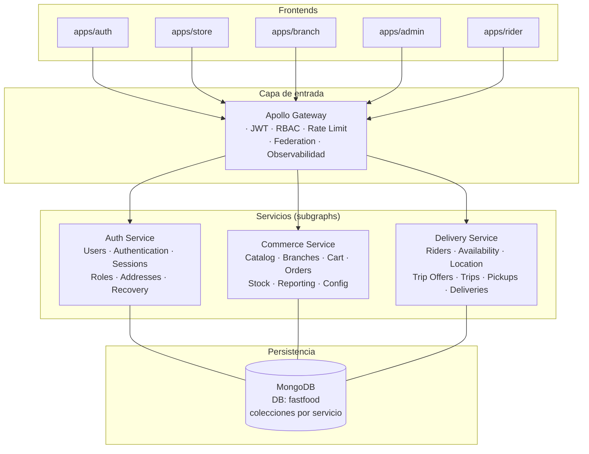
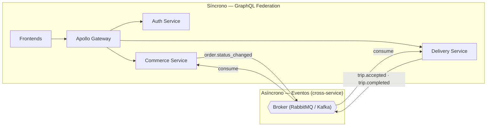
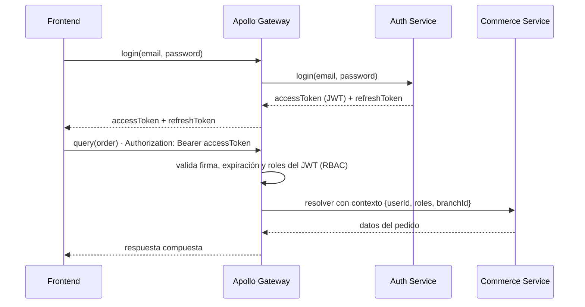
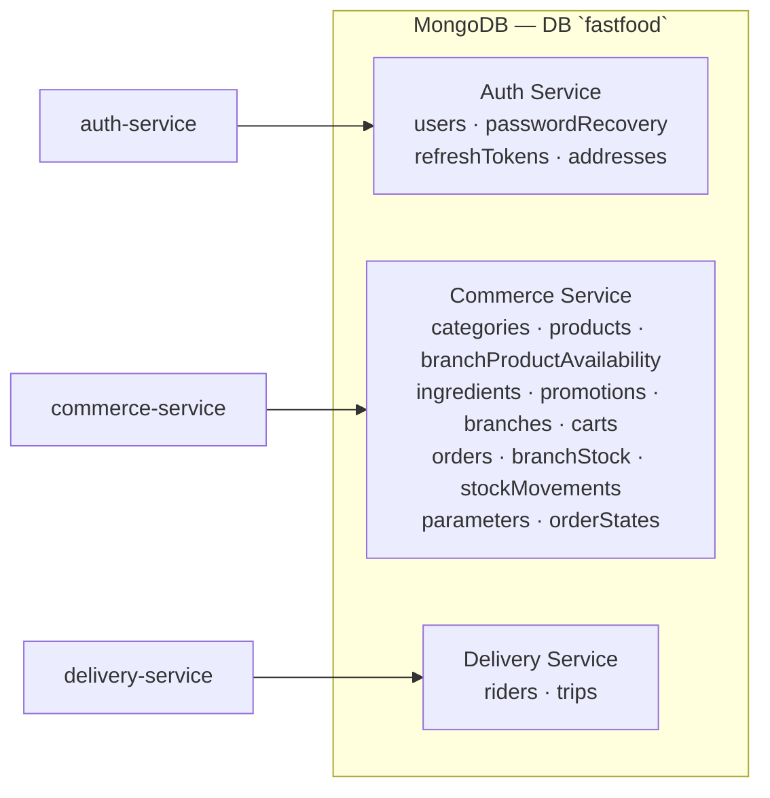

# Requerimientos — Backend (servicios)

> ⚠️ **OBSOLETO — archivado.** Esta variante (Apollo Gateway / GraphQL Federation, v2.0) fue descartada. La arquitectura canónica es `docs/requerimientos-backend-rest.md` (GraphQL Gateway + microservicios REST). Este archivo se conserva solo como histórico; su §10 (modelo de datos) fue consolidado en el documento canónico.

**Proyecto:** Plataforma de pedidos para una cadena de comidas rápidas
**Documento:** requerimientos funcionales y no funcionales del backend
**Arquitectura:** 3 servicios + Apollo Gateway (GraphQL Federation) + MongoDB
**Fuente de verdad funcional:** `docs/requerimientos-funcionales.md`
**Versión:** 2.0

> Este documento define el alcance del **backend** como un conjunto de **3 servicios** detrás de un **Apollo Gateway** (Apollo Federation), expuesto directamente a los cinco frontends. Cada servicio es dueño de sus dominios y de sus **colecciones** dentro de una única base **MongoDB** (`fastfood`).

---

## Índice

1. [Objetivo y alcance](#1-objetivo-y-alcance)
2. [Arquitectura general](#2-arquitectura-general)
3. [Servicios y responsabilidades](#3-servicios-y-responsabilidades)
4. [Capa de entrada: Apollo Gateway](#4-capa-de-entrada-apollo-gateway)
5. [Auth Service](#5-auth-service)
6. [Commerce Service](#6-commerce-service)
7. [Delivery Service](#7-delivery-service)
8. [Comunicación entre servicios](#8-comunicación-entre-servicios)
9. [Autenticación y autorización](#9-autenticación-y-autorización)
10. [Modelo de datos (MongoDB)](#10-modelo-de-datos-mongodb)
11. [Requerimientos no funcionales](#11-requerimientos-no-funcionales)
12. [Puertos locales (desarrollo)](#12-puertos-locales-desarrollo)
13. [Fuera del alcance](#13-fuera-del-alcance)

---

# 1. Objetivo y alcance

El backend da soporte a los cinco frontends (`apps/auth`, `apps/store`, `apps/branch`, `apps/admin`, `apps/rider`). Todos consumen un **único endpoint GraphQL** expuesto por el **Apollo Gateway**.

Se implementa como un conjunto de **3 servicios** más una capa de entrada:

1. **Apollo Gateway (GraphQL Federation)** — punto de entrada único: JWT, RBAC, rate limiting, federación y observabilidad. Sin lógica de negocio.
2. **Auth Service** — identidad, autenticación, sesiones, roles, direcciones y recuperación de contraseña.
3. **Commerce Service** — catálogo, sucursales, carrito, pedidos, stock, reportes y configuración.
4. **Delivery Service** — repartidores, disponibilidad, ubicación, ofertas de viaje, viajes, retiros y entregas.

Cada servicio posee sus **colecciones** dentro de una única base **MongoDB** (`fastfood`). Los servicios son **stateless**. La comunicación es **síncrona** (cliente → gateway → subgraphs, mediante GraphQL Federation) y **asíncrona** (eventos en un broker, solo entre servicios que lo requieren).

> Respecto a la versión 1.0: se elimina la capa BFF y se consolidan los 9 microservicios de dominio en 3 servicios. La orquestación que antes hacían los BFF ahora se resuelve de forma natural dentro de `Commerce Service` (sus módulos comparten el mismo contexto de datos) y en las referencias federadas del gateway.

---

# 2. Arquitectura general

```text
CLIENTS
      Auth       Store       Admin       AdminGlobal       Rider
        │          │           │              │              │
        └──────────┴───────────┴──────────────┴──────────────┘
                                   │
                                   ▼
                     ┌───────────────────────────┐
                     │      Apollo Gateway       │
                     │ JWT · RBAC · Rate Limit   │
                     │ Federation · Observability│
                     └─────────────┬─────────────┘
             ┌─────────────────────┼──────────────────────┐
             │                     │                      │
             ▼                     ▼                      ▼
     ┌───────────────┐    ┌───────────────────┐   ┌─────────────────┐
     │ AUTH SERVICE  │    │ COMMERCE SERVICE  │   │ DELIVERY SERVICE│
     │ Users         │    │ Catalog           │   │ Riders          │
     │ Authentication│    │ Branches          │   │ Availability    │
     │ Sessions      │    │ Cart              │   │ Location        │
     │ Roles         │    │ Orders            │   │ Trip Offers     │
     │ Addresses     │    │ Stock             │   │ Trips           │
     │ Recovery      │    │ Reporting         │   │ Pickups         │
     │               │    │ Config            │   │ Deliveries      │
     └───────┬───────┘    └─────────┬─────────┘   └────────┬────────┘
             │                      │                      │
             └──────────────────────┼──────────────────────┘
                                    │
                                    ▼
                         ┌──────────────────────┐
                         │       MongoDB        │
                         │    DB: fastfood      │
                         │ collections owned    │
                         │ by each service      │
                         └──────────────────────┘
```



---

# 3. Servicios y responsabilidades

| Servicio             | Responsabilidad                                                                                                                                             | Colecciones propias (MongoDB `fastfood`)                                                                                                                                        |
| -------------------- | ----------------------------------------------------------------------------------------------------------------------------------------------------------- | ------------------------------------------------------------------------------------------------------------------------------------------------------------------------------- |
| **Apollo Gateway**   | Punto de entrada único de los 5 frontends. Valida JWT, aplica RBAC/rate limiting, compone el _supergraph_ y expone observabilidad. No posee datos.          | Ninguna.                                                                                                                                                                        |
| **Auth Service**     | Registro, login, refresh, recuperación de contraseña, perfiles, direcciones del usuario, personal, roles. Emite/valida JWT.                                 | `users`, `passwordRecovery`, `refreshTokens`, `addresses`                                                                                                                       |
| **Commerce Service** | Catálogo (categorías, productos, configuraciones, ingredientes/recetas, promociones), sucursales, carrito, pedidos, stock, reportes y configuración global. | `categories`, `products`, `branchProductAvailability`, `ingredients`, `promotions`, `branches`, `carts`, `orders`, `branchStock`, `stockMovements`, `parameters`, `orderStates` |
| **Delivery Service** | Repartidores, disponibilidad/ubicación, ofertas de viaje, viajes, retiros y entregas.                                                                       | `riders`, `trips`                                                                                                                                                               |

---

# 4. Capa de entrada: Apollo Gateway

El gateway es el **router de federación** que expone un solo endpoint `POST /graphql` consumido directamente por los cinco frontends. No contiene reglas de negocio.

| ID       | Requerimiento                                                                                                                                                                  |
| -------- | ------------------------------------------------------------------------------------------------------------------------------------------------------------------------------ |
| RQ-GW-01 | El gateway deberá exponer un único endpoint GraphQL (`/graphql`) para todos los frontends.                                                                                     |
| RQ-GW-02 | El gateway deberá componer el _supergraph_ a partir de los _subgraphs_ de los 3 servicios (Apollo Federation v2).                                                              |
| RQ-GW-03 | El gateway deberá validar la firma, la expiración y los roles del JWT en cada request antes de resolver.                                                                       |
| RQ-GW-04 | El gateway deberá inyectar en el contexto GraphQL el `userId`, los `roles` y la `branchId` (si aplica) del usuario autenticado.                                                |
| RQ-GW-05 | El gateway deberá rechazar requests sin token válido en los campos/consultas protegidos, con un error de autenticación estandarizado.                                          |
| RQ-GW-06 | El gateway deberá propagar los errores de cada subgraph en un formato único (`errors[]` con código, mensaje y `path`).                                                         |
| RQ-GW-07 | El gateway deberá soportar consultas federadas que crucen servicios (ej. `Order.client` y `Trip.rider` resueltos contra Auth Service; `Order.branch` contra Commerce Service). |
| RQ-GW-08 | El gateway deberá aplicar _rate limiting_ por cliente/token.                                                                                                                   |
| RQ-GW-09 | El gateway deberá exponer `GET /health` y `GET /graphql` (sandbox) en entornos de desarrollo.                                                                                  |
| RQ-GW-10 | El gateway no deberá contener lógica de negocio de ningún dominio: solo enruta, autentica y compone.                                                                           |

### Ejemplo de query federada

```graphql
query PedidoCliente($id: ID!) {
  order(id: $id) {
    # Commerce Service
    number
    status
    total
    branch {
      name
    } # Commerce Service
    client {
      name
      email
    } # Auth Service (@key)
    items {
      product {
        name
      }
      quantity
    } # Commerce Service
  }
}
```

---

# 5. Auth Service

Dueño de la identidad, la autenticación, las sesiones, los roles, las **direcciones** del usuario y la recuperación de contraseña. Es el **único** servicio que emite y valida JWT.

### 5.1 Roles

| Rol            | Descripción                       |
| -------------- | --------------------------------- |
| `customer`     | Cliente de la Tienda.             |
| `branch_admin` | Admin de una sucursal específica. |
| `super_admin`  | Admin global.                     |
| `rider`        | Repartidor.                       |

### 5.2 Requerimientos

| ID         | Requerimiento                                                                                                                                                                      |
| ---------- | ---------------------------------------------------------------------------------------------------------------------------------------------------------------------------------- |
| RQ-AUTH-01 | El sistema deberá permitir el registro de un cliente con nombre, apellido, correo, teléfono y contraseña.                                                                          |
| RQ-AUTH-02 | El correo deberá identificar de forma única a cada usuario.                                                                                                                        |
| RQ-AUTH-03 | La contraseña deberá almacenarse con hash (bcrypt/argon2); nunca en texto plano.                                                                                                   |
| RQ-AUTH-04 | El sistema deberá permitir el login de clientes, admins y repartidores con correo y contraseña.                                                                                    |
| RQ-AUTH-05 | El login deberá devolver un `accessToken` (JWT de corta vida) y un `refreshToken`.                                                                                                 |
| RQ-AUTH-06 | El login fallido deberá devolver un error genérico ("Credenciales inválidas") sin revelar si falló el correo o la contraseña.                                                      |
| RQ-AUTH-07 | El sistema deberá permitir refrescar el `accessToken` a partir de un `refreshToken` válido.                                                                                        |
| RQ-AUTH-08 | El sistema deberá permitir cerrar sesión (revocar el `refreshToken`).                                                                                                              |
| RQ-AUTH-09 | El sistema deberá permitir solicitar recuperación de contraseña y responder de forma neutral (sin revelar si el correo existe).                                                    |
| RQ-AUTH-10 | El sistema deberá generar un token de recuperación con expiración y permitir restablecer la contraseña con él.                                                                     |
| RQ-AUTH-11 | Un usuario autenticado deberá poder consultar y modificar su propio perfil.                                                                                                        |
| RQ-AUTH-12 | El sistema deberá crearse con un administrador inicial (`super_admin`) por seed.                                                                                                   |
| RQ-AUTH-13 | Un `super_admin` deberá poder crear colaboradores de sucursal (`branch_admin`) y vincularlos a una sucursal existente (validando la sucursal contra Commerce Service vía gateway). |
| RQ-AUTH-14 | Un `super_admin` deberá poder crear otros `super_admin`.                                                                                                                           |
| RQ-AUTH-15 | El sistema deberá poder crear repartidores (`rider`) con su vehículo y teléfono.                                                                                                   |
| RQ-AUTH-16 | El sistema deberá poder activar/desactivar usuarios (sin borrado físico).                                                                                                          |
| RQ-AUTH-17 | El subgraph de Auth deberá exponer la entidad `User` como tipo federado (`@key`) para que los demás servicios la referencien.                                                      |
| RQ-AUTH-18 | El sistema deberá devolver el `role` y los datos del perfil en el `me`/`currentUser`.                                                                                              |
| RQ-AUTH-19 | Un cliente autenticado deberá poder listar sus direcciones de entrega.                                                                                                             |
| RQ-AUTH-20 | Un cliente autenticado deberá poder crear, consultar y modificar sus propias direcciones.                                                                                          |
| RQ-AUTH-21 | Un cliente autenticado deberá poder eliminar/desactivar una dirección propia.                                                                                                      |
| RQ-AUTH-22 | Una dirección deberá tener etiqueta, texto, localidad/ciudad, código postal, latitud y longitud.                                                                                   |

---

# 6. Commerce Service

Servicio que agrupa el flujo comercial completo. Sus módulos comparten el mismo contexto de datos y colaboran de forma interna (sin broker):

- **Catalog** — categorías, productos, configuraciones, ingredientes/recetas y promociones.
- **Branch** — sucursales, horarios y geolocalización.
- **Cart** — carrito, ítems y total.
- **Order** — pedidos, estados, asignación de sucursal y ETA.
- **Stock** — inventario de ingredientes por sucursal.
- **Reporting** — reportes de productos (lectura sobre las colecciones del propio servicio).
- **Config** — parámetros del sistema y catálogo de estados de pedido.

## 6.1 Catalog

| ID        | Requerimiento                                                                                                                                                                             |
| --------- | ----------------------------------------------------------------------------------------------------------------------------------------------------------------------------------------- |
| RQ-CAT-01 | Un admin global deberá poder crear, consultar, modificar y activar/desactivar categorías.                                                                                                 |
| RQ-CAT-02 | Una categoría deberá tener nombre y estado (activa/inactiva).                                                                                                                             |
| RQ-CAT-03 | Un admin global deberá poder crear, consultar, modificar y activar/desactivar productos.                                                                                                  |
| RQ-CAT-04 | Un producto deberá tener nombre, descripción, categoría, precio, imagen (opcional) y disponibilidad.                                                                                      |
| RQ-CAT-05 | El catálogo público deberá devolver únicamente categorías activas y productos disponibles (globalmente activos **y no pausados** en la sucursal correspondiente).                         |
| RQ-CAT-06 | Un producto deberá poder tener configuraciones especiales (tamaño, sabor, adicionales, eliminaciones).                                                                                    |
| RQ-CAT-07 | Cada configuración deberá indicar si es obligatoria, el tipo de selección (única/múltiple), mín/máx y sus opciones.                                                                       |
| RQ-CAT-08 | Cada opción de configuración deberá poder modificar el precio (variación `+$`).                                                                                                           |
| RQ-CAT-09 | Un admin global deberá poder mantener el catálogo de ingredientes (nombre y unidad).                                                                                                      |
| RQ-CAT-10 | Un ingrediente usado en recetas activas no deberá eliminarse, solo desactivarse.                                                                                                          |
| RQ-CAT-11 | Un admin global deberá poder definir la receta de un producto (ingrediente + cantidad).                                                                                                   |
| RQ-CAT-12 | La cantidad de un ingrediente en una receta deberá poder variar según la opción seleccionada (ej. "Doble" = 2 medallones).                                                                |
| RQ-CAT-13 | Un admin global deberá poder crear, consultar, modificar y activar/desactivar promociones como información general (sin motor de descuentos).                                             |
| RQ-CAT-14 | El subgraph de Commerce deberá exponer `Product`, `Category` e `Ingredient` como tipos federados.                                                                                         |
| RQ-CAT-15 | Un admin de sucursal (`branch_admin`) deberá poder pausar/reactivar productos en **su** sucursal, sin editar la definición global del producto.                                           |
| RQ-CAT-16 | La disponibilidad por sucursal deberá registrarse en `branchProductAvailability` (`branchId`, `productId`, `available`); el catálogo público combina el `available` global con este flag. |

## 6.2 Branch

| ID        | Requerimiento                                                                                                                            |
| --------- | ---------------------------------------------------------------------------------------------------------------------------------------- |
| RQ-BRN-01 | Un admin global deberá poder crear, consultar, modificar y activar/desactivar sucursales.                                                |
| RQ-BRN-02 | Una sucursal deberá tener nombre, dirección textual, latitud, longitud, teléfono y estado.                                               |
| RQ-BRN-03 | Una sucursal deberá tener horarios de atención por día (apertura/cierre, o cerrado).                                                     |
| RQ-BRN-04 | El sistema deberá poder listar las sucursales activas y abiertas para una ubicación (lat/lng) dentro de la distancia máxima configurada. |
| RQ-BRN-05 | El sistema deberá calcular la distancia entre la sucursal y la dirección del cliente.                                                    |
| RQ-BRN-06 | Una sucursal inactiva o cerrada no deberá aparecer como disponible para un pedido.                                                       |
| RQ-BRN-07 | El subgraph de Commerce deberá exponer `Branch` como tipo federado.                                                                      |
| RQ-BRN-08 | El módulo de Branch deberá permitir al módulo de Order consultar la sucursal activa y abierta más cercana (asignación interna).          |

## 6.3 Cart

| ID         | Requerimiento                                                                                                 |
| ---------- | ------------------------------------------------------------------------------------------------------------- |
| RQ-CART-01 | Un cliente autenticado deberá tener un carrito activo (o crearlo bajo demanda).                               |
| RQ-CART-02 | El sistema deberá agregar ítems al carrito validando que el producto y sus configuraciones estén disponibles. |
| RQ-CART-03 | Cada ítem deberá registrar producto, cantidad, observaciones y opciones seleccionadas.                        |
| RQ-CART-04 | El sistema deberá permitir modificar cantidad, observaciones y configuraciones de un ítem.                    |
| RQ-CART-05 | El sistema deberá permitir eliminar ítems del carrito.                                                        |
| RQ-CART-06 | El sistema deberá calcular el total del carrito a partir de precios, cantidades y adicionales.                |
| RQ-CART-07 | El total deberá recalcularse en el servidor (el cliente nunca lo calcula como verdad final).                  |
| RQ-CART-08 | El carrito deberá poder marcarse como "confirmado" al convertirse en pedido (RF-059).                         |
| RQ-CART-09 | Un carrito confirmado no deberá poder modificarse.                                                            |
| RQ-CART-10 | El subgraph de Commerce deberá exponer `Cart` y `CartItem` como tipos federados.                              |

## 6.4 Order

### Estados y transiciones

| Estado               | Siguientes permitidos             |
| -------------------- | --------------------------------- |
| `PENDING`            | `CONFIRMED`, `CANCELLED`          |
| `CONFIRMED`          | `PREPARING`, `CANCELLED`          |
| `PREPARING`          | `READY_FOR_DELIVERY`, `CANCELLED` |
| `READY_FOR_DELIVERY` | `ON_THE_WAY`, `CANCELLED`         |
| `ON_THE_WAY`         | `DELIVERED`, `CANCELLED`          |
| `DELIVERED`          | —                                 |
| `CANCELLED`          | —                                 |

| ID        | Requerimiento                                                                                                                                                                                              |
| --------- | ---------------------------------------------------------------------------------------------------------------------------------------------------------------------------------------------------------- |
| RQ-ORD-01 | El sistema deberá confirmar un carrito como pedido validando cliente, dirección, carrito, productos y el **stock de ingredientes** de la sucursal asignada (validación interna contra el módulo de Stock). |
| RQ-ORD-02 | Para confirmar, el cliente deberá haber seleccionado una dirección propia (validada contra Auth Service vía gateway).                                                                                      |
| RQ-ORD-03 | El sistema deberá asignar al pedido la sucursal activa y abierta más cercana dentro de la distancia máxima.                                                                                                |
| RQ-ORD-04 | Si no existe sucursal disponible, el pedido no deberá confirmarse.                                                                                                                                         |
| RQ-ORD-05 | El pedido deberá registrar cliente, sucursal asignada, dirección de entrega (snapshot), fecha y hora.                                                                                                      |
| RQ-ORD-06 | El pedido deberá guardar un snapshot del detalle (producto, nombre, precio unitario, cantidad, observaciones, opciones y subtotal).                                                                        |
| RQ-ORD-07 | El sistema deberá calcular y guardar el importe total del pedido.                                                                                                                                          |
| RQ-ORD-08 | El pedido deberá iniciar en estado `PENDING`.                                                                                                                                                              |
| RQ-ORD-09 | El sistema deberá calcular el tiempo estimado de entrega (tiempo base + traslado estimado por distancia).                                                                                                  |
| RQ-ORD-10 | El sistema deberá marcar el carrito como confirmado al crear el pedido.                                                                                                                                    |
| RQ-ORD-11 | El cliente deberá poder consultar el detalle y el historial de estados de sus propios pedidos.                                                                                                             |
| RQ-ORD-12 | El admin de sucursal deberá poder listar y operar los pedidos de **su** sucursal.                                                                                                                          |
| RQ-ORD-13 | El admin global deberá poder listar y operar los pedidos de **todas** las sucursales.                                                                                                                      |
| RQ-ORD-14 | El sistema deberá validar cada transición de estado contra la máquina de estados.                                                                                                                          |
| RQ-ORD-15 | Cada cambio de estado deberá registrar estado anterior, nuevo estado, fecha y hora.                                                                                                                        |
| RQ-ORD-16 | El repartidor deberá poder consultar los pedidos de sus viajes y marcarlos retirados/entregados (ver Delivery Service).                                                                                    |
| RQ-ORD-17 | El sistema deberá permitir repetir un pedido anterior creando un carrito nuevo con los productos que continúen disponibles.                                                                                |
| RQ-ORD-18 | El sistema deberá emitir el evento `order.status_changed` ante cada transición (consumido internamente por Stock y externamente por Delivery Service).                                                     |
| RQ-ORD-19 | El subgraph de Commerce deberá exponer `Order` y `OrderItem` como tipos federados.                                                                                                                         |
| RQ-ORD-20 | La máquina de estados (transiciones válidas) será fija en el código del módulo de Order; el catálogo de visualización de estados (código, nombre, orden) se gestiona en el módulo de Config.               |

## 6.5 Stock

| ID        | Requerimiento                                                                                                                                                                      |
| --------- | ---------------------------------------------------------------------------------------------------------------------------------------------------------------------------------- |
| RQ-STK-01 | El sistema deberá mantener el stock de ingredientes por sucursal.                                                                                                                  |
| RQ-STK-02 | El admin de sucursal deberá poder listar y ajustar el stock de **su** sucursal.                                                                                                    |
| RQ-STK-03 | El admin global deberá poder listar y ajustar el stock de **todas** las sucursales.                                                                                                |
| RQ-STK-04 | El ajuste de stock deberá registrar un movimiento (ingrediente, sucursal, cantidad, motivo/fecha).                                                                                 |
| RQ-STK-05 | Un producto se podrá preparar (y, por lo tanto, **comprar**) solo si hay stock suficiente de todos los ingredientes de su receta; sin stock, el producto no se puede comprar.      |
| RQ-STK-06 | El sistema deberá validar, al confirmar un pedido, que la sucursal asignada tenga stock suficiente de los ingredientes de cada producto; si falta stock, el pedido no se confirma. |
| RQ-STK-07 | El stock deberá descontarse cuando el pedido **entre en realización** (`PREPARING`), no al confirmar.                                                                              |
| RQ-STK-08 | El descuento deberá producirse al procesar la transición `order.status_changed` (→ `PREPARING`) dentro del propio servicio.                                                        |
| RQ-STK-09 | Si el pedido se cancela antes de entrar en realización, no deberá descontarse stock.                                                                                               |
| RQ-STK-10 | El subgraph de Commerce deberá exponer `BranchStock` e `IngredientStock` como tipos federados.                                                                                     |

## 6.6 Reporting

| ID        | Requerimiento                                                                                                                              |
| --------- | ------------------------------------------------------------------------------------------------------------------------------------------ |
| RQ-REP-01 | El sistema deberá reportar los productos **más vendidos** (cantidad, de mayor a menor).                                                    |
| RQ-REP-02 | El sistema deberá reportar los productos **menos vendidos** (incluye productos sin ventas).                                                |
| RQ-REP-03 | El sistema deberá reportar los productos **sin stock**.                                                                                    |
| RQ-REP-04 | El sistema deberá reportar los productos con **mayor facturación**.                                                                        |
| RQ-REP-05 | Los reportes deberán leerse de las colecciones del propio servicio (`orders`, `products`, `branchStock`), sin escritura de datos maestros. |
| RQ-REP-06 | El reporte de stock deberá reflejar el stock **por sucursal**; el admin de sucursal ve el suyo y el global ve todos.                       |

## 6.7 Config

### Parámetros

| ID        | Requerimiento                                                                                                                                   |
| --------- | ----------------------------------------------------------------------------------------------------------------------------------------------- |
| RQ-CFG-01 | El sistema deberá almacenar parámetros de decisión como pares clave/valor con unidad (ej. `MAX_DISTANCE_KM`, `BASE_PREP_MIN`, `AVG_SPEED_KMH`). |
| RQ-CFG-02 | El `super_admin` deberá poder listar y modificar parámetros, validando valores positivos.                                                       |
| RQ-CFG-03 | El módulo de Branch deberá leer `MAX_DISTANCE_KM` para filtrar las sucursales disponibles.                                                      |
| RQ-CFG-04 | El módulo de Order deberá leer `BASE_PREP_MIN` y `AVG_SPEED_KMH` para calcular el ETA.                                                          |

### Catálogo de estados

| ID        | Requerimiento                                                                                                                  |
| --------- | ------------------------------------------------------------------------------------------------------------------------------ |
| RQ-CFG-05 | El sistema deberá mantener el catálogo de estados de pedido (`code`, `name`, `order`, `active`) para su visualización.         |
| RQ-CFG-06 | El `super_admin` deberá poder listar y crear/modificar/activar/desactivar estados del catálogo.                                |
| RQ-CFG-07 | Las transiciones válidas entre estados seguirán controladas por el módulo de Order (máquina de estados), no por este catálogo. |
| RQ-CFG-08 | El subgraph de Commerce deberá exponer `Parameter` y `OrderState` como tipos federados.                                        |

---

# 7. Delivery Service

Dueño de los repartidores, su disponibilidad/ubicación, las ofertas de viaje y los viajes (retiros y entregas).

| ID        | Requerimiento                                                                                                                                                                   |
| --------- | ------------------------------------------------------------------------------------------------------------------------------------------------------------------------------- |
| RQ-DLV-01 | El repartidor deberá poder activar/desactivar su disponibilidad (online/offline).                                                                                               |
| RQ-DLV-02 | El repartidor deberá poder compartir su ubicación actual.                                                                                                                       |
| RQ-DLV-03 | El sistema deberá generar ofertas de viaje según la ubicación del repartidor (sin lista global), a partir de los pedidos `READY_FOR_DELIVERY` notificados por Commerce Service. |
| RQ-DLV-04 | Un viaje deberá agrupar una o más órdenes (de distintos clientes y/o sucursales).                                                                                               |
| RQ-DLV-05 | El repartidor deberá poder aceptar o rechazar una oferta de viaje; si no responde, la oferta vence.                                                                             |
| RQ-DLV-06 | Al aceptar, el viaje deberá pasar a "en curso".                                                                                                                                 |
| RQ-DLV-07 | El repartidor deberá poder marcar el retiro (`pickup`) y la entrega (`DELIVERED`) de cada orden del viaje.                                                                      |
| RQ-DLV-08 | Al entregar la última orden, el viaje deberá quedar completado.                                                                                                                 |
| RQ-DLV-09 | El repartidor no deberá poder modificar ítems ni cancelar órdenes.                                                                                                              |
| RQ-DLV-10 | El repartidor deberá poder consultar su historial de viajes.                                                                                                                    |
| RQ-DLV-11 | El repartidor deberá poder gestionar su perfil (nombre, vehículo, teléfono).                                                                                                    |
| RQ-DLV-12 | El sistema deberá emitir los eventos `trip.accepted` y `trip.completed`.                                                                                                        |
| RQ-DLV-13 | El subgraph de Delivery deberá exponer `Trip`, `TripOffer` y `Rider` como tipos federados.                                                                                      |

---

# 8. Comunicación entre servicios



| ID        | Requerimiento                                                                                                                                                               |
| --------- | --------------------------------------------------------------------------------------------------------------------------------------------------------------------------- |
| RQ-COM-01 | La comunicación síncrona deberá fluir así: **cliente → gateway → subgraphs** (federación de entidades `@key`).                                                              |
| RQ-COM-02 | Los efectos colaterales **dentro de un servicio** (descuento de stock al entrar en realización, actualización de reportes) deberán resolverse de forma interna, sin broker. |
| RQ-COM-03 | Los efectos colaterales **entre servicios** (Commerce ↔ Delivery) deberán comunicarse por eventos asíncronos en un broker.                                                  |
| RQ-COM-04 | Los eventos deberán tener un esquema versionado y un identificador de correlación (`orderId`, `tripId`).                                                                    |
| RQ-COM-05 | El consumo de eventos deberá ser idempotente (reprocesar un evento no deberá duplicar efectos).                                                                             |
| RQ-COM-06 | Ningún servicio deberá acceder directamente a las colecciones de otro servicio (cada uno opera solo sobre sus colecciones dentro de `fastfood`).                            |

### Eventos

| Evento                 | Emisor           | Consumidor       | Efecto                                                                |
| ---------------------- | ---------------- | ---------------- | --------------------------------------------------------------------- |
| `order.status_changed` | Commerce Service | Delivery Service | Generar ofertas de viaje cuando la orden pasa a `READY_FOR_DELIVERY`. |
| `trip.accepted`        | Delivery Service | Commerce Service | Marcar órdenes del viaje como asignadas a un repartidor.              |
| `trip.completed`       | Delivery Service | Commerce Service | Cierre de viaje (y actualización de estados de orden entregadas).     |

> El descuento de stock (`PREPARING`) y los reportes ya no necesitan broker: ocurren dentro de `Commerce Service` sobre sus propias colecciones.

---

# 9. Autenticación y autorización



| ID        | Requerimiento                                                                                                  |
| --------- | -------------------------------------------------------------------------------------------------------------- |
| RQ-SEC-01 | El `accessToken` deberá ser un JWT firmado con un secreto compartido entre Auth Service y el gateway.          |
| RQ-SEC-02 | El JWT deberá incluir `userId` y `roles`.                                                                      |
| RQ-SEC-03 | Cada servicio deberá aplicar autorización por rol sobre los campos/mutaciones que expone.                      |
| RQ-SEC-04 | El admin de sucursal solo deberá poder operar datos de **su** sucursal (`branchId` en el contexto).            |
| RQ-SEC-05 | El repartidor solo deberá poder operar sus propios viajes.                                                     |
| RQ-SEC-06 | Las credenciales y tokens nunca deberán registrarse en logs.                                                   |
| RQ-SEC-07 | Las contraseñas deberán almacenarse con hash; los tokens de recuperación deberán expirar y ser de un solo uso. |

---

# 10. Modelo de datos (MongoDB)

Una única base **MongoDB** (`fastfood`) donde **cada servicio es dueño de sus colecciones**. El aislamiento entre servicios se da a nivel de _colección_ (naming y permisos), no de base.



Reglas:

- **Una base, colecciones por servicio.** No se comparten colecciones entre servicios; cada uno opera solo sobre las suyas.
- Cada servicio se conecta con **credenciales propias** limitadas a sus colecciones.
- `reporting` (módulo de Commerce) lee las colecciones de `orders`/`products`/`branchStock` del propio servicio; no escribe datos maestros.
- El gateway **no tiene base de datos**.
- En desarrollo local alcanza con **un contenedor MongoDB** (`docker-compose`).
- `NFR-01` (índices) sigue aplicando por colección.

## 10.1 Auth Service — colecciones

```text
users: {
  _id, email (unique), passwordHash, role,
  firstName, lastName, phone, active,
  branchId (solo branch_admin), vehicle (solo rider), createdAt
}

passwordRecovery: { _id, userId, token, expiresAt, used }
refreshTokens:    { _id, userId, token, expiresAt, revoked }
addresses:        { _id, userId, label, text, city, postalCode, latitude, longitude, active }
```

## 10.2 Commerce Service — colecciones

```text
categories:  { _id, name, active }

products: {
  _id, categoryId, name, description, price, image, available,
  configGroups: [
    { _id, name, type, required, min, max,
      options: [ { _id, name, extraPrice, available } ] }
  ],
  recipe: [ { ingredientId, quantity, optionAdjustments? } ]
}

branchProductAvailability: { _id, branchId, productId, available }
  // available=false => branch_admin pausó el producto en esa sucursal.
  // Índice único (branchId, productId).

ingredients: { _id, name, unit, active }
promotions:  { _id, name, description, startDate, endDate, active }

branches: {
  _id, name, addressText, latitude, longitude, phone, active,
  hours: [ { dayOfWeek, opening, closing, closed } ]
}

carts: {
  _id, clientId, status (active|confirmed), createdAt,
  items: [
    { _id, productId, quantity, observations, optionIds: [] }
  ],
  total
}

orders: {
  _id, number, clientId, branchId, addressId,
  deliveryAddress: { text, latitude, longitude },  // snapshot
  status, total, estimatedDeliveryAt, createdAt,
  items: [
    { productId, name, unitPrice, quantity, observations, subtotal,
      options: [ { optionId, name, extraPrice } ] }
  ],
  statusHistory: [ { previousStatus, newStatus, changedAt } ]
}

branchStock: {
  _id, branchId, ingredientId, quantity,
  updatedAt
}

stockMovements: {
  _id, branchId, ingredientId, delta, reason (adjust|preparing), orderId?, createdAt
}

parameters: {
  _id, key (unique), value, unit
}

orderStates: {
  _id, code (unique), name, order, active
}
```

## 10.3 Delivery Service — colecciones

```text
riders: {
  _id, userId, vehicle, phone, available, currentLocation, status
}

trips: {
  _id, riderId, status (offered|active|completed|cancelled),
  orders: [ { orderId, pickup: {branchId}, delivery: {addressId}, status } ],
  startedAt, completedAt, earnings
}
```

---

# 11. Requerimientos no funcionales

| ID     | Requerimiento                                                                                                                                                                        |
| ------ | ------------------------------------------------------------------------------------------------------------------------------------------------------------------------------------ |
| NFR-01 | **Persistencia:** MongoDB; base única `fastfood` con colecciones por servicio; índices sobre los campos de consulta frecuente (`email`, `clientId`, `branchId`, `status`, `number`). |
| NFR-02 | **Statelessness:** los servicios deberán ser stateless; la sesión se resuelve vía JWT.                                                                                               |
| NFR-03 | **Observabilidad:** cada servicio deberá emitir logs estructurados y trazas con un `requestId` correlacionado desde el gateway.                                                      |
| NFR-04 | **Idempotencia:** las mutaciones que lo requieran (cambios de estado, ajustes de stock) deberán ser idempotentes.                                                                    |
| NFR-05 | **Errores:** formato único de error (`code`, `message`, `path`) y códigos de estado coherentes.                                                                                      |
| NFR-06 | **Escalabilidad:** cada servicio deberá poder escalar horizontalmente de forma independiente.                                                                                        |
| NFR-07 | **Seguridad:** hash de contraseñas (bcrypt/argon2), JWT firmado, validación de entradas y sin secretos en logs.                                                                      |
| NFR-08 | **Disponibilidad:** el gateway y los servicios deberán tener _health checks_ para orquestación.                                                                                      |
| NFR-09 | **Versionado:** los eventos y el esquema GraphQL deberán versionarse sin romper a los clientes.                                                                                      |

---

# 12. Puertos locales (desarrollo)

Convención: **gateway 4000**, **servicios 42xx**. Cada app lee su puerto de la variable de entorno `PORT`.

| Capa     | App                | Puerto local |
| -------- | ------------------ | ------------ |
| Gateway  | `gateway`          | **4000**     |
| Servicio | `auth-service`     | **4201**     |
| Servicio | `commerce-service` | **4202**     |
| Servicio | `delivery-service` | **4203**     |

Reglas:

- Los frontends (`client/`, Vite) corren en `5173`+ y apuntan al gateway en `http://localhost:4000/graphql`.
- El gateway (supergraph) apunta a los subgraphs de los servicios en sus puertos `42xx`.
- El broker y MongoDB se configuran por variables de entorno (sin puerto fijo en este documento).

---

# 13. Fuera del alcance

- Pago en línea.
- Navegación GPS real u optimización de recorridos.
- Motor automático de promociones/descuentos (solo información general).
- Reserva de stock al confirmar (el descuento es al entrar en realización).
- Notificaciones push en tiempo real.
- Auditoría completa o _outbox_ transaccional obligatorio.
- Reportes adicionales (pedidos, clientes, sucursales, promociones).
