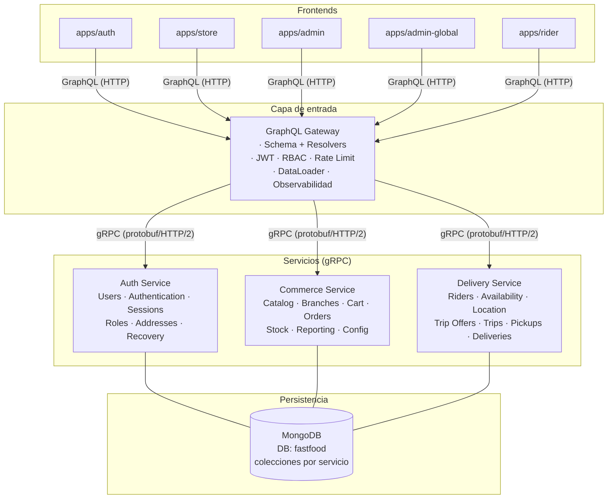
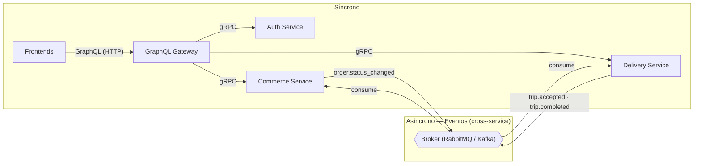
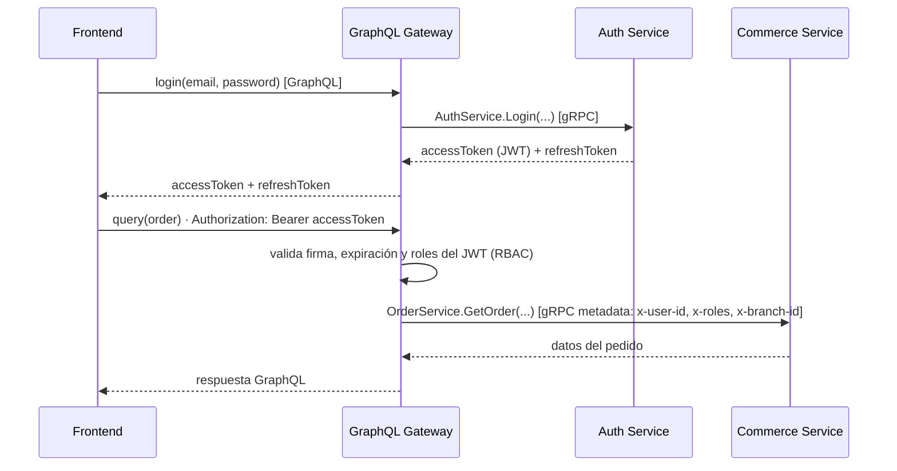
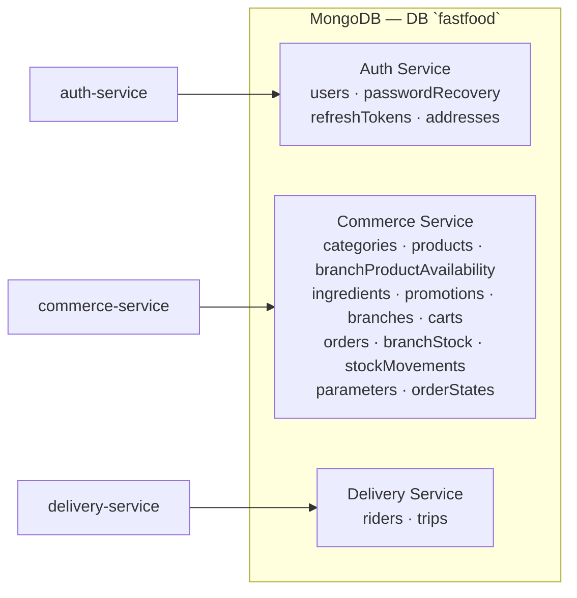

# Requerimientos — Backend (servicios, variante gRPC)

> ⚠️ **OBSOLETO — archivado.** Esta variante (GraphQL Gateway + gRPC) fue descartada. La arquitectura canónica es `docs/requerimientos-backend-rest.md` (GraphQL Gateway + microservicios REST). Este archivo se conserva solo como histórico.

**Proyecto:** Plataforma de pedidos para una cadena de comidas rápidas
**Documento:** requerimientos funcionales y no funcionales del backend (variante con gRPC)
**Arquitectura:** Frontends → GraphQL Gateway → gRPC → 3 servicios + MongoDB
**Fuente de verdad funcional:** `client/docs/requerimientos-funcionales.md`
**Versión:** 3.0 (variante gRPC)

> Este documento describe una **variante alternativa** de la arquitectura de `docs/requerimientos-backend.md` (v2.0). En lugar de un **Apollo Gateway con GraphQL Federation**, la capa de entrada es un **GraphQL Gateway** que expone un único esquema GraphQL a los cinco frontends y resuelve las consultas llamando a los servicios por **gRPC** (protobuf + HTTP/2). Los requerimientos funcionales de los dominios se mantienen; lo que cambia es el **contrato y el transporte entre el gateway y los servicios**.

---

## Índice

1. [Objetivo y alcance](#1-objetivo-y-alcance)
2. [Arquitectura general](#2-arquitectura-general)
3. [Servicios y responsabilidades](#3-servicios-y-responsabilidades)
4. [Capa de entrada: GraphQL Gateway](#4-capa-de-entrada-graphql-gateway)
5. [Contratos gRPC (IDL / protobuf)](#5-contratos-grpc-idl--protobuf)
6. [Auth Service](#6-auth-service)
7. [Commerce Service](#7-commerce-service)
8. [Delivery Service](#8-delivery-service)
9. [Comunicación entre servicios](#9-comunicación-entre-servicios)
10. [Autenticación y autorización](#10-autenticación-y-autorización)
11. [Modelo de datos (MongoDB)](#11-modelo-de-datos-mongodb)
12. [Requerimientos no funcionales](#12-requerimientos-no-funcionales)
13. [Puertos locales (desarrollo)](#13-puertos-locales-desarrollo)
14. [Fuera del alcance](#14-fuera-del-alcance)

---

# 1. Objetivo y alcance

El backend da soporte a los cinco frontends (`apps/auth`, `apps/store`, `apps/admin`, `apps/admin-global`, `apps/rider`). Todos consumen un **único endpoint GraphQL** expuesto por el **GraphQL Gateway**.

Se implementa como un conjunto de **3 servicios** más una capa de entrada:

1. **GraphQL Gateway** — punto de entrada único: esquema GraphQL propio, resolvers que traducen a gRPC, JWT, RBAC, rate limiting, DataLoader (N+1) y observabilidad. Sin lógica de negocio.
2. **Auth Service** — identidad, autenticación, sesiones, roles, direcciones y recuperación de contraseña. Expone un API **gRPC**.
3. **Commerce Service** — catálogo, sucursales, carrito, pedidos, stock, reportes y configuración. Expone un API **gRPC**.
4. **Delivery Service** — repartidores, disponibilidad, ubicación, ofertas de viaje, viajes, retiros y entregas. Expone un API **gRPC**.

Cada servicio posee sus **colecciones** dentro de una única base **MongoDB** (`fastfood`). Los servicios son **stateless**. La comunicación **síncrona** es **gRPC** (cliente → gateway por GraphQL/HTTP; gateway → servicios por gRPC). La comunicación **asíncrona** (eventos entre servicios) usa un broker.

> Respecto a la v2.0: se reemplaza Apollo Federation por **gRPC**. El gateway deja de componer subgraphs y pasa a **poseer el esquema GraphQL**; la resolución de campos y las uniones entre servicios se implementan en los **resolvers** del gateway, que invocan métodos gRPC (con DataLoader para evitar N+1). Los servicios dejan de exponer tipos federados `@key` y exponen **servicios y mensajes protobuf**.

---

# 2. Arquitectura general

```text
CLIENTS
      Auth       Store       Admin       AdminGlobal       Rider
        │          │           │              │              │
        └──────────┴───────────┴──────────────┴──────────────┘
                                   │ GraphQL (HTTP)
                                   ▼
                      ┌───────────────────────────┐
                      │      GraphQL Gateway      │
                      │ Schema · Resolvers        │
                      │ JWT · RBAC · Rate Limit   │
                      │ DataLoader · Observabilidad│
                      └─────────────┬─────────────┘
                    gRPC (protobuf / HTTP/2)
              ┌─────────────────────┼──────────────────────┐
              │                     │                      │
              ▼                     ▼                      ▼
      ┌───────────────┐    ┌───────────────────┐   ┌─────────────────┐
      │ AUTH SERVICE  │    │ COMMERCE SERVICE  │   │ DELIVERY SERVICE│
      │ Users         │    │ Catalog           │   │ Riders          │
      │ Authentication│    │ Branches          │   │ Availability    │
      │ Sessions      │    │ Cart              │   │ Location        │
      │ Roles         │    │ Orders            │   │ Trip Offers     │
      │ Addresses     │    │ Stock             │   │ Trips           │
      │ Recovery      │    │ Reporting         │   │ Pickups         │
      │               │    │ Config            │   │ Deliveries      │
      └───────┬───────┘    └─────────┬─────────┘   └────────┬────────┘
              │                      │                      │
              └──────────────────────┼──────────────────────┘
                                     │
                                     ▼
                          ┌──────────────────────┐
                          │       MongoDB        │
                          │    DB: fastfood      │
                          │ collections owned    │
                          │ by each service      │
                          └──────────────────────┘
```



---

# 3. Servicios y responsabilidades

| Servicio             | Responsabilidad                                                                                                                                                                                    | Colecciones propias (MongoDB `fastfood`)                                                                                                                                        |
| -------------------- | -------------------------------------------------------------------------------------------------------------------------------------------------------------------------------------------------- | ------------------------------------------------------------------------------------------------------------------------------------------------------------------------------- |
| **GraphQL Gateway**  | Punto de entrada único de los 5 frontends. Posee el esquema GraphQL, implementa los resolvers (traduciendo a gRPC), valida JWT, aplica RBAC/rate limiting y expone observabilidad. No posee datos. | Ninguna.                                                                                                                                                                        |
| **Auth Service**     | Registro, login, refresh, recuperación de contraseña, perfiles, direcciones del usuario, personal, roles. Emite/valida JWT. Expone un API gRPC (`auth.v1`).                                        | `users`, `passwordRecovery`, `refreshTokens`, `addresses`                                                                                                                       |
| **Commerce Service** | Catálogo (categorías, productos, configuraciones, ingredientes/recetas, promociones), sucursales, carrito, pedidos, stock, reportes y configuración global. Expone un API gRPC (`commerce.v1`).    | `categories`, `products`, `branchProductAvailability`, `ingredients`, `promotions`, `branches`, `carts`, `orders`, `branchStock`, `stockMovements`, `parameters`, `orderStates` |
| **Delivery Service** | Repartidores, disponibilidad/ubicación, ofertas de viaje, viajes, retiros y entregas. Expone un API gRPC (`delivery.v1`).                                                                          | `riders`, `trips`                                                                                                                                                               |

---

# 4. Capa de entrada: GraphQL Gateway

El gateway es el **único dueño del esquema GraphQL** y el punto de entrada de los cinco frontends. No contiene reglas de negocio: cada resolver se limita a traducir la operación GraphQL en una o más llamadas **gRPC** a los servicios y a componer la respuesta.

| ID       | Requerimiento                                                                                                                                                               |
| -------- | --------------------------------------------------------------------------------------------------------------------------------------------------------------------------- |
| RQ-GW-01 | El gateway deberá exponer un único endpoint GraphQL (`/graphql`) para todos los frontends.                                                                                  |
| RQ-GW-02 | El gateway deberá poseer y servir su propio **esquema GraphQL** (single schema, sin subgraphs ni supergraph federado).                                                      |
| RQ-GW-03 | El gateway deberá implementar **resolvers** que invoquen métodos gRPC de los 3 servicios a través de los stubs generados desde los contratos protobuf.                      |
| RQ-GW-04 | El gateway deberá validar la firma, la expiración y los roles del JWT en cada request antes de resolver.                                                                    |
| RQ-GW-05 | El gateway deberá inyectar en el contexto GraphQL el `userId`, los `roles` y la `branchId` (si aplica) del usuario autenticado.                                             |
| RQ-GW-06 | El gateway deberá rechazar requests sin token válido en los campos/consultas protegidos, con un error de autenticación estandarizado.                                       |
| RQ-GW-07 | El gateway deberá propagar los errores de cada servicio gRPC (código, mensaje, `path` y `details`) en un formato único (`errors[]` con `code`, `message`, `path`).          |
| RQ-GW-08 | El gateway deberá resolver campos que crucen servicios (ej. `Order.client` contra Auth Service; `Order.branch` contra Commerce Service) mediante llamadas gRPC adicionales. |
| RQ-GW-09 | El gateway deberá usar **DataLoader** para agrupar y deduplicar llamadas gRPC por lote y evitar el problema N+1.                                                            |
| RQ-GW-10 | El gateway deberá aplicar _rate limiting_ por cliente/token.                                                                                                                |
| RQ-GW-11 | El gateway deberá exponer `GET /health` y `GET /graphql` (sandbox) en entornos de desarrollo.                                                                               |
| RQ-GW-12 | El gateway no deberá contener lógica de negocio de ningún dominio: solo enruta, autentica, valida y traduce a gRPC.                                                         |
| RQ-GW-13 | El gateway deberá configurar los endpoints de los servicios (host:puerto) por variables de entorno y validar su conectividad vía `grpc.health.v1.Health`.                   |

### Ejemplo de resolución (antes "federado", ahora "por resolvers")

```graphql
query PedidoCliente($id: ID!) {
  order(id: $id) {
    number
    status
    total
    branch {
      name
    } # Resolver → commerce.v1.BranchService.GetBranch(branchId)
    client {
      name
      email
    } # Resolver → auth.v1.AuthService.GetUser(clientId)  (batched por DataLoader)
    items {
      product {
        name
      }
      quantity
    }
  }
}
```

```text
Gateway resolver "order":
  1. commerce.v1.OrderService.GetOrder(id)            → Order (con clientId, branchId)
  2. Resolver "client" → auth.v1.AuthService.GetUser  → User   (DataLoader)
  3. Resolver "branch" → commerce.v1.BranchService.GetBranch → Branch (DataLoader)
```

---

# 5. Contratos gRPC (IDL / protobuf)

Los contratos son la **fuente de verdad del contrato entre el gateway y los servicios**. Viven en un paquete compartido del monorepo (`packages/contracts/proto/`) y se versionan con `package` y/o versión de directorio (`auth.v1`, `commerce.v1`, `delivery.v1`).

| ID         | Requerimiento                                                                                                                                |
| ---------- | -------------------------------------------------------------------------------------------------------------------------------------------- |
| RQ-GRPC-01 | Los contratos deberán definirse en **protobuf v3** (`syntax = "proto3"`), un archivo por dominio, agrupados por paquete de versión.          |
| RQ-GRPC-02 | Los mensajes y servicios deberán organizarse en paquetes versionados (`auth.v1`, `commerce.v1`, `delivery.v1`).                              |
| RQ-GRPC-03 | El código de los stubs (servidor y cliente) deberá generarse desde los `.proto` y compartirse entre gateway y servicios (no duplicarse).     |
| RQ-GRPC-04 | Cada servicio deberá implementar el health check estándar `grpc.health.v1.Health` (`Check`).                                                 |
| RQ-GRPC-05 | Los contratos deberán versionarse sin romper a los clientes (campos nuevos son aditivos; cambios incompatibles crean una nueva versión).     |
| RQ-GRPC-06 | Los campos obligatorios, opcionales, repetidos y sus tipos deberán estar explícitos en el `.proto` (sin ambigüedades entre ausencia y cero). |
| RQ-GRPC-07 | Los errores de negocio deberán transportarse como `google.rpc.Status` (código + mensaje + `details`) o un error estándar por servicio.       |

### Estructura de los contratos

```text
packages/contracts/proto/
├── common/
│   └── v1/
│       └── common.proto       # Empty, paginación, coordenadas, errores compartidos
├── auth/
│   └── v1/
│       └── auth.proto         # AuthService + AddressService
├── commerce/
│   └── v1/
│       ├── catalog.proto      # CatalogService
│       ├── branch.proto       # BranchService
│       ├── cart.proto         # CartService
│       ├── order.proto        # OrderService
│       ├── stock.proto        # StockService
│       ├── reporting.proto    # ReportingService
│       └── config.proto       # ConfigService
└── delivery/
    └── v1/
        └── delivery.proto     # DeliveryService
```

### Ejemplo de contrato (referencia)

```proto
// common/v1/common.proto
syntax = "proto3";
package common.v1;

message Empty {}

message GeoPoint {
  double latitude = 1;
  double longitude = 2;
}

message PageRequest {
  int32 limit = 1;
  int32 offset = 2;
}

message PageInfo {
  int32 total = 1;
  int32 limit = 2;
  int32 offset = 3;
}
```

```proto
// auth/v1/auth.proto
syntax = "proto3";
package auth.v1;

import "common/v1/common.proto";

enum Role {
  ROLE_UNSPECIFIED = 0;
  CUSTOMER = 1;
  BRANCH_ADMIN = 2;
  SUPER_ADMIN = 3;
  RIDER = 4;
}

message User {
  string id = 1;
  string email = 2;
  string first_name = 3;
  string last_name = 4;
  string phone = 5;
  Role role = 6;
  bool active = 7;
  string branch_id = 8;        // solo branch_admin
  string vehicle = 9;          // solo rider
}

message Address {
  string id = 1;
  string user_id = 2;
  string label = 3;
  string text = 4;
  string city = 5;
  string postal_code = 6;
  double latitude = 7;
  double longitude = 8;
  bool active = 9;
}

message AuthTokens {
  string access_token = 1;
  string refresh_token = 2;
}

message RegisterRequest { string first_name = 1; string last_name = 2; string email = 3; string phone = 4; string password = 5; }
message LoginRequest { string email = 1; string password = 2; }
message RefreshTokenRequest { string refresh_token = 1; }
message LogoutRequest { string refresh_token = 1; }
message RequestPasswordRecoveryRequest { string email = 1; }
message ResetPasswordRequest { string token = 1; string new_password = 2; }
message GetUserRequest { string user_id = 1; }
message GetCurrentUserRequest {}
message UpdateProfileRequest { string user_id = 1; string first_name = 2; string last_name = 3; string phone = 4; }
message CreateStaffRequest { string first_name = 1; string last_name = 2; string email = 3; string phone = 4; string password = 5; Role role = 6; string branch_id = 7; }
message CreateRiderRequest { string first_name = 1; string last_name = 2; string email = 3; string phone = 4; string password = 5; string vehicle = 6; }
message SetUserActiveRequest { string user_id = 1; bool active = 2; }
message ListUsersRequest { PageRequest page = 1; Role role = 2; }

message ListUsersResponse { repeated User users = 1; PageInfo page = 2; }

message ListAddressesRequest { string user_id = 1; }
message ListAddressesResponse { repeated Address addresses = 1; }
message CreateAddressRequest { string user_id = 1; string label = 2; string text = 3; string city = 4; string postal_code = 5; double latitude = 6; double longitude = 7; }
message UpdateAddressRequest { string address_id = 1; string user_id = 2; string label = 3; string text = 4; string city = 5; string postal_code = 6; double latitude = 7; double longitude = 8; }
message DeleteAddressRequest { string address_id = 1; string user_id = 2; }
message GetAddressRequest { string address_id = 1; string user_id = 2; }

service AuthService {
  rpc Register(RegisterRequest) returns (AuthTokens);
  rpc Login(LoginRequest) returns (AuthTokens);
  rpc RefreshToken(RefreshTokenRequest) returns (AuthTokens);
  rpc Logout(LogoutRequest) returns (common.v1.Empty);
  rpc RequestPasswordRecovery(RequestPasswordRecoveryRequest) returns (common.v1.Empty);
  rpc ResetPassword(ResetPasswordRequest) returns (common.v1.Empty);
  rpc GetUser(GetUserRequest) returns (User);
  rpc GetCurrentUser(GetCurrentUserRequest) returns (User);
  rpc UpdateProfile(UpdateProfileRequest) returns (User);
  rpc CreateStaff(CreateStaffRequest) returns (User);
  rpc CreateRider(CreateRiderRequest) returns (User);
  rpc SetUserActive(SetUserActiveRequest) returns (User);
  rpc ListUsers(ListUsersRequest) returns (ListUsersResponse);
  rpc ListAddresses(ListAddressesRequest) returns (ListAddressesResponse);
  rpc CreateAddress(CreateAddressRequest) returns (Address);
  rpc UpdateAddress(UpdateAddressRequest) returns (Address);
  rpc DeleteAddress(DeleteAddressRequest) returns (common.v1.Empty);
  rpc GetAddress(GetAddressRequest) returns (Address);
}
```

> Los archivos `commerce/v1/*.proto` y `delivery/v1/delivery.proto` siguen la misma convención (un `service` por módulo de dominio, mensajes request/response explícitos). Se definen en detalle en la implementación; este documento fija los servicios y sus operaciones en las secciones 6–8.

---

# 6. Auth Service

Dueño de la identidad, la autenticación, las sesiones, los roles, las **direcciones** del usuario y la recuperación de contraseña. Es el **único** servicio que emite y valida JWT. Expone el paquete gRPC `auth.v1`.

### 6.1 Roles

| Rol            | Descripción                       |
| -------------- | --------------------------------- |
| `customer`     | Cliente de la Tienda.             |
| `branch_admin` | Admin de una sucursal específica. |
| `super_admin`  | Admin global.                     |
| `rider`        | Repartidor.                       |

### 6.2 Requerimientos

| ID         | Requerimiento                                                                                                                                                                   |
| ---------- | ------------------------------------------------------------------------------------------------------------------------------------------------------------------------------- |
| RQ-AUTH-01 | El sistema deberá permitir el registro de un cliente con nombre, apellido, correo, teléfono y contraseña.                                                                       |
| RQ-AUTH-02 | El correo deberá identificar de forma única a cada usuario.                                                                                                                     |
| RQ-AUTH-03 | La contraseña deberá almacenarse con hash (bcrypt/argon2); nunca en texto plano.                                                                                                |
| RQ-AUTH-04 | El sistema deberá permitir el login de clientes, admins y repartidores con correo y contraseña.                                                                                 |
| RQ-AUTH-05 | El login deberá devolver un `accessToken` (JWT de corta vida) y un `refreshToken`.                                                                                              |
| RQ-AUTH-06 | El login fallido deberá devolver un error genérico ("Credenciales inválidas") sin revelar si falló el correo o la contraseña.                                                   |
| RQ-AUTH-07 | El sistema deberá permitir refrescar el `accessToken` a partir de un `refreshToken` válido.                                                                                     |
| RQ-AUTH-08 | El sistema deberá permitir cerrar sesión (revocar el `refreshToken`).                                                                                                           |
| RQ-AUTH-09 | El sistema deberá permitir solicitar recuperación de contraseña y responder de forma neutral (sin revelar si el correo existe).                                                 |
| RQ-AUTH-10 | El sistema deberá generar un token de recuperación con expiración y permitir restablecer la contraseña con él.                                                                  |
| RQ-AUTH-11 | Un usuario autenticado deberá poder consultar y modificar su propio perfil.                                                                                                     |
| RQ-AUTH-12 | El sistema deberá crearse con un administrador inicial (`super_admin`) por seed.                                                                                                |
| RQ-AUTH-13 | Un `super_admin` deberá poder crear colaboradores de sucursal (`branch_admin`) y vincularlos a una sucursal existente (validando la sucursal contra Commerce Service vía gRPC). |
| RQ-AUTH-14 | Un `super_admin` deberá poder crear otros `super_admin`.                                                                                                                        |
| RQ-AUTH-15 | El sistema deberá poder crear repartidores (`rider`) con su vehículo y teléfono.                                                                                                |
| RQ-AUTH-16 | El sistema deberá poder activar/desactivar usuarios (sin borrado físico).                                                                                                       |
| RQ-AUTH-17 | El servicio deberá exponer el método gRPC `GetUser` para que el gateway y otros servicios resuelvan la entidad `User` por id.                                                   |
| RQ-AUTH-18 | El sistema deberá devolver el `role` y los datos del perfil en el `GetCurrentUser`.                                                                                             |
| RQ-AUTH-19 | Un cliente autenticado deberá poder listar sus direcciones de entrega.                                                                                                          |
| RQ-AUTH-20 | Un cliente autenticado deberá poder crear, consultar y modificar sus propias direcciones.                                                                                       |
| RQ-AUTH-21 | Un cliente autenticado deberá poder eliminar/desactivar una dirección propia.                                                                                                   |
| RQ-AUTH-22 | Una dirección deberá tener etiqueta, texto, localidad/ciudad, código postal, latitud y longitud.                                                                                |

---

# 7. Commerce Service

Servicio que agrupa el flujo comercial completo. Sus módulos comparten el mismo contexto de datos y colaboran de forma interna (sin broker). Expone el paquete gRPC `commerce.v1` (un `service` gRPC por módulo de dominio: `CatalogService`, `BranchService`, `CartService`, `OrderService`, `StockService`, `ReportingService`, `ConfigService`).

- **Catalog** — categorías, productos, configuraciones, ingredientes/recetas y promociones.
- **Branch** — sucursales, horarios y geolocalización.
- **Cart** — carrito, ítems y total.
- **Order** — pedidos, estados, asignación de sucursal y ETA.
- **Stock** — inventario de ingredientes por sucursal.
- **Reporting** — reportes de productos (lectura sobre las colecciones del propio servicio).
- **Config** — parámetros del sistema y catálogo de estados de pedido.

## 7.1 Catalog

| ID        | Requerimiento                                                                                                                                                                             |
| --------- | ----------------------------------------------------------------------------------------------------------------------------------------------------------------------------------------- |
| RQ-CAT-01 | Un admin global deberá poder crear, consultar, modificar y activar/desactivar categorías.                                                                                                 |
| RQ-CAT-02 | Una categoría deberá tener nombre y estado (activa/inactiva).                                                                                                                             |
| RQ-CAT-03 | Un admin global deberá poder crear, consultar, modificar y activar/desactivar productos.                                                                                                  |
| RQ-CAT-04 | Un producto deberá tener nombre, descripción, categoría, precio, imagen (opcional) y disponibilidad.                                                                                      |
| RQ-CAT-05 | El catálogo público deberá devolver únicamente categorías activas y productos disponibles (globalmente activos **y no pausados** en la sucursal correspondiente).                         |
| RQ-CAT-06 | Un producto deberá poder tener configuraciones especiales (tamaño, sabor, adicionales, eliminaciones).                                                                                    |
| RQ-CAT-07 | Cada configuración deberá indicar si es obligatoria, el tipo de selección (única/múltiple), mín/máx y sus opciones.                                                                       |
| RQ-CAT-08 | Cada opción de configuración deberá poder modificar el precio (variación `+$`).                                                                                                           |
| RQ-CAT-09 | Un admin global deberá poder mantener el catálogo de ingredientes (nombre y unidad).                                                                                                      |
| RQ-CAT-10 | Un ingrediente usado en recetas activas no deberá eliminarse, solo desactivarse.                                                                                                          |
| RQ-CAT-11 | Un admin global deberá poder definir la receta de un producto (ingrediente + cantidad).                                                                                                   |
| RQ-CAT-12 | La cantidad de un ingrediente en una receta deberá poder variar según la opción seleccionada (ej. "Doble" = 2 medallones).                                                                |
| RQ-CAT-13 | Un admin global deberá poder crear, consultar, modificar y activar/desactivar promociones como información general (sin motor de descuentos).                                             |
| RQ-CAT-14 | El `CatalogService` gRPC deberá exponer `GetProduct`, `GetCategory`, `GetIngredient` y sus listados para que el gateway resuelva los campos correspondientes.                             |
| RQ-CAT-15 | Un admin de sucursal (`branch_admin`) deberá poder pausar/reactivar productos en **su** sucursal, sin editar la definición global del producto.                                           |
| RQ-CAT-16 | La disponibilidad por sucursal deberá registrarse en `branchProductAvailability` (`branchId`, `productId`, `available`); el catálogo público combina el `available` global con este flag. |

## 7.2 Branch

| ID        | Requerimiento                                                                                                                            |
| --------- | ---------------------------------------------------------------------------------------------------------------------------------------- |
| RQ-BRN-01 | Un admin global deberá poder crear, consultar, modificar y activar/desactivar sucursales.                                                |
| RQ-BRN-02 | Una sucursal deberá tener nombre, dirección textual, latitud, longitud, teléfono y estado.                                               |
| RQ-BRN-03 | Una sucursal deberá tener horarios de atención por día (apertura/cierre, o cerrado).                                                     |
| RQ-BRN-04 | El sistema deberá poder listar las sucursales activas y abiertas para una ubicación (lat/lng) dentro de la distancia máxima configurada. |
| RQ-BRN-05 | El sistema deberá calcular la distancia entre la sucursal y la dirección del cliente.                                                    |
| RQ-BRN-06 | Una sucursal inactiva o cerrada no deberá aparecer como disponible para un pedido.                                                       |
| RQ-BRN-07 | El `BranchService` gRPC deberá exponer `GetBranch` para que el gateway resuelva `Order.branch` y otros campos.                           |
| RQ-BRN-08 | El módulo de Branch deberá permitir al módulo de Order consultar la sucursal activa y abierta más cercana (asignación interna).          |

## 7.3 Cart

| ID         | Requerimiento                                                                                                 |
| ---------- | ------------------------------------------------------------------------------------------------------------- |
| RQ-CART-01 | Un cliente autenticado deberá tener un carrito activo (o crearlo bajo demanda).                               |
| RQ-CART-02 | El sistema deberá agregar ítems al carrito validando que el producto y sus configuraciones estén disponibles. |
| RQ-CART-03 | Cada ítem deberá registrar producto, cantidad, observaciones y opciones seleccionadas.                        |
| RQ-CART-04 | El sistema deberá permitir modificar cantidad, observaciones y configuraciones de un ítem.                    |
| RQ-CART-05 | El sistema deberá permitir eliminar ítems del carrito.                                                        |
| RQ-CART-06 | El sistema deberá calcular el total del carrito a partir de precios, cantidades y adicionales.                |
| RQ-CART-07 | El total deberá recalcularse en el servidor (el cliente nunca lo calcula como verdad final).                  |
| RQ-CART-08 | El carrito deberá poder marcarse como "confirmado" al convertirse en pedido (RF-059).                         |
| RQ-CART-09 | Un carrito confirmado no deberá poder modificarse.                                                            |
| RQ-CART-10 | El `CartService` gRPC deberá exponer `GetCart`, `AddItem`, `UpdateItem`, `RemoveItem` y `ConfirmCart`.        |

## 7.4 Order

### Estados y transiciones

| Estado               | Siguientes permitidos             |
| -------------------- | --------------------------------- |
| `PENDING`            | `CONFIRMED`, `CANCELLED`          |
| `CONFIRMED`          | `PREPARING`, `CANCELLED`          |
| `PREPARING`          | `READY_FOR_DELIVERY`, `CANCELLED` |
| `READY_FOR_DELIVERY` | `ON_THE_WAY`, `CANCELLED`         |
| `ON_THE_WAY`         | `DELIVERED`, `CANCELLED`          |
| `DELIVERED`          | —                                 |
| `CANCELLED`          | —                                 |

| ID        | Requerimiento                                                                                                                                                                                              |
| --------- | ---------------------------------------------------------------------------------------------------------------------------------------------------------------------------------------------------------- |
| RQ-ORD-01 | El sistema deberá confirmar un carrito como pedido validando cliente, dirección, carrito, productos y el **stock de ingredientes** de la sucursal asignada (validación interna contra el módulo de Stock). |
| RQ-ORD-02 | Para confirmar, el cliente deberá haber seleccionado una dirección propia (validada contra Auth Service vía gRPC, orquestada por el gateway).                                                              |
| RQ-ORD-03 | El sistema deberá asignar al pedido la sucursal activa y abierta más cercana dentro de la distancia máxima.                                                                                                |
| RQ-ORD-04 | Si no existe sucursal disponible, el pedido no deberá confirmarse.                                                                                                                                         |
| RQ-ORD-05 | El pedido deberá registrar cliente, sucursal asignada, dirección de entrega (snapshot), fecha y hora.                                                                                                      |
| RQ-ORD-06 | El pedido deberá guardar un snapshot del detalle (producto, nombre, precio unitario, cantidad, observaciones, opciones y subtotal).                                                                        |
| RQ-ORD-07 | El sistema deberá calcular y guardar el importe total del pedido.                                                                                                                                          |
| RQ-ORD-08 | El pedido deberá iniciar en estado `PENDING`.                                                                                                                                                              |
| RQ-ORD-09 | El sistema deberá calcular el tiempo estimado de entrega (tiempo base + traslado estimado por distancia).                                                                                                  |
| RQ-ORD-10 | El sistema deberá marcar el carrito como confirmado al crear el pedido.                                                                                                                                    |
| RQ-ORD-11 | El cliente deberá poder consultar el detalle y el historial de estados de sus propios pedidos.                                                                                                             |
| RQ-ORD-12 | El admin de sucursal deberá poder listar y operar los pedidos de **su** sucursal.                                                                                                                          |
| RQ-ORD-13 | El admin global deberá poder listar y operar los pedidos de **todas** las sucursales.                                                                                                                      |
| RQ-ORD-14 | El sistema deberá validar cada transición de estado contra la máquina de estados.                                                                                                                          |
| RQ-ORD-15 | Cada cambio de estado deberá registrar estado anterior, nuevo estado, fecha y hora.                                                                                                                        |
| RQ-ORD-16 | El repartidor deberá poder consultar los pedidos de sus viajes y marcarlos retirados/entregados (ver Delivery Service).                                                                                    |
| RQ-ORD-17 | El sistema deberá permitir repetir un pedido anterior creando un carrito nuevo con los productos que continúen disponibles.                                                                                |
| RQ-ORD-18 | El sistema deberá emitir el evento `order.status_changed` ante cada transición (consumido internamente por Stock y externamente por Delivery Service).                                                     |
| RQ-ORD-19 | El `OrderService` gRPC deberá exponer `GetOrder`, `ListOrders`, `ConfirmOrder`, `ChangeOrderStatus` y `RepeatOrder`.                                                                                       |
| RQ-ORD-20 | La máquina de estados (transiciones válidas) será fija en el código del módulo de Order; el catálogo de visualización de estados (código, nombre, orden) se gestiona en el módulo de Config.               |

## 7.5 Stock

| ID        | Requerimiento                                                                                                                                                                      |
| --------- | ---------------------------------------------------------------------------------------------------------------------------------------------------------------------------------- |
| RQ-STK-01 | El sistema deberá mantener el stock de ingredientes por sucursal.                                                                                                                  |
| RQ-STK-02 | El admin de sucursal deberá poder listar y ajustar el stock de **su** sucursal.                                                                                                    |
| RQ-STK-03 | El admin global deberá poder listar y ajustar el stock de **todas** las sucursales.                                                                                                |
| RQ-STK-04 | El ajuste de stock deberá registrar un movimiento (ingrediente, sucursal, cantidad, motivo/fecha).                                                                                 |
| RQ-STK-05 | Un producto se podrá preparar (y, por lo tanto, **comprar**) solo si hay stock suficiente de todos los ingredientes de su receta; sin stock, el producto no se puede comprar.      |
| RQ-STK-06 | El sistema deberá validar, al confirmar un pedido, que la sucursal asignada tenga stock suficiente de los ingredientes de cada producto; si falta stock, el pedido no se confirma. |
| RQ-STK-07 | El stock deberá descontarse cuando el pedido **entre en realización** (`PREPARING`), no al confirmar.                                                                              |
| RQ-STK-08 | El descuento deberá producirse al procesar la transición `order.status_changed` (→ `PREPARING`) dentro del propio servicio.                                                        |
| RQ-STK-09 | Si el pedido se cancela antes de entrar en realización, no deberá descontarse stock.                                                                                               |
| RQ-STK-10 | El `StockService` gRPC deberá exponer `ListBranchStock` y `AdjustStock` (y sus variantes por sucursal).                                                                            |

## 7.6 Reporting

| ID        | Requerimiento                                                                                                                              |
| --------- | ------------------------------------------------------------------------------------------------------------------------------------------ |
| RQ-REP-01 | El sistema deberá reportar los productos **más vendidos** (cantidad, de mayor a menor).                                                    |
| RQ-REP-02 | El sistema deberá reportar los productos **menos vendidos** (incluye productos sin ventas).                                                |
| RQ-REP-03 | El sistema deberá reportar los productos **sin stock**.                                                                                    |
| RQ-REP-04 | El sistema deberá reportar los productos con **mayor facturación**.                                                                        |
| RQ-REP-05 | Los reportes deberán leerse de las colecciones del propio servicio (`orders`, `products`, `branchStock`), sin escritura de datos maestros. |
| RQ-REP-06 | El reporte de stock deberá reflejar el stock **por sucursal**; el admin de sucursal ve el suyo y el global ve todos.                       |

## 7.7 Config

### Parámetros

| ID        | Requerimiento                                                                                                                                   |
| --------- | ----------------------------------------------------------------------------------------------------------------------------------------------- |
| RQ-CFG-01 | El sistema deberá almacenar parámetros de decisión como pares clave/valor con unidad (ej. `MAX_DISTANCE_KM`, `BASE_PREP_MIN`, `AVG_SPEED_KMH`). |
| RQ-CFG-02 | El `super_admin` deberá poder listar y modificar parámetros, validando valores positivos.                                                       |
| RQ-CFG-03 | El módulo de Branch deberá leer `MAX_DISTANCE_KM` para filtrar las sucursales disponibles.                                                      |
| RQ-CFG-04 | El módulo de Order deberá leer `BASE_PREP_MIN` y `AVG_SPEED_KMH` para calcular el ETA.                                                          |

### Catálogo de estados

| ID        | Requerimiento                                                                                                                       |
| --------- | ----------------------------------------------------------------------------------------------------------------------------------- |
| RQ-CFG-05 | El sistema deberá mantener el catálogo de estados de pedido (`code`, `name`, `order`, `active`) para su visualización.              |
| RQ-CFG-06 | El `super_admin` deberá poder listar y crear/modificar/activar/desactivar estados del catálogo.                                     |
| RQ-CFG-07 | Las transiciones válidas entre estados seguirán controladas por el módulo de Order (máquina de estados), no por este catálogo.      |
| RQ-CFG-08 | El `ConfigService` gRPC deberá exponer `GetParameter`, `ListParameters`, `UpdateParameter`, `ListOrderStates` y `UpsertOrderState`. |

---

# 8. Delivery Service

Dueño de los repartidores, su disponibilidad/ubicación, las ofertas de viaje y los viajes (retiros y entregas). Expone el paquete gRPC `delivery.v1` (`DeliveryService`).

| ID        | Requerimiento                                                                                                                                                                                  |
| --------- | ---------------------------------------------------------------------------------------------------------------------------------------------------------------------------------------------- |
| RQ-DLV-01 | El repartidor deberá poder activar/desactivar su disponibilidad (online/offline).                                                                                                              |
| RQ-DLV-02 | El repartidor deberá poder compartir su ubicación actual.                                                                                                                                      |
| RQ-DLV-03 | El sistema deberá generar ofertas de viaje según la ubicación del repartidor (sin lista global), a partir de los pedidos `READY_FOR_DELIVERY` notificados por Commerce Service.                |
| RQ-DLV-04 | Un viaje deberá agrupar una o más órdenes (de distintos clientes y/o sucursales).                                                                                                              |
| RQ-DLV-05 | El repartidor deberá poder aceptar o rechazar una oferta de viaje; si no responde, la oferta vence.                                                                                            |
| RQ-DLV-06 | Al aceptar, el viaje deberá pasar a "en curso".                                                                                                                                                |
| RQ-DLV-07 | El repartidor deberá poder marcar el retiro (`pickup`) y la entrega (`DELIVERED`) de cada orden del viaje.                                                                                     |
| RQ-DLV-08 | Al entregar la última orden, el viaje deberá quedar completado.                                                                                                                                |
| RQ-DLV-09 | El repartidor no deberá poder modificar ítems ni cancelar órdenes.                                                                                                                             |
| RQ-DLV-10 | El repartidor deberá poder consultar su historial de viajes.                                                                                                                                   |
| RQ-DLV-11 | El repartidor deberá poder gestionar su perfil (nombre, vehículo, teléfono).                                                                                                                   |
| RQ-DLV-12 | El sistema deberá emitir los eventos `trip.accepted` y `trip.completed`.                                                                                                                       |
| RQ-DLV-13 | El `DeliveryService` gRPC deberá exponer `SetAvailability`, `UpdateLocation`, `ListTripOffers`, `AcceptTrip`, `RejectTrip`, `MarkPickup`, `MarkDelivered`, `ListTrips` y `UpdateRiderProfile`. |

---

# 9. Comunicación entre servicios



| ID        | Requerimiento                                                                                                                                                                                                                                                |
| --------- | ------------------------------------------------------------------------------------------------------------------------------------------------------------------------------------------------------------------------------------------------------------ |
| RQ-COM-01 | La comunicación síncrona deberá fluir así: **cliente → gateway (GraphQL/HTTP) → servicios (gRPC)**, usando los stubs generados desde los contratos protobuf.                                                                                                 |
| RQ-COM-02 | Los efectos colaterales **dentro de un servicio** (descuento de stock al entrar en realización, actualización de reportes) deberán resolverse de forma interna, sin broker.                                                                                  |
| RQ-COM-03 | Los efectos colaterales **entre servicios** (Commerce ↔ Delivery) deberán comunicarse por eventos asíncronos en un broker.                                                                                                                                   |
| RQ-COM-04 | Los eventos deberán tener un esquema versionado y un identificador de correlación (`orderId`, `tripId`).                                                                                                                                                     |
| RQ-COM-05 | El consumo de eventos deberá ser idempotente (reprocesar un evento no deberá duplicar efectos).                                                                                                                                                              |
| RQ-COM-06 | Ningún servicio deberá acceder directamente a las colecciones de otro servicio (cada uno opera solo sobre sus colecciones dentro de `fastfood`).                                                                                                             |
| RQ-COM-07 | Si un servicio necesita datos de otro en una operación síncrona (ej. confirmar pedido valida la dirección del cliente), la orquestación la hará el gateway o un orchestrator del servicio, **nunca** un servicio primario llamando a otro servicio primario. |

### Eventos

| Evento                 | Emisor           | Consumidor       | Efecto                                                                |
| ---------------------- | ---------------- | ---------------- | --------------------------------------------------------------------- |
| `order.status_changed` | Commerce Service | Delivery Service | Generar ofertas de viaje cuando la orden pasa a `READY_FOR_DELIVERY`. |
| `trip.accepted`        | Delivery Service | Commerce Service | Marcar órdenes del viaje como asignadas a un repartidor.              |
| `trip.completed`       | Delivery Service | Commerce Service | Cierre de viaje (y actualización de estados de orden entregadas).     |

> El descuento de stock (`PREPARING`) y los reportes ya no necesitan broker: ocurren dentro de `Commerce Service` sobre sus propias colecciones. A diferencia de la federación, aquí el **gateway** resuelve las uniones entre servicios (ej. `Order.client`, `Trip.rider`) llamando a gRPC con DataLoader.

---

# 10. Autenticación y autorización



| ID        | Requerimiento                                                                                                                      |
| --------- | ---------------------------------------------------------------------------------------------------------------------------------- |
| RQ-SEC-01 | El `accessToken` deberá ser un JWT firmado con un secreto compartido entre Auth Service y el gateway.                              |
| RQ-SEC-02 | El JWT deberá incluir `userId` y `roles`.                                                                                          |
| RQ-SEC-03 | El gateway deberá propagar el contexto de identidad (`userId`, `roles`, `branchId`) a los servicios mediante **metadata gRPC**.    |
| RQ-SEC-04 | Cada servicio deberá aplicar autorización por rol sobre los métodos gRPC que expone (defensa en profundidad).                      |
| RQ-SEC-05 | El admin de sucursal solo deberá poder operar datos de **su** sucursal (`branchId` en el contexto).                                |
| RQ-SEC-06 | El repartidor solo deberá poder operar sus propios viajes.                                                                         |
| RQ-SEC-07 | Las credenciales y tokens nunca deberán registrarse en logs.                                                                       |
| RQ-SEC-08 | Las contraseñas deberán almacenarse con hash; los tokens de recuperación deberán expirar y ser de un solo uso.                     |
| RQ-SEC-09 | El puerto gRPC de los servicios no deberá exponerse a la red pública; solo el gateway (y otros servicios autorizados) lo alcanzan. |

---

# 11. Modelo de datos (MongoDB)

Una única base **MongoDB** (`fastfood`) donde **cada servicio es dueño de sus colecciones**. El aislamiento entre servicios se da a nivel de _colección_ (naming y permisos), no de base. El modelo de datos es **idéntico** al de `docs/requerimientos-backend.md` v2.0 (el cambio es solo el transporte gateway↔servicios).



Reglas:

- **Una base, colecciones por servicio.** No se comparten colecciones entre servicios; cada uno opera solo sobre las suyas.
- Cada servicio se conecta con **credenciales propias** limitadas a sus colecciones.
- `reporting` (módulo de Commerce) lee las colecciones de `orders`/`products`/`branchStock` del propio servicio; no escribe datos maestros.
- El gateway **no tiene base de datos**.
- En desarrollo local alcanza con **un contenedor MongoDB** (`docker-compose`).
- `NFR-01` (índices) sigue aplicando por colección.

> Los esquemas de colección son los definidos en `docs/requerimientos-backend.md` §10 (Auth Service, Commerce Service y Delivery Service). Se omiten aquí para no duplicar contenido; esta variante no altera el modelo de datos.

---

# 12. Requerimientos no funcionales

| ID     | Requerimiento                                                                                                                                                                        |
| ------ | ------------------------------------------------------------------------------------------------------------------------------------------------------------------------------------ |
| NFR-01 | **Persistencia:** MongoDB; base única `fastfood` con colecciones por servicio; índices sobre los campos de consulta frecuente (`email`, `clientId`, `branchId`, `status`, `number`). |
| NFR-02 | **Statelessness:** los servicios y el gateway deberán ser stateless; la sesión se resuelve vía JWT.                                                                                  |
| NFR-03 | **Observabilidad:** cada servicio y el gateway deberán emitir logs estructurados y trazas con un `requestId` correlacionado desde el gateway (propagado también por metadata gRPC).  |
| NFR-04 | **Idempotencia:** las mutaciones que lo requieran (cambios de estado, ajustes de stock) deberán ser idempotentes.                                                                    |
| NFR-05 | **Errores:** formato único de error (`code`, `message`, `path`) y códigos de estado coherentes; los errores gRPC se mapean a `google.rpc.Status`.                                    |
| NFR-06 | **Escalabilidad:** cada servicio deberá poder escalar horizontalmente de forma independiente.                                                                                        |
| NFR-07 | **Seguridad:** hash de contraseñas (bcrypt/argon2), JWT firmado, validación de entradas, TLS/mTLS en la malla gRPC y sin secretos en logs.                                           |
| NFR-08 | **Disponibilidad:** el gateway y los servicios deberán tener _health checks_ (HTTP y `grpc.health.v1.Health`) para orquestación.                                                     |
| NFR-09 | **Versionado:** los contratos protobuf y el esquema GraphQL deberán versionarse sin romper a los clientes.                                                                           |
| NFR-10 | **Rendimiento:** el gateway deberá agrupar llamadas gRPC con DataLoader y definir timeouts/retries por método para acotar la latencia.                                               |

---

# 13. Puertos locales (desarrollo)

Convención: **gateway 4000** (HTTP/GraphQL), **servicios gRPC 42xx**. Cada app lee su puerto de la variable de entorno `PORT` (y `GRPC_PORT` cuando corresponda).

| Capa     | App                | Puerto local (gRPC)     |
| -------- | ------------------ | ----------------------- |
| Gateway  | `gateway`          | **4000** (GraphQL/HTTP) |
| Servicio | `auth-service`     | **4201**                |
| Servicio | `commerce-service` | **4202**                |
| Servicio | `delivery-service` | **4203**                |

Reglas:

- Los frontends (`client/`, Vite) corren en `5173`+ y apuntan al gateway en `http://localhost:4000/graphql`.
- El gateway configura los endpoints gRPC de los servicios en `localhost:42xx`.
- El broker y MongoDB se configuran por variables de entorno (sin puerto fijo en este documento).
- El gateway puede exponer un puerto adicional para métricas/observabilidad si se requiere.

---

# 14. Fuera del alcance

- Pago en línea.
- Navegación GPS real u optimización de recorridos.
- Motor automático de promociones/descuentos (solo información general).
- Reserva de stock al confirmar (el descuento es al entrar en realización).
- Notificaciones push en tiempo real.
- Auditoría completa o _outbox_ transaccional obligatorio.
- Reportes adicionales (pedidos, clientes, sucursales, promociones).
- Service mesh completo (Istio/Linkerd) o gRPC streaming bidireccional (solo se requiere unary y server-streaming mínimo si aplica).
