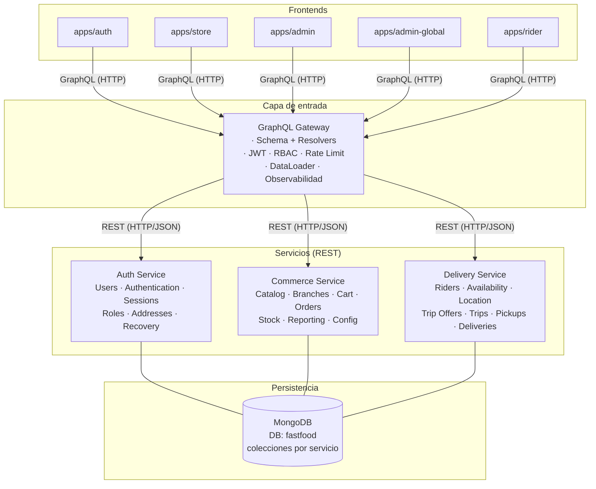
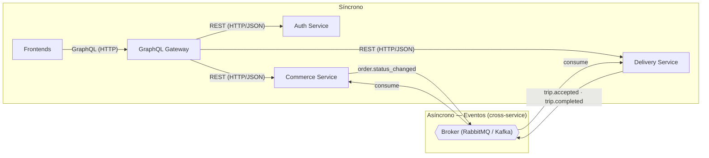
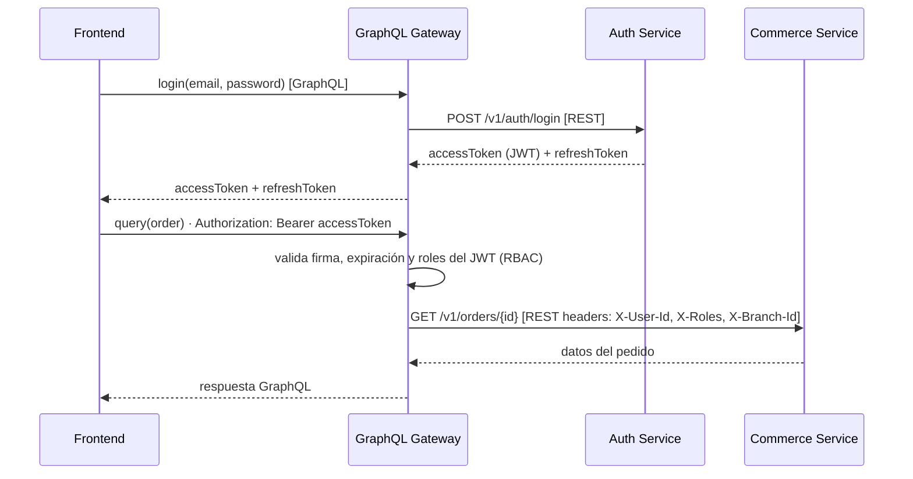
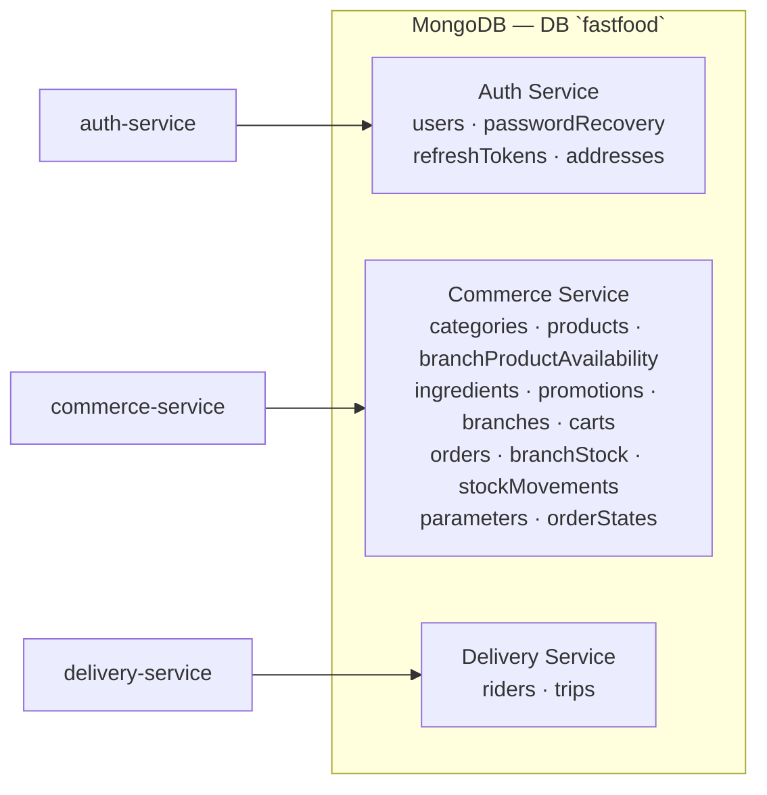

# Requerimientos — Backend (servicios)

**Proyecto:** Plataforma de pedidos para una cadena de comidas rápidas
**Documento:** requerimientos funcionales y no funcionales del backend
**Arquitectura:** Frontends → GraphQL Gateway → REST (HTTP/JSON) → 3 servicios + MongoDB
**Fuente de verdad funcional:** `client/docs/requerimientos-funcionales.md`
**Versión:** 3.2 (canónica)

> Este documento es la **fuente de verdad del backend**. La capa de entrada es un **GraphQL Gateway** que expone un único esquema GraphQL a los cinco frontends y resuelve las consultas llamando a los servicios por **REST** (HTTP/JSON). La fundamentación de esta decisión está en `docs/fundamentacion-gateway-graphql-rest.md`.

> El **catálogo de endpoints** de las secciones 6–8 es **exhaustivo**: se derivó recorriendo cada pantalla del frontend (`requerimientos-frontend.md`, §6 Tienda, §8 Admin de sucursal, §10 Admin global, §12 Repartidor). La trazabilidad pantalla → endpoint está en la [sección 15](#15-trazabilidad-frontend--endpoints).

---

## Índice

1. [Objetivo y alcance](#1-objetivo-y-alcance)
2. [Arquitectura general](#2-arquitectura-general)
3. [Servicios y responsabilidades](#3-servicios-y-responsabilidades)
4. [Capa de entrada: GraphQL Gateway](#4-capa-de-entrada-graphql-gateway)
   - [Esquema GraphQL (queries y mutations)](#esquema-graphql-del-gateway-queries-y-mutations)
5. [Contratos REST (OpenAPI)](#5-contratos-rest-openapi)
6. [Auth Service](#6-auth-service)
7. [Commerce Service](#7-commerce-service)
8. [Delivery Service](#8-delivery-service)
9. [Comunicación entre servicios](#9-comunicación-entre-servicios)
10. [Autenticación y autorización](#10-autenticación-y-autorización)
11. [Modelo de datos (MongoDB)](#11-modelo-de-datos-mongodb)
12. [Requerimientos no funcionales](#12-requerimientos-no-funcionales)
13. [Puertos locales (desarrollo)](#13-puertos-locales-desarrollo)
14. [Fuera del alcance](#14-fuera-del-alcance)
15. [Trazabilidad frontend → endpoints](#15-trazabilidad-frontend--endpoints)

---

# 1. Objetivo y alcance

El backend da soporte a los cinco frontends (`apps/auth`, `apps/store`, `apps/admin`, `apps/admin-global`, `apps/rider`). Todos consumen un **único endpoint GraphQL** expuesto por el **GraphQL Gateway**.

Se implementa como un conjunto de **3 servicios** más una capa de entrada:

1. **GraphQL Gateway** — punto de entrada único: esquema GraphQL propio, resolvers que traducen a REST, JWT, RBAC, rate limiting, DataLoader (N+1) y observabilidad. Sin lógica de negocio.
2. **Auth Service** — identidad, autenticación, sesiones, roles, direcciones y recuperación de contraseña. Expone un API **REST**.
3. **Commerce Service** — catálogo, sucursales, carrito, pedidos, stock, reportes y configuración. Expone un API **REST**.
4. **Delivery Service** — repartidores, disponibilidad, ubicación, ofertas de viaje, viajes, retiros y entregas. Expone un API **REST**.

Cada servicio posee sus **colecciones** dentro de una única base **MongoDB** (`fastfood`). Los servicios son **stateless**. La comunicación **síncrona** es **REST** (cliente → gateway por GraphQL/HTTP; gateway → servicios por REST/HTTP+JSON). La comunicación **asíncrona** (eventos entre servicios) usa un broker.

> Respecto a la variante de **GraphQL Federation** (archivada en `docs/archive/requerimientos-backend-federation.md`): se reemplaza Apollo Federation por **REST**. El gateway deja de componer subgraphs y pasa a **poseer el esquema GraphQL**; la resolución de campos y las uniones entre servicios se implementan en los **resolvers** del gateway, que invocan endpoints REST (con DataLoader para evitar N+1). Los servicios dejan de exponer tipos federados `@key` y exponen **recursos HTTP** documentados con OpenAPI.

---

# 2. Arquitectura general

```text
CLIENTS
      Auth       Store       Admin       AdminGlobal       Rider
        │          │           │              │              │
        └──────────┴───────────┴──────────────┴──────────────┘
                                   │ GraphQL (HTTP)
                                   ▼
                      ┌───────────────────────────┐
                      │      GraphQL Gateway      │
                      │ Schema · Resolvers        │
                      │ JWT · RBAC · Rate Limit   │
                      │ DataLoader · Observabilidad│
                      └─────────────┬─────────────┘
                    REST (HTTP/JSON)
              ┌─────────────────────┼──────────────────────┐
              │                     │                      │
              ▼                     ▼                      ▼
      ┌───────────────┐    ┌───────────────────┐   ┌─────────────────┐
      │ AUTH SERVICE  │    │ COMMERCE SERVICE  │   │ DELIVERY SERVICE│
      │ Users         │    │ Catalog           │   │ Riders          │
      │ Authentication│    │ Branches          │   │ Availability    │
      │ Sessions      │    │ Cart              │   │ Location        │
      │ Roles         │    │ Orders            │   │ Trip Offers     │
      │ Addresses     │    │ Stock             │   │ Trips           │
      │ Recovery      │    │ Reporting         │   │ Pickups         │
      │               │    │ Config            │   │ Deliveries      │
      └───────┬───────┘    └─────────┬─────────┘   └────────┬────────┘
              │                      │                      │
              └──────────────────────┼──────────────────────┘
                                     │
                                     ▼
                          ┌──────────────────────┐
                          │       MongoDB        │
                          │    DB: fastfood      │
                          │ collections owned    │
                          │ by each service      │
                          └──────────────────────┘
```



---

# 3. Servicios y responsabilidades

| Servicio             | Responsabilidad                                                                                                                                                                                    | Colecciones propias (MongoDB `fastfood`)                                                                                                                                        |
| -------------------- | -------------------------------------------------------------------------------------------------------------------------------------------------------------------------------------------------- | ------------------------------------------------------------------------------------------------------------------------------------------------------------------------------- |
| **GraphQL Gateway**  | Punto de entrada único de los 5 frontends. Posee el esquema GraphQL, implementa los resolvers (traduciendo a REST), valida JWT, aplica RBAC/rate limiting y expone observabilidad. No posee datos. | Ninguna.                                                                                                                                                                        |
| **Auth Service**     | Registro, login, refresh, recuperación de contraseña, perfiles, direcciones del usuario, personal, roles. Emite/valida JWT. Expone un API REST (`/v1/...`).                                        | `users`, `passwordRecovery`, `refreshTokens`, `addresses`                                                                                                                       |
| **Commerce Service** | Catálogo (categorías, productos, configuraciones, ingredientes/recetas, promociones), sucursales, carrito, pedidos, stock, reportes y configuración global. Expone un API REST (`/v1/...`).        | `categories`, `products`, `branchProductAvailability`, `ingredients`, `promotions`, `branches`, `carts`, `orders`, `branchStock`, `stockMovements`, `parameters`, `orderStates` |
| **Delivery Service** | Repartidores, disponibilidad/ubicación, ofertas de viaje, viajes, retiros y entregas. Expone un API REST (`/v1/...`).                                                                              | `riders`, `trips`                                                                                                                                                               |

### Roles

| Rol            | Descripción                       |
| -------------- | --------------------------------- |
| `customer`     | Cliente de la Tienda.             |
| `branch_admin` | Admin de una sucursal específica. |
| `super_admin`  | Admin global.                     |
| `rider`        | Repartidor.                       |

> En las tablas de endpoints, la columna **Acceso** indica los roles autorizados y, cuando aplica, el alcance (`propio`, `su sucursal`, `todas`). El gateway aplica el RBAC antes de invocar al servicio; el servicio lo revalida (defensa en profundidad).

---

# 4. Capa de entrada: GraphQL Gateway

El gateway es el **único dueño del esquema GraphQL** y el punto de entrada de los cinco frontends. No contiene reglas de negocio: cada resolver se limita a traducir la operación GraphQL en una o más llamadas **REST** a los servicios y a componer la respuesta.

| ID       | Requerimiento                                                                                                                                                               |
| -------- | --------------------------------------------------------------------------------------------------------------------------------------------------------------------------- |
| RQ-GW-01 | El gateway deberá exponer un único endpoint GraphQL (`/graphql`) para todos los frontends.                                                                                  |
| RQ-GW-02 | El gateway deberá poseer y servir su propio **esquema GraphQL** (single schema, sin subgraphs ni supergraph federado).                                                      |
| RQ-GW-03 | El gateway deberá implementar **resolvers** que invoquen endpoints REST de los 3 servicios a través de clientes HTTP generados desde los contratos OpenAPI.                 |
| RQ-GW-04 | El gateway deberá validar la firma, la expiración y los roles del JWT en cada request antes de resolver.                                                                    |
| RQ-GW-05 | El gateway deberá inyectar en el contexto GraphQL el `userId`, los `roles` y la `branchId` (si aplica) del usuario autenticado.                                             |
| RQ-GW-06 | El gateway deberá rechazar requests sin token válido en los campos/consultas protegidos, con un error de autenticación estandarizado.                                       |
| RQ-GW-07 | El gateway deberá propagar los errores de cada servicio REST (código, mensaje y `path`) en un formato único (`errors[]` con `code`, `message`, `path`).                     |
| RQ-GW-08 | El gateway deberá resolver campos que crucen servicios (ej. `Order.client` contra Auth Service; `Order.branch` contra Commerce Service) mediante llamadas REST adicionales. |
| RQ-GW-09 | El gateway deberá usar **DataLoader** para agrupar y deduplicar llamadas REST por lote y evitar el problema N+1.                                                            |
| RQ-GW-10 | El gateway deberá aplicar _rate limiting_ por cliente/token.                                                                                                                |
| RQ-GW-11 | El gateway deberá exponer `GET /health` y `GET /graphql` (sandbox) en entornos de desarrollo.                                                                               |
| RQ-GW-12 | El gateway no deberá contener lógica de negocio de ningún dominio: solo enruta, autentica, valida y traduce a REST.                                                         |
| RQ-GW-13 | El gateway deberá configurar los endpoints base (URL) de los servicios por variables de entorno y validar su conectividad vía `GET /health`.                                |

### Ejemplo de resolución (antes "federado", ahora "por resolvers")

```graphql
query PedidoCliente($id: ID!) {
  order(id: $id) {
    number
    status
    total
    branch {
      name
    } # Resolver → GET /v1/branches/{branchId}
    client {
      name
      email
    } # Resolver → GET /v1/users/{clientId}  (batched por DataLoader)
    items {
      product {
        name
      }
      quantity
    }
  }
}
```

```text
Gateway resolver "order":
  1. GET /v1/orders/{id}                    → Order (con clientId, branchId)
  2. Resolver "client" → GET /v1/users/{id} → User   (DataLoader)
  3. Resolver "branch" → GET /v1/branches/{id} → Branch (DataLoader)
```

### Esquema GraphQL del gateway (queries y mutations)

El gateway expone un único esquema GraphQL a los cinco frontends. Cada campo de `Query`/`Mutation` mapea a uno o más endpoints REST (ver [sección 15](#15-trazabilidad-frontend--endpoints)).

```graphql
# ===== Enums =====
enum Role {
  CUSTOMER
  BRANCH_ADMIN
  SUPER_ADMIN
  RIDER
}

enum OrderStatus {
  PENDING
  CONFIRMED
  PREPARING
  READY_FOR_DELIVERY
  ON_THE_WAY
  DELIVERED
  CANCELLED
}

enum TripStatus {
  OFFERED
  ACTIVE
  COMPLETED
  CANCELLED
}

enum ConfigGroupType {
  SINGLE
  MULTIPLE
}

# ===== Auth / sesión =====
type AuthTokens {
  accessToken: String!
  refreshToken: String!
}

type User {
  id: ID!
  email: String!
  firstName: String!
  lastName: String!
  phone: String
  role: Role!
  active: Boolean!
  branchId: ID
  vehicle: String
}

type Address {
  id: ID!
  label: String!
  text: String!
  city: String
  postalCode: String
  latitude: Float!
  longitude: Float!
  active: Boolean!
}

# ===== Catálogo =====
type Category {
  id: ID!
  name: String!
  active: Boolean!
}

type Product {
  id: ID!
  categoryId: ID!
  category: Category # Resolver → GET /v1/catalog/categories/{id} (DataLoader)
  name: String!
  description: String!
  price: Float!
  image: String
  available: Boolean!
  configGroups: [ConfigGroup!]!
  recipe: [RecipeItem!]!
}

type ConfigGroup {
  id: ID!
  name: String!
  type: ConfigGroupType!
  required: Boolean!
  min: Int
  max: Int
  options: [ConfigOption!]!
}

type ConfigOption {
  id: ID!
  name: String!
  extraPrice: Float!
  available: Boolean!
}

type RecipeItem {
  id: ID!
  ingredientId: ID!
  ingredient: Ingredient # Resolver → GET /v1/catalog/ingredients/{id} (DataLoader)
  quantity: Float!
}

type Ingredient {
  id: ID!
  name: String!
  unit: String!
  active: Boolean!
}

type Promotion {
  id: ID!
  name: String!
  description: String
  startDate: String!
  endDate: String!
  active: Boolean!
}

# ===== Sucursales =====
type BranchHours {
  dayOfWeek: Int!
  opening: String
  closing: String
  closed: Boolean!
}

type Branch {
  id: ID!
  name: String!
  addressText: String!
  latitude: Float!
  longitude: Float!
  phone: String
  active: Boolean!
  hours: [BranchHours!]!
}

# ===== Carrito =====
type CartItem {
  id: ID!
  productId: ID!
  product: Product # Resolver → GET /v1/catalog/products/{id} (DataLoader)
  quantity: Int!
  observations: String
  optionIds: [ID!]!
  options: [ConfigOption!]!
}

type Cart {
  id: ID!
  clientId: ID!
  status: String!
  items: [CartItem!]!
  total: Float!
}

# ===== Pedidos =====
type OrderItemOption {
  optionId: ID!
  name: String!
  extraPrice: Float!
}

type OrderItem {
  productId: ID!
  name: String!
  unitPrice: Float!
  quantity: Int!
  observations: String
  subtotal: Float!
  options: [OrderItemOption!]!
}

type OrderStatusHistory {
  previousStatus: OrderStatus!
  newStatus: OrderStatus!
  changedAt: String!
}

type Order {
  id: ID!
  number: String!
  clientId: ID!
  client: User # Resolver → GET /v1/users/{clientId} (DataLoader)
  branchId: ID!
  branch: Branch # Resolver → GET /v1/branches/{branchId} (DataLoader)
  deliveryAddress: Address!
  status: OrderStatus!
  total: Float!
  estimatedDeliveryAt: String
  createdAt: String!
  items: [OrderItem!]!
  statusHistory: [OrderStatusHistory!]!
  availableTransitions: [OrderStatus!]! # Resolver → GET /v1/orders/{id}/transitions
}

type RepeatOrderResult {
  cart: Cart!
  skippedProducts: [Product!]! # productos no disponibles que no se agregaron
}

# ===== Stock =====
type BranchStock {
  ingredientId: ID!
  ingredient: Ingredient
  branchId: ID!
  quantity: Float!
}

type StockMovement {
  id: ID!
  branchId: ID!
  ingredientId: ID!
  delta: Float!
  reason: String!
  orderId: ID
  createdAt: String!
}

# ===== Config =====
type Parameter {
  key: String!
  value: Float!
  unit: String!
}

type OrderState {
  code: String!
  name: String!
  order: Int!
  active: Boolean!
}

# ===== Reportes =====
type ProductReportRow {
  position: Int!
  product: Product!
  category: Category
  quantity: Int
  revenue: Float
}

type OutOfStockRow {
  product: Product!
  category: Category
  quantity: Float!
}

# ===== Delivery =====
type Rider {
  id: ID!
  userId: ID!
  vehicle: String
  phone: String
  available: Boolean!
  currentLocation: GeoPoint
}

type GeoPoint {
  latitude: Float!
  longitude: Float!
}

type TripOrder {
  orderId: ID!
  order: Order # Resolver → GET /v1/orders/{orderId} (DataLoader)
  pickupBranchId: ID!
  deliveryAddress: Address
  status: OrderStatus!
}

type TripOffer {
  id: ID!
  orderCount: Int!
  distanceKm: Float!
  estimatedMinutes: Int!
  estimatedEarnings: Float!
}

type Trip {
  id: ID!
  riderId: ID!
  status: TripStatus!
  orders: [TripOrder!]!
  startedAt: String
  completedAt: String
  earnings: Float
}

# ===== Query =====
type Query {
  # Auth / sesión
  me: User!
  users(filter: UserFilter, page: PageInput): [User!]!
  user(id: ID!): User!
  myAddresses: [Address!]!
  address(id: ID!): Address!

  # Catálogo
  categories(activeOnly: Boolean, page: PageInput): [Category!]!
  category(id: ID!): Category!
  products(filter: ProductFilter, page: PageInput): [Product!]!
  product(id: ID!): Product!
  ingredients(activeOnly: Boolean, page: PageInput): [Ingredient!]!
  ingredient(id: ID!): Ingredient!
  promotions(activeOnly: Boolean, page: PageInput): [Promotion!]!
  promotion(id: ID!): Promotion!

  # Sucursales
  branches(filter: BranchFilter, page: PageInput): [Branch!]!
  branch(id: ID!): Branch!
  branchHours(branchId: ID!): [BranchHours!]!
  availableBranches(lat: Float!, lng: Float!): [Branch!]!
  branchProducts(branchId: ID!): [Product!]!

  # Carrito
  myCart: Cart!

  # Pedidos
  myOrders(filter: OrderFilter, page: PageInput): [Order!]!
  orders(filter: OrderFilter, page: PageInput): [Order!]! # admin: su sucursal / todas
  order(id: ID!): Order!
  orderHistory(id: ID!): [OrderStatusHistory!]!

  # Stock
  branchStock(branchId: ID): [BranchStock!]!

  # Reportes
  bestSellingProducts(branchId: ID): [ProductReportRow!]!
  leastSoldProducts(branchId: ID): [ProductReportRow!]!
  outOfStockProducts(branchId: ID): [OutOfStockRow!]!
  highestRevenueProducts(branchId: ID): [ProductReportRow!]!

  # Config
  parameters: [Parameter!]!
  orderStates: [OrderState!]!

  # Delivery
  riderProfile: Rider!
  tripOffers: [TripOffer!]!
  trip(id: ID!): Trip!
  myTrips(page: PageInput): [Trip!]!
}

# ===== Mutation =====
type Mutation {
  # Auth / sesión
  register(input: RegisterInput!): AuthTokens!
  login(input: LoginInput!): AuthTokens!
  refreshToken(refreshToken: String!): AuthTokens!
  logout: Boolean!
  requestPasswordRecovery(email: String!): Boolean!
  resetPassword(token: String!, newPassword: String!): Boolean!
  updateProfile(input: UpdateProfileInput!): User!

  # Usuarios / personal (admin)
  createStaff(input: CreateStaffInput!): User!
  createAdmin(input: CreateAdminInput!): User!
  createRider(input: CreateRiderInput!): User!
  updateUser(id: ID!, input: UpdateUserInput!): User!
  setUserActive(id: ID!, active: Boolean!): User!

  # Direcciones (cliente)
  createAddress(input: CreateAddressInput!): Address!
  updateAddress(id: ID!, input: UpdateAddressInput!): Address!
  deleteAddress(id: ID!): Boolean!

  # Catálogo (admin global)
  createCategory(input: CategoryInput!): Category!
  updateCategory(id: ID!, input: CategoryInput!): Category!
  setCategoryActive(id: ID!, active: Boolean!): Category!

  createProduct(input: ProductInput!): Product!
  updateProduct(id: ID!, input: ProductInput!): Product!
  setProductAvailable(id: ID!, available: Boolean!): Product!

  createConfigGroup(productId: ID!, input: ConfigGroupInput!): ConfigGroup!
  updateConfigGroup(productId: ID!, groupId: ID!, input: ConfigGroupInput!): ConfigGroup!
  deleteConfigGroup(productId: ID!, groupId: ID!): Boolean!
  createConfigOption(productId: ID!, groupId: ID!, input: ConfigOptionInput!): ConfigOption!
  updateConfigOption(
    productId: ID!
    groupId: ID!
    optionId: ID!
    input: ConfigOptionInput!
  ): ConfigOption!
  deleteConfigOption(productId: ID!, groupId: ID!, optionId: ID!): Boolean!

  setProductRecipe(productId: ID!, items: [RecipeItemInput!]!): Product!
  addRecipeItem(productId: ID!, input: RecipeItemInput!): Product!
  updateRecipeItem(productId: ID!, itemId: ID!, input: RecipeItemInput!): Product!
  removeRecipeItem(productId: ID!, itemId: ID!): Product!

  createIngredient(input: IngredientInput!): Ingredient!
  updateIngredient(id: ID!, input: IngredientInput!): Ingredient!
  setIngredientActive(id: ID!, active: Boolean!): Ingredient!

  createPromotion(input: PromotionInput!): Promotion!
  updatePromotion(id: ID!, input: PromotionInput!): Promotion!
  setPromotionActive(id: ID!, active: Boolean!): Promotion!

  # Sucursales (admin global)
  createBranch(input: BranchInput!): Branch!
  updateBranch(id: ID!, input: BranchInput!): Branch!
  setBranchActive(id: ID!, active: Boolean!): Branch!
  updateBranchHours(branchId: ID!, hours: [BranchHoursInput!]!): [BranchHours!]!

  # Disponibilidad por sucursal (admin de sucursal)
  setBranchProductAvailability(branchId: ID!, productId: ID!, available: Boolean!): Boolean!

  # Carrito (cliente)
  addCartItem(input: AddCartItemInput!): Cart!
  updateCartItem(itemId: ID!, input: UpdateCartItemInput!): Cart!
  removeCartItem(itemId: ID!): Cart!

  # Pedidos
  createOrder: Order! # confirma el carrito activo
  changeOrderStatus(orderId: ID!, status: OrderStatus!): Order!
  repeatOrder(orderId: ID!): RepeatOrderResult!

  # Stock
  adjustStock(input: AdjustStockInput!): BranchStock!

  # Config (admin global)
  updateParameter(key: String!, value: Float!): Parameter!
  createOrderState(input: OrderStateInput!): OrderState!
  updateOrderState(code: String!, input: OrderStateInput!): OrderState!
  setOrderStateActive(code: String!, active: Boolean!): OrderState!

  # Delivery (repartidor)
  updateRiderProfile(input: UpdateRiderProfileInput!): Rider!
  setRiderAvailability(online: Boolean!): Rider!
  updateRiderLocation(lat: Float!, lng: Float!): Rider!
  acceptTripOffer(offerId: ID!): Trip!
  rejectTripOffer(offerId: ID!): Boolean!
  markOrderPickup(tripId: ID!, orderId: ID!): Trip!
  markOrderDelivered(tripId: ID!, orderId: ID!): Trip!
}
```

### Inputs

```graphql
input RegisterInput {
  firstName: String!
  lastName: String!
  email: String!
  phone: String!
  password: String!
}
input LoginInput {
  email: String!
  password: String!
}
input UpdateProfileInput {
  firstName: String!
  lastName: String!
  phone: String!
}

input CreateStaffInput {
  firstName: String!
  lastName: String!
  email: String!
  phone: String!
  password: String!
  branchId: ID!
}
input CreateAdminInput {
  firstName: String!
  lastName: String!
  email: String!
  phone: String!
  password: String!
}
input CreateRiderInput {
  firstName: String!
  lastName: String!
  email: String!
  phone: String!
  password: String!
  vehicle: String!
}
input UpdateUserInput {
  firstName: String
  lastName: String
  phone: String
  branchId: ID
}

input CreateAddressInput {
  label: String!
  text: String!
  city: String
  postalCode: String
  latitude: Float!
  longitude: Float!
}
input UpdateAddressInput {
  label: String
  text: String
  city: String
  postalCode: String
  latitude: Float
  longitude: Float
}

input CategoryInput {
  name: String!
  active: Boolean
}

input ConfigGroupInput {
  name: String!
  type: ConfigGroupType!
  required: Boolean!
  min: Int
  max: Int
}
input ConfigOptionInput {
  name: String!
  extraPrice: Float!
  available: Boolean
}

input RecipeItemInput {
  ingredientId: ID!
  quantity: Float!
}

input IngredientInput {
  name: String!
  unit: String!
  active: Boolean
}

input ProductInput {
  categoryId: ID!
  name: String!
  description: String!
  price: Float!
  image: String
  available: Boolean
}

input PromotionInput {
  name: String!
  description: String
  startDate: String!
  endDate: String!
  active: Boolean
}

input BranchInput {
  name: String!
  addressText: String!
  latitude: Float!
  longitude: Float!
  phone: String
  active: Boolean
}
input BranchHoursInput {
  dayOfWeek: Int!
  opening: String
  closing: String
  closed: Boolean!
}

input AddCartItemInput {
  productId: ID!
  quantity: Int!
  observations: String
  optionIds: [ID!]
}
input UpdateCartItemInput {
  quantity: Int
  observations: String
  optionIds: [ID!]
}

input AdjustStockInput {
  branchId: ID!
  ingredientId: ID!
  delta: Float!
  reason: String!
}

input OrderStateInput {
  name: String!
  order: Int!
  active: Boolean
}

input UpdateRiderProfileInput {
  vehicle: String
  phone: String
}

input UserFilter {
  role: Role
  active: Boolean
  search: String
}
input ProductFilter {
  categoryId: ID
  search: String
  available: Boolean
}
input BranchFilter {
  active: Boolean
  search: String
}
input OrderFilter {
  status: OrderStatus
  branchId: ID
  search: String
}

input PageInput {
  limit: Int
  offset: Int
}

type PageInfo {
  total: Int!
  limit: Int!
  offset: Int!
}
```

> Los campos marcados con `Resolver → GET ... (DataLoader)` son las **uniones entre servicios** que el gateway resuelve con llamadas REST adicionales agrupadas por DataLoader (`Order.client`, `Order.branch`, `Product.category`, `RecipeItem.ingredient`, `CartItem.product`, `TripOrder.order`).

> **Paginación:** las queries de lista aceptan `page: { limit, offset }` (mapeado a `?limit=&offset=` en REST). El total lo expone la capa REST en `meta.total`; el gateway lo puede devolver como `PageInfo` junto a cada lista cuando el cliente lo necesite para "cargar más".

---

# 5. Contratos REST (OpenAPI)

Los contratos son la **fuente de verdad del contrato entre el gateway y los servicios**. Viven en un paquete compartido del monorepo (`packages/contracts/openapi/`) y se versionan por ruta (`/v1`, `/v2`) y/o por documento.

| ID         | Requerimiento                                                                                                                                   |
| ---------- | ----------------------------------------------------------------------------------------------------------------------------------------------- |
| RQ-REST-01 | Los contratos deberán definirse en **OpenAPI 3.x**, un documento por servicio, con rutas versionadas (`/v1/...`).                               |
| RQ-REST-02 | Los recursos, métodos, parámetros, cuerpos (schemas) y respuestas deberán estar explícitos en cada documento OpenAPI.                           |
| RQ-REST-03 | Los clientes HTTP del gateway deberán generarse desde los documentos OpenAPI y compartirse entre gateway y servicios (no duplicarse).           |
| RQ-REST-04 | Cada servicio deberá exponer `GET /health` para orquestación y liveness/readiness.                                                              |
| RQ-REST-05 | Los contratos deberán versionarse sin romper a los clientes (cambios aditivos en la misma versión; cambios incompatibles en una nueva).         |
| RQ-REST-06 | Los recursos se identificarán por UUID y las subentidades por rutas anidadas o filtros (según corresponda).                                     |
| RQ-REST-07 | Los errores de negocio deberán transportarse como **RFC 7807 (`application/problem+json`)** o un envelope estándar (`code`, `message`, `path`). |

### Convenciones de API

```text
Métodos:    GET (leer), POST (crear/acciones), PATCH (actualizar parcial), PUT (reemplazar), DELETE (eliminar/desactivar)
Rutas:      /v1/<recurso>[/{id}[/subrecurso]]
Paginación: query ?limit=&offset= → respuesta { data: [], meta: { total, limit, offset } }
Filtros:    query strings por campo (ej. ?categoryId=&status=&search=&lat=&lng=)
Errores:    4xx/5xx con envelope { code, message, path, details? }
Auth:       header Authorization: Bearer <JWT> + headers de contexto X-User-Id, X-Roles, X-Branch-Id
```

### Estructura de los contratos

```text
packages/contracts/openapi/
├── common/
│   └── common.yaml          # componentes compartidos: Page, GeoPoint, Error, Empty
├── auth/
│   └── v1/
│       └── auth.openapi.yaml
├── commerce/
│   └── v1/
│       ├── catalog.openapi.yaml
│       ├── branch.openapi.yaml
│       ├── cart.openapi.yaml
│       ├── order.openapi.yaml
│       ├── stock.openapi.yaml
│       ├── reporting.openapi.yaml
│       └── config.openapi.yaml
└── delivery/
    └── v1/
        └── delivery.openapi.yaml
```

### Ejemplo de contrato (referencia)

```yaml
# auth/v1/auth.openapi.yaml (extracto)
openapi: 3.0.3
info:
  title: Auth Service
  version: 1.0.0
servers:
  - url: http://localhost:4201
paths:
  /v1/auth/login:
    post:
      summary: Login de clientes, admins y repartidores
      requestBody:
        required: true
        content:
          application/json:
            schema:
              type: object
              required: [email, password]
              properties:
                email: { type: string, format: email }
                password: { type: string }
      responses:
        '200':
          description: Tokens
          content:
            application/json:
              schema:
                type: object
                properties:
                  accessToken: { type: string }
                  refreshToken: { type: string }
        '401':
          $ref: '#/components/responses/Unauthorized'

  /v1/users/{userId}:
    get:
      summary: Obtener usuario por id (para resolver referencias cross-service)
      parameters:
        - { name: userId, in: path, required: true, schema: { type: string } }
      responses:
        '200':
          description: Usuario
          content:
            application/json:
              schema: { $ref: '#/components/schemas/User' }

components:
  schemas:
    User:
      type: object
      properties:
        id: { type: string }
        email: { type: string }
        firstName: { type: string }
        lastName: { type: string }
        phone: { type: string }
        role: { type: string, enum: [customer, branch_admin, super_admin, rider] }
        active: { type: boolean }
        branchId: { type: string }
        vehicle: { type: string }
  responses:
    Unauthorized:
      description: Credenciales inválidas
      content:
        application/json:
          schema:
            type: object
            properties:
              code: { type: string }
              message: { type: string }
              path: { type: string }
```

---

# 6. Auth Service

Dueño de la identidad, la autenticación, las sesiones, los roles, las **direcciones** del usuario y la recuperación de contraseña. Es el **único** servicio que emite y valida JWT. Expone el API REST bajo `/v1`.

### 6.1 Autenticación y sesión

| Método | Ruta                         | Acceso      | Operación                                                           |
| ------ | ---------------------------- | ----------- | ------------------------------------------------------------------- |
| POST   | `/v1/auth/register`          | Público     | Registro de cliente (nombre, apellido, email, teléfono, contraseña) |
| POST   | `/v1/auth/login`             | Público     | Login (devuelve `accessToken` + `refreshToken`)                     |
| POST   | `/v1/auth/refresh`           | Público     | Refrescar `accessToken` a partir de `refreshToken`                  |
| POST   | `/v1/auth/logout`            | Autenticado | Revocar el `refreshToken` (cierre de sesión)                        |
| POST   | `/v1/auth/password-recovery` | Público     | Solicitar recuperación (respuesta neutral)                          |
| POST   | `/v1/auth/reset-password`    | Público     | Restablecer contraseña con token de recuperación                    |
| GET    | `/v1/me`                     | Autenticado | Perfil del usuario autenticado (datos + `role`)                     |
| PATCH  | `/v1/me`                     | Autenticado | Modificar el propio perfil (nombre, apellido, teléfono)             |

### 6.2 Usuarios / personal (administración)

| Método | Ruta                        | Acceso                  | Operación                                                                    |
| ------ | --------------------------- | ----------------------- | ---------------------------------------------------------------------------- |
| GET    | `/v1/users`                 | `super_admin`           | Listar usuarios (filtros: `role`, `active`, `search`)                        |
| GET    | `/v1/users/{userId}`        | `super_admin` / interno | Obtener usuario por id (referencias cross-service del gateway)               |
| POST   | `/v1/users/staff`           | `super_admin`           | Crear colaborador `branch_admin` (vínculo a sucursal existente)              |
| POST   | `/v1/users/admins`          | `super_admin`           | Crear otro `super_admin`                                                     |
| POST   | `/v1/users/riders`          | `super_admin`           | Crear repartidor `rider` (con vehículo y teléfono)                           |
| PATCH  | `/v1/users/{userId}`        | `super_admin`           | Modificar datos permitidos (incluida la sucursal asignada de un colaborador) |
| PATCH  | `/v1/users/{userId}/active` | `super_admin`           | Activar/desactivar usuario (sin borrado físico)                              |

### 6.3 Direcciones (cliente)

| Método | Ruta                        | Acceso     | Operación                                                      |
| ------ | --------------------------- | ---------- | -------------------------------------------------------------- |
| GET    | `/v1/addresses`             | `customer` | Listar direcciones propias                                     |
| POST   | `/v1/addresses`             | `customer` | Crear dirección propia (etiqueta, texto, ciudad, cp, lat, lng) |
| GET    | `/v1/addresses/{addressId}` | `customer` | Obtener dirección propia                                       |
| PATCH  | `/v1/addresses/{addressId}` | `customer` | Modificar dirección propia                                     |
| DELETE | `/v1/addresses/{addressId}` | `customer` | Eliminar/desactivar dirección propia                           |

### 6.4 Requerimientos

| ID         | Requerimiento                                                                                                                                                                   |
| ---------- | ------------------------------------------------------------------------------------------------------------------------------------------------------------------------------- |
| RQ-AUTH-01 | El sistema deberá permitir el registro de un cliente con nombre, apellido, correo, teléfono y contraseña.                                                                       |
| RQ-AUTH-02 | El correo deberá identificar de forma única a cada usuario.                                                                                                                     |
| RQ-AUTH-03 | La contraseña deberá almacenarse con hash (bcrypt/argon2); nunca en texto plano.                                                                                                |
| RQ-AUTH-04 | El sistema deberá permitir el login de clientes, admins y repartidores con correo y contraseña.                                                                                 |
| RQ-AUTH-05 | El login deberá devolver un `accessToken` (JWT de corta vida) y un `refreshToken`.                                                                                              |
| RQ-AUTH-06 | El login fallido deberá devolver un error genérico ("Credenciales inválidas") sin revelar si falló el correo o la contraseña.                                                   |
| RQ-AUTH-07 | El sistema deberá permitir refrescar el `accessToken` a partir de un `refreshToken` válido.                                                                                     |
| RQ-AUTH-08 | El sistema deberá permitir cerrar sesión (revocar el `refreshToken`).                                                                                                           |
| RQ-AUTH-09 | El sistema deberá permitir solicitar recuperación de contraseña y responder de forma neutral (sin revelar si el correo existe).                                                 |
| RQ-AUTH-10 | El sistema deberá generar un token de recuperación con expiración y permitir restablecer la contraseña con él.                                                                  |
| RQ-AUTH-11 | Un usuario autenticado deberá poder consultar y modificar su propio perfil.                                                                                                     |
| RQ-AUTH-12 | El sistema deberá crearse con un administrador inicial (`super_admin`) por seed.                                                                                                |
| RQ-AUTH-13 | Un `super_admin` deberá poder crear colaboradores de sucursal (`branch_admin`) y vincularlos a una sucursal existente (validando la sucursal contra Commerce Service vía REST). |
| RQ-AUTH-14 | Un `super_admin` deberá poder crear otros `super_admin`.                                                                                                                        |
| RQ-AUTH-15 | El sistema deberá poder crear repartidores (`rider`) con su vehículo y teléfono.                                                                                                |
| RQ-AUTH-16 | El sistema deberá poder activar/desactivar usuarios (sin borrado físico).                                                                                                       |
| RQ-AUTH-17 | El servicio deberá exponer `GET /v1/users/{userId}` para que el gateway y otros servicios resuelvan la entidad `User` por id.                                                   |
| RQ-AUTH-18 | El sistema deberá devolver el `role` y los datos del perfil en `GET /v1/me`.                                                                                                    |
| RQ-AUTH-19 | Un cliente autenticado deberá poder listar sus direcciones de entrega.                                                                                                          |
| RQ-AUTH-20 | Un cliente autenticado deberá poder crear, consultar y modificar sus propias direcciones.                                                                                       |
| RQ-AUTH-21 | Un cliente autenticado deberá poder eliminar/desactivar una dirección propia.                                                                                                   |
| RQ-AUTH-22 | Una dirección deberá tener etiqueta, texto, localidad/ciudad, código postal, latitud y longitud.                                                                                |

---

# 7. Commerce Service

Servicio que agrupa el flujo comercial completo. Sus módulos comparten el mismo contexto de datos y colaboran de forma interna (sin broker). Expone el API REST bajo `/v1`, con un grupo de rutas por módulo de dominio.

## 7.1 Catalog

### Categorías

| Método | Ruta                                         | Acceso        | Operación                                           |
| ------ | -------------------------------------------- | ------------- | --------------------------------------------------- |
| GET    | `/v1/catalog/categories`                     | Público       | Listar categorías activas (público) / todas (admin) |
| POST   | `/v1/catalog/categories`                     | `super_admin` | Crear categoría                                     |
| GET    | `/v1/catalog/categories/{categoryId}`        | `super_admin` | Obtener categoría                                   |
| PATCH  | `/v1/catalog/categories/{categoryId}`        | `super_admin` | Modificar categoría                                 |
| PATCH  | `/v1/catalog/categories/{categoryId}/active` | `super_admin` | Activar/desactivar categoría                        |

### Productos

| Método | Ruta                                         | Acceso        | Operación                                                       |
| ------ | -------------------------------------------- | ------------- | --------------------------------------------------------------- |
| GET    | `/v1/catalog/products`                       | Público       | Listar productos (filtros: `categoryId`, `search`, `available`) |
| POST   | `/v1/catalog/products`                       | `super_admin` | Crear producto (nombre, descripción, categoría, precio, imagen) |
| GET    | `/v1/catalog/products/{productId}`           | Público       | Obtener producto (incluye configuraciones y receta)             |
| PATCH  | `/v1/catalog/products/{productId}`           | `super_admin` | Modificar producto                                              |
| PATCH  | `/v1/catalog/products/{productId}/available` | `super_admin` | Cambiar disponibilidad global del producto                      |

### Configuraciones de producto (grupos y opciones)

| Método | Ruta                                                                           | Acceso        | Operación                             |
| ------ | ------------------------------------------------------------------------------ | ------------- | ------------------------------------- |
| GET    | `/v1/catalog/products/{productId}/configurations`                              | `super_admin` | Listar grupos y opciones del producto |
| POST   | `/v1/catalog/products/{productId}/configurations`                              | `super_admin` | Crear grupo de configuración          |
| PATCH  | `/v1/catalog/products/{productId}/configurations/{groupId}`                    | `super_admin` | Modificar grupo                       |
| DELETE | `/v1/catalog/products/{productId}/configurations/{groupId}`                    | `super_admin` | Eliminar grupo                        |
| POST   | `/v1/catalog/products/{productId}/configurations/{groupId}/options`            | `super_admin` | Agregar opción                        |
| PATCH  | `/v1/catalog/products/{productId}/configurations/{groupId}/options/{optionId}` | `super_admin` | Modificar opción                      |
| DELETE | `/v1/catalog/products/{productId}/configurations/{groupId}/options/{optionId}` | `super_admin` | Eliminar opción                       |

### Receta (ingredientes del producto)

| Método | Ruta                                                     | Acceso        | Operación                                     |
| ------ | -------------------------------------------------------- | ------------- | --------------------------------------------- |
| GET    | `/v1/catalog/products/{productId}/recipe`                | `super_admin` | Listar ingredientes y cantidades de la receta |
| PUT    | `/v1/catalog/products/{productId}/recipe`                | `super_admin` | Reemplazar la receta completa                 |
| POST   | `/v1/catalog/products/{productId}/recipe/items`          | `super_admin` | Agregar ingrediente + cantidad                |
| PATCH  | `/v1/catalog/products/{productId}/recipe/items/{itemId}` | `super_admin` | Modificar ingrediente/cantidad                |
| DELETE | `/v1/catalog/products/{productId}/recipe/items/{itemId}` | `super_admin` | Quitar ingrediente de la receta               |

### Ingredientes (catálogo)

| Método | Ruta                                            | Acceso        | Operación                                                     |
| ------ | ----------------------------------------------- | ------------- | ------------------------------------------------------------- |
| GET    | `/v1/catalog/ingredients`                       | `super_admin` | Listar ingredientes (nombre, unidad, estado)                  |
| POST   | `/v1/catalog/ingredients`                       | `super_admin` | Crear ingrediente                                             |
| PATCH  | `/v1/catalog/ingredients/{ingredientId}`        | `super_admin` | Modificar ingrediente                                         |
| PATCH  | `/v1/catalog/ingredients/{ingredientId}/active` | `super_admin` | Activar/desactivar (no eliminar si se usa en recetas activas) |

### Promociones

| Método | Ruta                                          | Acceso        | Operación                    |
| ------ | --------------------------------------------- | ------------- | ---------------------------- |
| GET    | `/v1/catalog/promotions`                      | `super_admin` | Listar promociones           |
| POST   | `/v1/catalog/promotions`                      | `super_admin` | Crear promoción              |
| GET    | `/v1/catalog/promotions/{promotionId}`        | `super_admin` | Obtener promoción            |
| PATCH  | `/v1/catalog/promotions/{promotionId}`        | `super_admin` | Modificar promoción          |
| PATCH  | `/v1/catalog/promotions/{promotionId}/active` | `super_admin` | Activar/desactivar promoción |

### Requerimientos — Catalog

| ID        | Requerimiento                                                                                                                                                                                |
| --------- | -------------------------------------------------------------------------------------------------------------------------------------------------------------------------------------------- |
| RQ-CAT-01 | Un admin global deberá poder crear, consultar, modificar y activar/desactivar categorías.                                                                                                    |
| RQ-CAT-02 | Una categoría deberá tener nombre y estado (activa/inactiva).                                                                                                                                |
| RQ-CAT-03 | Un admin global deberá poder crear, consultar, modificar y activar/desactivar productos.                                                                                                     |
| RQ-CAT-04 | Un producto deberá tener nombre, descripción, categoría, precio, imagen (opcional) y disponibilidad.                                                                                         |
| RQ-CAT-05 | El catálogo público deberá devolver únicamente categorías activas y productos disponibles (globalmente activos **y no pausados** en la sucursal correspondiente).                            |
| RQ-CAT-06 | Un producto deberá poder tener configuraciones especiales (tamaño, sabor, adicionales, eliminaciones).                                                                                       |
| RQ-CAT-07 | Cada configuración deberá indicar si es obligatoria, el tipo de selección (única/múltiple), mín/máx y sus opciones.                                                                          |
| RQ-CAT-08 | Cada opción de configuración deberá poder modificar el precio (variación `+$`).                                                                                                              |
| RQ-CAT-09 | Un admin global deberá poder mantener el catálogo de ingredientes (nombre y unidad).                                                                                                         |
| RQ-CAT-10 | Un ingrediente usado en recetas activas no deberá eliminarse, solo desactivarse.                                                                                                             |
| RQ-CAT-11 | Un admin global deberá poder definir la receta de un producto (ingrediente + cantidad).                                                                                                      |
| RQ-CAT-12 | La cantidad de un ingrediente en una receta deberá poder variar según la opción seleccionada (ej. "Doble" = 2 medallones).                                                                   |
| RQ-CAT-13 | Un admin global deberá poder crear, consultar, modificar y activar/desactivar promociones como información general (sin motor de descuentos).                                                |
| RQ-CAT-14 | El API REST deberá exponer `GET /v1/catalog/products/{id}`, `GET /v1/catalog/categories/{id}` e `GET /v1/catalog/ingredients/{id}` para que el gateway resuelva los campos correspondientes. |
| RQ-CAT-15 | Un admin de sucursal (`branch_admin`) deberá poder pausar/reactivar productos en **su** sucursal, sin editar la definición global del producto.                                              |
| RQ-CAT-16 | La disponibilidad por sucursal deberá registrarse en `branchProductAvailability` (`branchId`, `productId`, `available`); el catálogo público combina el `available` global con este flag.    |

## 7.2 Branch

| Método | Ruta                                                        | Acceso                       | Operación                                                              |
| ------ | ----------------------------------------------------------- | ---------------------------- | ---------------------------------------------------------------------- |
| GET    | `/v1/branches`                                              | `super_admin`                | Listar sucursales (filtros: `active`, `search`)                        |
| POST   | `/v1/branches`                                              | `super_admin`                | Crear sucursal (nombre, dirección, lat/lng, teléfono, estado)          |
| GET    | `/v1/branches/{branchId}`                                   | Público / admin              | Obtener sucursal                                                       |
| PATCH  | `/v1/branches/{branchId}`                                   | `super_admin`                | Modificar sucursal                                                     |
| PATCH  | `/v1/branches/{branchId}/active`                            | `super_admin`                | Activar/desactivar sucursal                                            |
| GET    | `/v1/branches/{branchId}/hours`                             | Público / admin              | Obtener horarios de la sucursal                                        |
| PUT    | `/v1/branches/{branchId}/hours`                             | `super_admin`                | Actualizar horarios (por día, apertura/cierre/cerrado)                 |
| GET    | `/v1/branches/available?lat=&lng=`                          | Público                      | Listar sucursales activas, abiertas y dentro de la distancia máxima    |
| GET    | `/v1/branches/{branchId}/products`                          | `branch_admin` (su sucursal) | Listar productos con disponibilidad en la sucursal                     |
| PATCH  | `/v1/branches/{branchId}/products/{productId}/availability` | `branch_admin` (su sucursal) | Pausar/reactivar producto en la sucursal (`branchProductAvailability`) |

### Requerimientos — Branch

| ID        | Requerimiento                                                                                                                            |
| --------- | ---------------------------------------------------------------------------------------------------------------------------------------- |
| RQ-BRN-01 | Un admin global deberá poder crear, consultar, modificar y activar/desactivar sucursales.                                                |
| RQ-BRN-02 | Una sucursal deberá tener nombre, dirección textual, latitud, longitud, teléfono y estado.                                               |
| RQ-BRN-03 | Una sucursal deberá tener horarios de atención por día (apertura/cierre, o cerrado).                                                     |
| RQ-BRN-04 | El sistema deberá poder listar las sucursales activas y abiertas para una ubicación (lat/lng) dentro de la distancia máxima configurada. |
| RQ-BRN-05 | El sistema deberá calcular la distancia entre la sucursal y la dirección del cliente.                                                    |
| RQ-BRN-06 | Una sucursal inactiva o cerrada no deberá aparecer como disponible para un pedido.                                                       |
| RQ-BRN-07 | El API REST deberá exponer `GET /v1/branches/{id}` para que el gateway resuelva `Order.branch` y otros campos.                           |
| RQ-BRN-08 | El módulo de Branch deberá permitir al módulo de Order consultar la sucursal activa y abierta más cercana (asignación interna).          |

## 7.3 Cart

| Método | Ruta                       | Acceso     | Operación                                                     |
| ------ | -------------------------- | ---------- | ------------------------------------------------------------- |
| GET    | `/v1/carts`                | `customer` | Obtener el carrito activo (o indicarlo vacío/inexistente)     |
| POST   | `/v1/carts/items`          | `customer` | Agregar ítem (producto, cantidad, opciones, observaciones)    |
| PATCH  | `/v1/carts/items/{itemId}` | `customer` | Modificar cantidad, observaciones u opciones de un ítem       |
| DELETE | `/v1/carts/items/{itemId}` | `customer` | Eliminar ítem del carrito                                     |
| POST   | `/v1/carts/confirm`        | `customer` | Marcar el carrito como confirmado (parte del flujo de pedido) |

### Requerimientos — Cart

| ID         | Requerimiento                                                                                                                                               |
| ---------- | ----------------------------------------------------------------------------------------------------------------------------------------------------------- |
| RQ-CART-01 | Un cliente autenticado deberá tener un carrito activo (o crearlo bajo demanda).                                                                             |
| RQ-CART-02 | El sistema deberá agregar ítems al carrito validando que el producto y sus configuraciones estén disponibles.                                               |
| RQ-CART-03 | Cada ítem deberá registrar producto, cantidad, observaciones y opciones seleccionadas.                                                                      |
| RQ-CART-04 | El sistema deberá permitir modificar cantidad, observaciones y configuraciones de un ítem.                                                                  |
| RQ-CART-05 | El sistema deberá permitir eliminar ítems del carrito.                                                                                                      |
| RQ-CART-06 | El sistema deberá calcular el total del carrito a partir de precios, cantidades y adicionales.                                                              |
| RQ-CART-07 | El total deberá recalcularse en el servidor (el cliente nunca lo calcula como verdad final).                                                                |
| RQ-CART-08 | El carrito deberá poder marcarse como "confirmado" al convertirse en pedido (RF-059).                                                                       |
| RQ-CART-09 | Un carrito confirmado no deberá poder modificarse.                                                                                                          |
| RQ-CART-10 | El API REST deberá exponer `GET /v1/carts`, `POST /v1/carts/items`, `PATCH /v1/carts/items/{id}`, `DELETE /v1/carts/items/{id}` y `POST /v1/carts/confirm`. |

## 7.4 Order

| Método | Ruta                               | Acceso                                                                      | Operación                                                                                        |
| ------ | ---------------------------------- | --------------------------------------------------------------------------- | ------------------------------------------------------------------------------------------------ |
| GET    | `/v1/orders`                       | `customer` (propios) / `branch_admin` (su sucursal) / `super_admin` (todas) | Listar pedidos (filtros: `status`, `branchId`, `search`)                                         |
| POST   | `/v1/orders`                       | `customer`                                                                  | Confirmar el carrito como pedido (asigna sucursal, valida stock)                                 |
| GET    | `/v1/orders/{orderId}`             | Dueño / admin                                                               | Obtener detalle (incluye `statusHistory` e ítems con snapshot)                                   |
| GET    | `/v1/orders/{orderId}/history`     | Dueño / admin                                                               | Obtener el historial de estados del pedido                                                       |
| GET    | `/v1/orders/{orderId}/transitions` | Dueño / admin                                                               | Estados siguientes permitidos (según la máquina de estados)                                      |
| PATCH  | `/v1/orders/{orderId}/status`      | `branch_admin` (su sucursal) / `super_admin`                                | Cambiar estado (valida transición contra la máquina de estados)                                  |
| POST   | `/v1/orders/{orderId}/repeat`      | `customer` (propio)                                                         | Repetir pedido: crea un carrito nuevo con los productos disponibles (`cart` + `skippedProducts`) |

### Estados y transiciones

| Estado               | Siguientes permitidos             |
| -------------------- | --------------------------------- |
| `PENDING`            | `CONFIRMED`, `CANCELLED`          |
| `CONFIRMED`          | `PREPARING`, `CANCELLED`          |
| `PREPARING`          | `READY_FOR_DELIVERY`, `CANCELLED` |
| `READY_FOR_DELIVERY` | `ON_THE_WAY`, `CANCELLED`         |
| `ON_THE_WAY`         | `DELIVERED`, `CANCELLED`          |
| `DELIVERED`          | —                                 |
| `CANCELLED`          | —                                 |

### Requerimientos — Order

| ID        | Requerimiento                                                                                                                                                                                              |
| --------- | ---------------------------------------------------------------------------------------------------------------------------------------------------------------------------------------------------------- |
| RQ-ORD-01 | El sistema deberá confirmar un carrito como pedido validando cliente, dirección, carrito, productos y el **stock de ingredientes** de la sucursal asignada (validación interna contra el módulo de Stock). |
| RQ-ORD-02 | Para confirmar, el cliente deberá haber seleccionado una dirección propia (validada contra Auth Service vía REST, orquestada por el gateway).                                                              |
| RQ-ORD-03 | El sistema deberá asignar al pedido la sucursal activa y abierta más cercana dentro de la distancia máxima.                                                                                                |
| RQ-ORD-04 | Si no existe sucursal disponible, el pedido no deberá confirmarse.                                                                                                                                         |
| RQ-ORD-05 | El pedido deberá registrar cliente, sucursal asignada, dirección de entrega (snapshot), fecha y hora.                                                                                                      |
| RQ-ORD-06 | El pedido deberá guardar un snapshot del detalle (producto, nombre, precio unitario, cantidad, observaciones, opciones y subtotal).                                                                        |
| RQ-ORD-07 | El sistema deberá calcular y guardar el importe total del pedido.                                                                                                                                          |
| RQ-ORD-08 | El pedido deberá iniciar en estado `PENDING`.                                                                                                                                                              |
| RQ-ORD-09 | El sistema deberá calcular el tiempo estimado de entrega (tiempo base + traslado estimado por distancia).                                                                                                  |
| RQ-ORD-10 | El sistema deberá marcar el carrito como confirmado al crear el pedido.                                                                                                                                    |
| RQ-ORD-11 | El cliente deberá poder consultar el detalle y el historial de estados de sus propios pedidos.                                                                                                             |
| RQ-ORD-12 | El admin de sucursal deberá poder listar y operar los pedidos de **su** sucursal.                                                                                                                          |
| RQ-ORD-13 | El admin global deberá poder listar y operar los pedidos de **todas** las sucursales.                                                                                                                      |
| RQ-ORD-14 | El sistema deberá validar cada transición de estado contra la máquina de estados.                                                                                                                          |
| RQ-ORD-15 | Cada cambio de estado deberá registrar estado anterior, nuevo estado, fecha y hora.                                                                                                                        |
| RQ-ORD-16 | El repartidor deberá poder consultar los pedidos de sus viajes y marcarlos retirados/entregados (ver Delivery Service).                                                                                    |
| RQ-ORD-17 | El sistema deberá permitir repetir un pedido anterior creando un carrito nuevo con los productos que continúen disponibles.                                                                                |
| RQ-ORD-18 | El sistema deberá emitir el evento `order.status_changed` ante cada transición (consumido internamente por Stock y externamente por Delivery Service).                                                     |
| RQ-ORD-19 | El API REST deberá exponer `GET /v1/orders/{id}`, `GET /v1/orders`, `POST /v1/orders`, `GET /v1/orders/{id}/transitions`, `PATCH /v1/orders/{id}/status` y `POST /v1/orders/{id}/repeat`.                  |
| RQ-ORD-20 | La máquina de estados (transiciones válidas) será fija en el código del módulo de Order; el catálogo de visualización de estados (código, nombre, orden) se gestiona en el módulo de Config.               |

## 7.5 Stock

| Método | Ruta                    | Acceso                                               | Operación                                                |
| ------ | ----------------------- | ---------------------------------------------------- | -------------------------------------------------------- |
| GET    | `/v1/stock`             | `branch_admin` (su sucursal) / `super_admin` (todas) | Listar stock de ingredientes (`?branchId=` opcional)     |
| POST   | `/v1/stock/adjustments` | `branch_admin` (su sucursal) / `super_admin`         | Ajustar cantidad de un ingrediente (registra movimiento) |

### Requerimientos — Stock

| ID        | Requerimiento                                                                                                                                                                      |
| --------- | ---------------------------------------------------------------------------------------------------------------------------------------------------------------------------------- |
| RQ-STK-01 | El sistema deberá mantener el stock de ingredientes por sucursal.                                                                                                                  |
| RQ-STK-02 | El admin de sucursal deberá poder listar y ajustar el stock de **su** sucursal.                                                                                                    |
| RQ-STK-03 | El admin global deberá poder listar y ajustar el stock de **todas** las sucursales.                                                                                                |
| RQ-STK-04 | El ajuste de stock deberá registrar un movimiento (ingrediente, sucursal, cantidad, motivo/fecha).                                                                                 |
| RQ-STK-05 | Un producto se podrá preparar (y, por lo tanto, **comprar**) solo si hay stock suficiente de todos los ingredientes de su receta; sin stock, el producto no se puede comprar.      |
| RQ-STK-06 | El sistema deberá validar, al confirmar un pedido, que la sucursal asignada tenga stock suficiente de los ingredientes de cada producto; si falta stock, el pedido no se confirma. |
| RQ-STK-07 | El stock deberá descontarse cuando el pedido **entre en realización** (`PREPARING`), no al confirmar.                                                                              |
| RQ-STK-08 | El descuento deberá producirse al procesar la transición `order.status_changed` (→ `PREPARING`) dentro del propio servicio.                                                        |
| RQ-STK-09 | Si el pedido se cancela antes de entrar en realización, no deberá descontarse stock.                                                                                               |
| RQ-STK-10 | El API REST deberá exponer `GET /v1/stock` y `POST /v1/stock/adjustments`.                                                                                                         |

## 7.6 Reporting

| Método | Ruta                                     | Acceso                                       | Operación                              |
| ------ | ---------------------------------------- | -------------------------------------------- | -------------------------------------- |
| GET    | `/v1/reporting/products/best-sellers`    | `branch_admin` (su sucursal) / `super_admin` | Productos más vendidos (cantidad desc) |
| GET    | `/v1/reporting/products/least-sold`      | `branch_admin` (su sucursal) / `super_admin` | Productos menos vendidos (incluye 0)   |
| GET    | `/v1/reporting/products/out-of-stock`    | `branch_admin` (su sucursal) / `super_admin` | Productos sin stock                    |
| GET    | `/v1/reporting/products/highest-revenue` | `branch_admin` (su sucursal) / `super_admin` | Productos con mayor facturación        |

### Requerimientos — Reporting

| ID        | Requerimiento                                                                                                                              |
| --------- | ------------------------------------------------------------------------------------------------------------------------------------------ |
| RQ-REP-01 | El sistema deberá reportar los productos **más vendidos** (cantidad, de mayor a menor).                                                    |
| RQ-REP-02 | El sistema deberá reportar los productos **menos vendidos** (incluye productos sin ventas).                                                |
| RQ-REP-03 | El sistema deberá reportar los productos **sin stock**.                                                                                    |
| RQ-REP-04 | El sistema deberá reportar los productos con **mayor facturación**.                                                                        |
| RQ-REP-05 | Los reportes deberán leerse de las colecciones del propio servicio (`orders`, `products`, `branchStock`), sin escritura de datos maestros. |
| RQ-REP-06 | El reporte de stock deberá reflejar el stock **por sucursal**; el admin de sucursal ve el suyo y el global ve todos.                       |

## 7.7 Config

| Método | Ruta                                    | Acceso        | Operación                                                                                                          |
| ------ | --------------------------------------- | ------------- | ------------------------------------------------------------------------------------------------------------------ |
| GET    | `/v1/config/parameters`                 | `super_admin` | Listar parámetros (clave, valor, unidad)                                                                           |
| PATCH  | `/v1/config/parameters/{key}`           | `super_admin` | Modificar parámetro (valida valores positivos)                                                                     |
| GET    | `/v1/config/order-states`               | Autenticado   | Listar catálogo de estados (`code`, `name`, `order`, `active`) — lo leen la Tienda (badges) y los admins (filtros) |
| POST   | `/v1/config/order-states`               | `super_admin` | Crear estado del catálogo                                                                                          |
| PUT    | `/v1/config/order-states/{code}`        | `super_admin` | Modificar estado del catálogo                                                                                      |
| PATCH  | `/v1/config/order-states/{code}/active` | `super_admin` | Activar/desactivar estado del catálogo                                                                             |

### Parámetros

| ID        | Requerimiento                                                                                                                                   |
| --------- | ----------------------------------------------------------------------------------------------------------------------------------------------- |
| RQ-CFG-01 | El sistema deberá almacenar parámetros de decisión como pares clave/valor con unidad (ej. `MAX_DISTANCE_KM`, `BASE_PREP_MIN`, `AVG_SPEED_KMH`). |
| RQ-CFG-02 | El `super_admin` deberá poder listar y modificar parámetros, validando valores positivos.                                                       |
| RQ-CFG-03 | El módulo de Branch deberá leer `MAX_DISTANCE_KM` para filtrar las sucursales disponibles.                                                      |
| RQ-CFG-04 | El módulo de Order deberá leer `BASE_PREP_MIN` y `AVG_SPEED_KMH` para calcular el ETA.                                                          |

### Catálogo de estados

| ID        | Requerimiento                                                                                                                                                      |
| --------- | ------------------------------------------------------------------------------------------------------------------------------------------------------------------ |
| RQ-CFG-05 | El sistema deberá mantener el catálogo de estados de pedido (`code`, `name`, `order`, `active`) para su visualización.                                             |
| RQ-CFG-06 | El `super_admin` deberá poder listar y crear/modificar/activar/desactivar estados del catálogo.                                                                    |
| RQ-CFG-07 | Las transiciones válidas entre estados seguirán controladas por el módulo de Order (máquina de estados), no por este catálogo.                                     |
| RQ-CFG-08 | El API REST deberá exponer `GET /v1/config/parameters`, `PATCH /v1/config/parameters/{key}`, `GET /v1/config/order-states` y `PUT /v1/config/order-states/{code}`. |

---

# 8. Delivery Service

Dueño de los repartidores, su disponibilidad/ubicación, las ofertas de viaje y los viajes (retiros y entregas). Expone el API REST bajo `/v1`.

### Riders

| Método | Ruta                         | Acceso  | Operación                                                  |
| ------ | ---------------------------- | ------- | ---------------------------------------------------------- |
| GET    | `/v1/riders/me`              | `rider` | Obtener perfil del repartidor (nombre, vehículo, teléfono) |
| PATCH  | `/v1/riders/me`              | `rider` | Modificar perfil (nombre, vehículo, teléfono)              |
| PATCH  | `/v1/riders/me/availability` | `rider` | Activar/desactivar disponibilidad (online/offline)         |
| PATCH  | `/v1/riders/me/location`     | `rider` | Compartir ubicación actual (lat/lng)                       |

### Trips

| Método | Ruta                                          | Acceso  | Operación                                                 |
| ------ | --------------------------------------------- | ------- | --------------------------------------------------------- |
| GET    | `/v1/trips/offers`                            | `rider` | Listar ofertas de viaje según la ubicación actual         |
| POST   | `/v1/trips/offers/{offerId}/accept`           | `rider` | Aceptar oferta (el viaje pasa a "en curso")               |
| POST   | `/v1/trips/offers/{offerId}/reject`           | `rider` | Rechazar oferta                                           |
| GET    | `/v1/trips`                                   | `rider` | Historial de viajes del repartidor                        |
| GET    | `/v1/trips/{tripId}`                          | `rider` | Detalle de un viaje (con sus órdenes, retiros y entregas) |
| POST   | `/v1/trips/{tripId}/orders/{orderId}/pickup`  | `rider` | Marcar el retiro de una orden del viaje                   |
| POST   | `/v1/trips/{tripId}/orders/{orderId}/deliver` | `rider` | Marcar la entrega de una orden del viaje (`DELIVERED`)    |

### Requerimientos

| ID        | Requerimiento                                                                                                                                                                   |
| --------- | ------------------------------------------------------------------------------------------------------------------------------------------------------------------------------- |
| RQ-DLV-01 | El repartidor deberá poder activar/desactivar su disponibilidad (online/offline).                                                                                               |
| RQ-DLV-02 | El repartidor deberá poder compartir su ubicación actual.                                                                                                                       |
| RQ-DLV-03 | El sistema deberá generar ofertas de viaje según la ubicación del repartidor (sin lista global), a partir de los pedidos `READY_FOR_DELIVERY` notificados por Commerce Service. |
| RQ-DLV-04 | Un viaje deberá agrupar una o más órdenes (de distintos clientes y/o sucursales).                                                                                               |
| RQ-DLV-05 | El repartidor deberá poder aceptar o rechazar una oferta de viaje; si no responde, la oferta vence.                                                                             |
| RQ-DLV-06 | Al aceptar, el viaje deberá pasar a "en curso".                                                                                                                                 |
| RQ-DLV-07 | El repartidor deberá poder marcar el retiro (`pickup`) y la entrega (`DELIVERED`) de cada orden del viaje.                                                                      |
| RQ-DLV-08 | Al entregar la última orden, el viaje deberá quedar completado.                                                                                                                 |
| RQ-DLV-09 | El repartidor no deberá poder modificar ítems ni cancelar órdenes.                                                                                                              |
| RQ-DLV-10 | El repartidor deberá poder consultar su historial de viajes.                                                                                                                    |
| RQ-DLV-11 | El repartidor deberá poder gestionar su perfil (nombre, vehículo, teléfono).                                                                                                    |
| RQ-DLV-12 | El sistema deberá emitir los eventos `trip.accepted` y `trip.completed`.                                                                                                        |
| RQ-DLV-13 | El API REST deberá exponer los endpoints de `riders` y `trips` listados arriba para que el gateway los traduzca a GraphQL.                                                      |

---

# 9. Comunicación entre servicios



| ID        | Requerimiento                                                                                                                                                                                                                                                |
| --------- | ------------------------------------------------------------------------------------------------------------------------------------------------------------------------------------------------------------------------------------------------------------ |
| RQ-COM-01 | La comunicación síncrona deberá fluir así: **cliente → gateway (GraphQL/HTTP) → servicios (REST/HTTP+JSON)**, usando clientes generados desde OpenAPI.                                                                                                       |
| RQ-COM-02 | Los efectos colaterales **dentro de un servicio** (descuento de stock al entrar en realización, actualización de reportes) deberán resolverse de forma interna, sin broker.                                                                                  |
| RQ-COM-03 | Los efectos colaterales **entre servicios** (Commerce ↔ Delivery) deberán comunicarse por eventos asíncronos en un broker.                                                                                                                                   |
| RQ-COM-04 | Los eventos deberán tener un esquema versionado y un identificador de correlación (`orderId`, `tripId`).                                                                                                                                                     |
| RQ-COM-05 | El consumo de eventos deberá ser idempotente (reprocesar un evento no deberá duplicar efectos).                                                                                                                                                              |
| RQ-COM-06 | Ningún servicio deberá acceder directamente a las colecciones de otro servicio (cada uno opera solo sobre sus colecciones dentro de `fastfood`).                                                                                                             |
| RQ-COM-07 | Si un servicio necesita datos de otro en una operación síncrona (ej. confirmar pedido valida la dirección del cliente), la orquestación la hará el gateway o un orchestrator del servicio, **nunca** un servicio primario llamando a otro servicio primario. |

### Eventos

| Evento                 | Emisor           | Consumidor       | Efecto                                                                |
| ---------------------- | ---------------- | ---------------- | --------------------------------------------------------------------- |
| `order.status_changed` | Commerce Service | Delivery Service | Generar ofertas de viaje cuando la orden pasa a `READY_FOR_DELIVERY`. |
| `trip.accepted`        | Delivery Service | Commerce Service | Marcar órdenes del viaje como asignadas a un repartidor.              |
| `trip.completed`       | Delivery Service | Commerce Service | Cierre de viaje (y actualización de estados de orden entregadas).     |

> El descuento de stock (`PREPARING`) y los reportes ya no necesitan broker: ocurren dentro de `Commerce Service` sobre sus propias colecciones. A diferencia de la federación, aquí el **gateway** resuelve las uniones entre servicios (ej. `Order.client`, `Trip.rider`) llamando a REST con DataLoader.

---

# 10. Autenticación y autorización



| ID        | Requerimiento                                                                                                                                                 |
| --------- | ------------------------------------------------------------------------------------------------------------------------------------------------------------- |
| RQ-SEC-01 | El `accessToken` deberá ser un JWT firmado con un secreto compartido entre Auth Service y el gateway.                                                         |
| RQ-SEC-02 | El JWT deberá incluir `userId` y `roles`.                                                                                                                     |
| RQ-SEC-03 | El gateway deberá propagar el contexto de identidad (`userId`, `roles`, `branchId`) a los servicios mediante headers (`X-User-Id`, `X-Roles`, `X-Branch-Id`). |
| RQ-SEC-04 | Cada servicio deberá aplicar autorización por rol sobre los endpoints REST que expone (defensa en profundidad).                                               |
| RQ-SEC-05 | El admin de sucursal solo deberá poder operar datos de **su** sucursal (`branchId` en el contexto).                                                           |
| RQ-SEC-06 | El repartidor solo deberá poder operar sus propios viajes.                                                                                                    |
| RQ-SEC-07 | Las credenciales y tokens nunca deberán registrarse en logs.                                                                                                  |
| RQ-SEC-08 | Las contraseñas deberán almacenarse con hash; los tokens de recuperación deberán expirar y ser de un solo uso.                                                |
| RQ-SEC-09 | Los endpoints REST de los servicios no deberán exponerse a la red pública; solo el gateway (y otros servicios autorizados) los alcanzan.                      |

---

# 11. Modelo de datos (MongoDB)

Una única base **MongoDB** (`fastfood`) donde **cada servicio es dueño de sus colecciones**. El aislamiento entre servicios se da a nivel de _colección_ (naming y permisos), no de base.



Reglas:

- **Una base, colecciones por servicio.** No se comparten colecciones entre servicios; cada uno opera solo sobre las suyas.
- Cada servicio se conecta con **credenciales propias** limitadas a sus colecciones.
- `reporting` (módulo de Commerce) lee las colecciones de `orders`/`products`/`branchStock` del propio servicio; no escribe datos maestros.
- El gateway **no tiene base de datos**.
- En desarrollo local alcanza con **un contenedor MongoDB** (`docker-compose`).
- `NFR-01` (índices) sigue aplicando por colección.

## 11.1 Auth Service — colecciones

```text
users: {
  _id, email (unique), passwordHash, role,
  firstName, lastName, phone, active,
  branchId (solo branch_admin), vehicle (solo rider), createdAt
}

passwordRecovery: { _id, userId, token, expiresAt, used }
refreshTokens:    { _id, userId, token, expiresAt, revoked }
addresses:        { _id, userId, label, text, city, postalCode, latitude, longitude, active }
```

## 11.2 Commerce Service — colecciones

```text
categories:  { _id, name, active }

products: {
  _id, categoryId, name, description, price, image, available,
  configGroups: [
    { _id, name, type, required, min, max,
      options: [ { _id, name, extraPrice, available } ] }
  ],
  recipe: [ { ingredientId, quantity, optionAdjustments? } ]
}

branchProductAvailability: { _id, branchId, productId, available }
  // available=false => branch_admin pausó el producto en esa sucursal.
  // Índice único (branchId, productId).

ingredients: { _id, name, unit, active }
promotions:  { _id, name, description, startDate, endDate, active }

branches: {
  _id, name, addressText, latitude, longitude, phone, active,
  hours: [ { dayOfWeek, opening, closing, closed } ]
}

carts: {
  _id, clientId, status (active|confirmed), createdAt,
  items: [
    { _id, productId, quantity, observations, optionIds: [] }
  ],
  total
}

orders: {
  _id, number, clientId, branchId, addressId,
  deliveryAddress: { text, latitude, longitude },  // snapshot
  status, total, estimatedDeliveryAt, createdAt,
  items: [
    { productId, name, unitPrice, quantity, observations, subtotal,
      options: [ { optionId, name, extraPrice } ] }
  ],
  statusHistory: [ { previousStatus, newStatus, changedAt } ]
}

branchStock: {
  _id, branchId, ingredientId, quantity,
  updatedAt
}

stockMovements: {
  _id, branchId, ingredientId, delta, reason (adjust|preparing), orderId?, createdAt
}

parameters: {
  _id, key (unique), value, unit
}

orderStates: {
  _id, code (unique), name, order, active
}
```

## 11.3 Delivery Service — colecciones

```text
riders: {
  _id, userId, vehicle, phone, available, currentLocation, status
}

trips: {
  _id, riderId, status (offered|active|completed|cancelled),
  orders: [ { orderId, pickup: {branchId}, delivery: {addressId}, status } ],
  startedAt, completedAt, earnings
}
```

---

# 12. Requerimientos no funcionales

| ID     | Requerimiento                                                                                                                                                                        |
| ------ | ------------------------------------------------------------------------------------------------------------------------------------------------------------------------------------ |
| NFR-01 | **Persistencia:** MongoDB; base única `fastfood` con colecciones por servicio; índices sobre los campos de consulta frecuente (`email`, `clientId`, `branchId`, `status`, `number`). |
| NFR-02 | **Statelessness:** los servicios y el gateway deberán ser stateless; la sesión se resuelve vía JWT.                                                                                  |
| NFR-03 | **Observabilidad:** cada servicio y el gateway deberán emitir logs estructurados y trazas con un `requestId` correlacionado desde el gateway (propagado también por headers).        |
| NFR-04 | **Idempotencia:** las mutaciones que lo requieran (cambios de estado, ajustes de stock) deberán ser idempotentes.                                                                    |
| NFR-05 | **Errores:** formato único de error (`code`, `message`, `path`) y códigos de estado coherentes; los errores REST siguen RFC 7807 (`application/problem+json`).                       |
| NFR-06 | **Escalabilidad:** cada servicio deberá poder escalar horizontalmente de forma independiente.                                                                                        |
| NFR-07 | **Seguridad:** hash de contraseñas (bcrypt/argon2), JWT firmado, validación de entradas, TLS en la malla REST y sin secretos en logs.                                                |
| NFR-08 | **Disponibilidad:** el gateway y los servicios deberán tener _health checks_ (`GET /health`) para orquestación.                                                                      |
| NFR-09 | **Versionado:** los contratos OpenAPI y el esquema GraphQL deberán versionarse sin romper a los clientes.                                                                            |
| NFR-10 | **Rendimiento:** el gateway deberá agrupar llamadas REST con DataLoader y definir timeouts/retries por endpoint para acotar la latencia.                                             |

---

# 13. Puertos locales (desarrollo)

Convención: **gateway 4000** (HTTP/GraphQL), **servicios REST 42xx**. Cada app lee su puerto de la variable de entorno `PORT`.

| Capa     | App                | Puerto local (REST)     |
| -------- | ------------------ | ----------------------- |
| Gateway  | `gateway`          | **4000** (GraphQL/HTTP) |
| Servicio | `auth-service`     | **4201**                |
| Servicio | `commerce-service` | **4202**                |
| Servicio | `delivery-service` | **4203**                |

Reglas:

- Los frontends (`client/`, Vite) corren en `5173`+ y apuntan al gateway en `http://localhost:4000/graphql`.
- El gateway configura las URL base de los servicios en `http://localhost:42xx`.
- El broker y MongoDB se configuran por variables de entorno (sin puerto fijo en este documento).
- El gateway puede exponer un puerto adicional para métricas/observabilidad si se requiere.

---

# 14. Fuera del alcance

- Pago en línea.
- Navegación GPS real u optimización de recorridos.
- Motor automático de promociones/descuentos (solo información general).
- Reserva de stock al confirmar (el descuento es al entrar en realización).
- Notificaciones push en tiempo real.
- Auditoría completa o _outbox_ transaccional obligatorio.
- Reportes adicionales (pedidos, clientes, sucursales, promociones).
- HATEOAS completo o negociación de hipermedia; se usan recursos JSON simples con convenciones estables.

---

# 15. Trazabilidad frontend → endpoints

Mapa pantalla (`requerimientos-frontend.md`) → endpoints REST que invoca el gateway.

### Auth app (T-01 … T-04)

| Pantalla       | Endpoints                           |
| -------------- | ----------------------------------- |
| T-01 Login     | `POST /v1/auth/login`, `GET /v1/me` |
| T-02 Registro  | `POST /v1/auth/register`            |
| T-03 Recuperar | `POST /v1/auth/password-recovery`   |
| T-04 Reset     | `POST /v1/auth/reset-password`      |

### Tienda (T-05 … T-18)

| Pantalla                    | Endpoints                                                                    |
| --------------------------- | ---------------------------------------------------------------------------- |
| T-05 Inicio                 | `GET /v1/catalog/categories`, `GET /v1/catalog/products`                     |
| T-06 Catálogo               | `GET /v1/catalog/categories`, `GET /v1/catalog/products?categoryId=&search=` |
| T-07 Detalle de producto    | `GET /v1/catalog/products/{id}`, `POST /v1/carts/items`                      |
| T-08 Sucursales disponibles | `GET /v1/branches/available?lat=&lng=`, `GET /v1/addresses`                  |
| T-09 Carrito                | `GET /v1/carts`, `PATCH /v1/carts/items/{id}`, `DELETE /v1/carts/items/{id}` |
| T-10 Checkout dirección     | `GET /v1/addresses`, `GET /v1/branches/available?lat=&lng=`                  |
| T-11 Checkout resumen       | `GET /v1/carts`, `POST /v1/orders`                                           |
| T-12 Pedido confirmado      | `GET /v1/orders/{id}`                                                        |
| T-13 Seguimiento            | `GET /v1/orders/{id}`, `GET /v1/orders/{id}/history`                         |
| T-14 Historial              | `GET /v1/orders`, `POST /v1/orders/{id}/repeat`                              |
| T-15 Repetición             | `POST /v1/orders/{id}/repeat` (devuelve `cart` + `skippedProducts`)          |
| T-16 Perfil                 | `GET /v1/me`, `PATCH /v1/me`                                                 |
| T-17 Lista de direcciones   | `GET /v1/addresses`, `DELETE /v1/addresses/{id}`                             |
| T-18 Crear/editar dirección | `POST /v1/addresses`, `GET /v1/addresses/{id}`, `PATCH /v1/addresses/{id}`   |

### Admin de sucursal (S-01 … S-07)

| Pantalla                        | Endpoints                                                                                                               |
| ------------------------------- | ----------------------------------------------------------------------------------------------------------------------- |
| S-01 Login administrativo       | `POST /v1/auth/login`, `GET /v1/me`                                                                                     |
| S-02 Inicio                     | `GET /v1/orders?branchId=...&status=...`                                                                                |
| S-03 Productos de mi sucursal   | `GET /v1/branches/{branchId}/products`, `PATCH /v1/branches/{branchId}/products/{id}/availability`                      |
| S-04 Stock de ingredientes      | `GET /v1/stock?branchId=...`, `POST /v1/stock/adjustments`                                                              |
| S-05 Lista de pedidos           | `GET /v1/orders?branchId=...`, `GET /v1/branches`, `GET /v1/config/order-states`                                        |
| S-06 Detalle y cambio de estado | `GET /v1/orders/{id}`, `GET /v1/orders/{id}/history`, `GET /v1/orders/{id}/transitions`, `PATCH /v1/orders/{id}/status` |
| S-07 Reportes                   | `GET /v1/reporting/products/best-sellers`, `least-sold`, `out-of-stock`, `highest-revenue`                              |

### Admin global (G-01 … G-15)

| Pantalla                      | Endpoints                                                                                                                                                  |
| ----------------------------- | ---------------------------------------------------------------------------------------------------------------------------------------------------------- |
| G-01/G-02 Categorías          | `GET /v1/catalog/categories`, `POST /v1/catalog/categories`, `GET /v1/catalog/categories/{id}`, `PATCH ...`, `PATCH .../active`                            |
| G-03/G-04 Productos           | `GET /v1/catalog/products`, `POST /v1/catalog/products`, `GET /v1/catalog/products/{id}`, `PATCH ...`, `PATCH .../available`, `GET /v1/catalog/categories` |
| G-05 Configuraciones          | `GET/POST /v1/catalog/products/{id}/configurations`, `PATCH/DELETE .../{groupId}`, `POST/PATCH/DELETE .../options/{optionId}`                              |
| G-06 Ingredientes/receta      | `GET/PUT /v1/catalog/products/{id}/recipe`, `POST/PATCH/DELETE /v1/catalog/products/{id}/recipe/items/{itemId}`                                            |
| G-07 Catálogo de ingredientes | `GET /v1/catalog/ingredients`, `POST ...`, `PATCH .../{id}`, `PATCH .../{id}/active`                                                                       |
| G-08/G-09 Sucursales          | `GET /v1/branches`, `POST ...`, `PATCH .../{id}`, `PATCH .../{id}/active`, `GET/PUT /v1/branches/{id}/hours`                                               |
| G-10/G-11 Promociones         | `GET /v1/catalog/promotions`, `POST ...`, `GET/PATCH .../{id}`, `PATCH .../{id}/active`                                                                    |
| G-12/G-13 Personal            | `GET /v1/users`, `POST /v1/users/staff`, `POST /v1/users/admins`, `GET /v1/users/{id}`, `PATCH ...`, `PATCH .../active`                                    |
| G-14 Estados generales        | `GET /v1/config/order-states`, `POST ...`, `PUT .../{code}`, `PATCH .../{code}/active`                                                                     |
| G-15 Parámetros               | `GET /v1/config/parameters`, `PATCH /v1/config/parameters/{key}`                                                                                           |

### Repartidor (R-01 … R-05)

| Pantalla                 | Endpoints                                                                                                      |
| ------------------------ | -------------------------------------------------------------------------------------------------------------- |
| R-01 Oferta de viaje     | `PATCH /v1/riders/me/location`, `GET /v1/trips/offers`, `POST /v1/trips/offers/{id}/accept`, `POST .../reject` |
| R-02 Viaje en curso      | `GET /v1/trips/{id}`, `POST /v1/trips/{id}/orders/{orderId}/pickup`, `POST .../deliver`                        |
| R-03 Detalle de orden    | `GET /v1/trips/{id}` (incluye órdenes del viaje)                                                               |
| R-04 Historial de viajes | `GET /v1/trips`                                                                                                |
| R-05 Perfil              | `GET /v1/riders/me`, `PATCH /v1/riders/me`, `PATCH /v1/riders/me/availability`                                 |

### Notas de clarificación (abiertas)

| #   | Tema                                        | Nota                                                                                                                                                                                                                                                                                                                                 |
| --- | ------------------------------------------- | ------------------------------------------------------------------------------------------------------------------------------------------------------------------------------------------------------------------------------------------------------------------------------------------------------------------------------------ |
| 1   | Catálogo público vs stock/pausa (RQ-CAT-05) | La sucursal se asigna al **confirmar** (§1.4), así que al navegar (T-05/T-06) no hay sucursal definida. Decisión actual: catálogo **global** al navegar; pausa + stock se validan al confirmar (RQ-ORD-01/03, RQ-STK-06). Si se quiere disponibilidad real por sucursal en la Tienda, agregar `GET /v1/branches/{branchId}/catalog`. |
| 2   | Validación de token de recuperación (T-04)  | Se resuelve con el error de `POST /v1/auth/reset-password` (token vencido/inválido). Opcional: `GET /v1/auth/reset-password/validate?token=` para validar antes de mostrar el formulario.                                                                                                                                            |
| 3   | Orden de "pedidos recientes" (S-02/S-05)    | `GET /v1/orders` deberá ordenar por fecha desc por defecto (o aceptar `sort`). Definir explícito en el contrato.                                                                                                                                                                                                                     |
